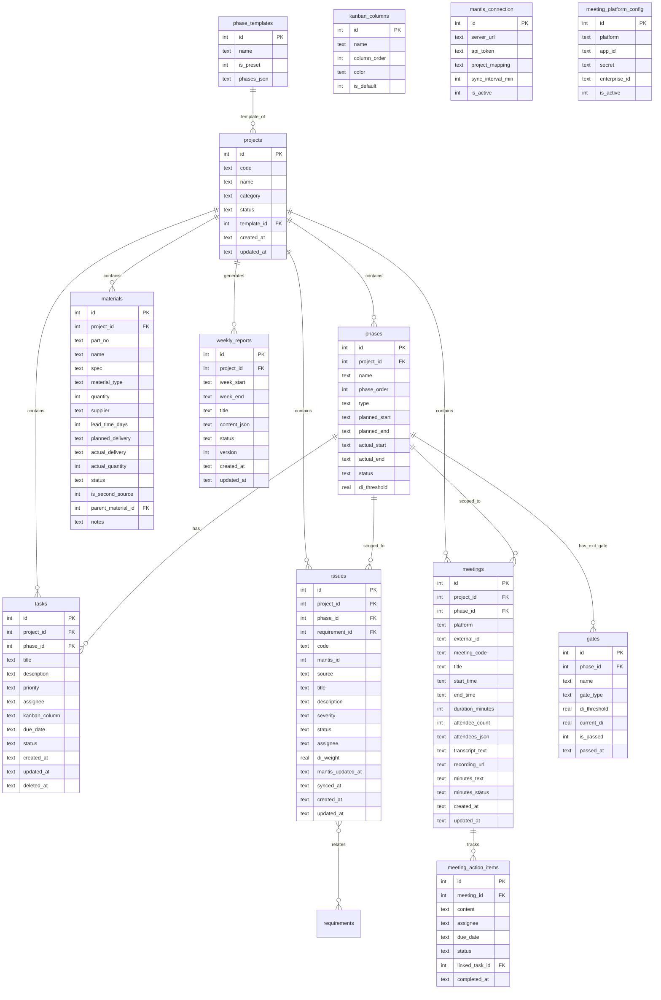

# HPM 系统架构设计

> 基准：`docs/PRD.md` v2.0 + `docs/modules/01-06-*.md`  
> 日期：2026-07-07   
> 后续：基础架构搭建 → M1→M6 串行开发

---

## 一、实现方案与框架选型

| 层 | 选型 | 理由 |
|---|------|------|
| **前端框架** | React 18 + Vite 5 | 个人工具，Vite 冷启动快，React+MUI 生态成熟 |
| **UI 库** | MUI 5 (Material UI) | 专业风格组件齐全（DataGrid/Timeline/Gantt 替代方案）|
| **样式辅助** | Tailwind CSS 3 | 补充 MUI 覆盖不到的自定义布局 |
| **路由** | react-router-dom v6 | SPA 标配 |
| **状态管理** | React Context + useReducer | 个人工具无需 Redux，轻量够用 |
| **甘特图** | `@neodrag/gantt` 或自研 SVG | 轻量无依赖 |
| **看板拖拽** | `@dnd-kit/core` | Headless 拖拽库，配合 MUI 卡片 |
| **后端框架** | Express 4 | 生态最大、中间件丰富 |
| **ORM** | `better-sqlite3`（同步 SQLite 驱动）| 个人使用，零配置、无网络依赖 |
| **数据库** | SQLite 3 | 个人工具首选，单文件存储，无需独立服务 |
| **API 风格** | RESTful JSON | 前后端分离标准 |
| **部署** | 待定（候选：本地 Electron 打包 / Vercel+Supabase） |

---

## 二、数据库设计

### 2.1 ER 图（Mermaid）



### 2.2 完整建表 DDL

```sql
-- =====================================================
-- M1 项目进度模块
-- =====================================================

CREATE TABLE phase_templates (
    id INTEGER PRIMARY KEY AUTOINCREMENT,
    name TEXT NOT NULL,
    is_preset INTEGER DEFAULT 0,           -- 1=系统预设不可删
    phases_json TEXT NOT NULL               -- JSON: [{name,order,type(PHASE|GATE),duration_weeks,di_threshold,...}]
);

CREATE TABLE projects (
    id INTEGER PRIMARY KEY AUTOINCREMENT,
    code TEXT NOT NULL,                     -- 项目代号
    name TEXT NOT NULL,                     -- 项目名称
    category TEXT DEFAULT '新品',           -- 新品/OEM/升级/定制/派生/部件引入/独立板卡/机柜机箱/产品维护
    status TEXT DEFAULT '进行中',           -- 进行中/已结项/已归档
    template_id INTEGER REFERENCES phase_templates(id),
    created_at TEXT DEFAULT (datetime('now','localtime')),
    updated_at TEXT DEFAULT (datetime('now','localtime'))
);

CREATE TABLE phases (
    id INTEGER PRIMARY KEY AUTOINCREMENT,
    project_id INTEGER NOT NULL REFERENCES projects(id) ON DELETE CASCADE,
    name TEXT NOT NULL,                     -- 阶段名
    phase_order INTEGER NOT NULL,           -- 阶段序号
    type TEXT DEFAULT 'PHASE',              -- PHASE / GATE
    planned_start TEXT,
    planned_end TEXT,
    actual_start TEXT,
    actual_end TEXT,
    status TEXT DEFAULT '未开始',           -- 未开始/进行中/已完成/已逾期
    di_threshold REAL                       -- DI值门槛（仅GATE类型）
);

CREATE TABLE gates (
    id INTEGER PRIMARY KEY AUTOINCREMENT,
    phase_id INTEGER NOT NULL REFERENCES phases(id) ON DELETE CASCADE,
    name TEXT NOT NULL,                     -- 门禁点名
    gate_type TEXT NOT NULL,                -- TR / DCP / MR / G-O
    di_threshold REAL,
    current_di REAL DEFAULT 0,
    is_passed INTEGER DEFAULT 0,
    passed_at TEXT
);

-- =====================================================
-- M2 待办事项模块
-- =====================================================

CREATE TABLE kanban_columns (
    id INTEGER PRIMARY KEY AUTOINCREMENT,
    name TEXT NOT NULL,                     -- 列名
    column_order INTEGER NOT NULL,          -- 排序
    color TEXT DEFAULT '#1565C0',           -- 顶部色条
    is_default INTEGER DEFAULT 0            -- 预设列不可删
);

CREATE TABLE tasks (
    id INTEGER PRIMARY KEY AUTOINCREMENT,
    project_id INTEGER REFERENCES projects(id) ON DELETE SET NULL,
    phase_id INTEGER REFERENCES phases(id) ON DELETE SET NULL,
    title TEXT NOT NULL,
    description TEXT,
    priority TEXT DEFAULT 'P2',             -- P0 / P1 / P2
    assignee TEXT,                          -- 负责人（字符串）
    kanban_column TEXT DEFAULT '待开始',     -- 所属看板列
    due_date TEXT,
    status TEXT DEFAULT '待开始',           -- 与kanban_column联动
    created_at TEXT DEFAULT (datetime('now','localtime')),
    updated_at TEXT DEFAULT (datetime('now','localtime')),
    deleted_at TEXT                         -- 软删除
);

-- =====================================================
-- M3 故障管理模块
-- =====================================================

CREATE TABLE issues (
    id INTEGER PRIMARY KEY AUTOINCREMENT,
    project_id INTEGER NOT NULL REFERENCES projects(id) ON DELETE CASCADE,
    phase_id INTEGER REFERENCES phases(id) ON DELETE SET NULL,
    requirement_id INTEGER,                 -- 后续关联需求表
    code TEXT NOT NULL UNIQUE,              -- HPM-xxx 或 Mantis-xxxxx
    mantis_id INTEGER,                      -- Mantis Issue ID（NULL=本地缺陷）
    source TEXT DEFAULT 'local',            -- mantis / local
    title TEXT NOT NULL,
    description TEXT,
    severity TEXT DEFAULT 'Minor',          -- Critical / Major / Minor / Trivial
    status TEXT DEFAULT '新建',             -- 新建/处理中/已解决/已关闭
    assignee TEXT,
    di_weight REAL DEFAULT 1.0,             -- Critical=10, Major=3, Minor=1, Trivial=0.1
    mantis_updated_at TEXT,
    synced_at TEXT,
    created_at TEXT DEFAULT (datetime('now','localtime')),
    updated_at TEXT DEFAULT (datetime('now','localtime'))
);

CREATE TABLE mantis_connection (
    id INTEGER PRIMARY KEY AUTOINCREMENT,
    server_url TEXT NOT NULL,
    api_token TEXT NOT NULL,                -- 加密存储
    project_mapping TEXT,                   -- JSON: [{mantis_id, hpm_project_id}]
    sync_interval_min INTEGER DEFAULT 30,
    is_active INTEGER DEFAULT 1
);

-- =====================================================
-- M4 物料管理模块
-- =====================================================

CREATE TABLE materials (
    id INTEGER PRIMARY KEY AUTOINCREMENT,
    project_id INTEGER NOT NULL REFERENCES projects(id) ON DELETE CASCADE,
    part_no TEXT NOT NULL,                  -- 料号
    name TEXT NOT NULL,                     -- 物料名称
    spec TEXT,                              -- 规格
    material_type TEXT DEFAULT '开发',       -- 通用/开发/包材
    quantity INTEGER DEFAULT 1,
    supplier TEXT,
    lead_time_days INTEGER,                 -- 备料周期（天）
    planned_delivery TEXT,                  -- 计划交期
    actual_delivery TEXT,                   -- 实际到货日期
    actual_quantity INTEGER,
    status TEXT DEFAULT '待下单',           -- 待下单/已下单/在途/已到货/已逾期
    is_second_source INTEGER DEFAULT 0,     -- 是否Second Source
    parent_material_id INTEGER REFERENCES materials(id) ON DELETE SET NULL,
    notes TEXT,
    created_at TEXT DEFAULT (datetime('now','localtime')),
    updated_at TEXT DEFAULT (datetime('now','localtime'))
);

-- =====================================================
-- M5 会议纪要模块
-- =====================================================

CREATE TABLE meeting_platform_config (
    id INTEGER PRIMARY KEY AUTOINCREMENT,
    platform TEXT NOT NULL UNIQUE,           -- tencent / quanshi
    app_id TEXT,
    secret TEXT,                            -- 加密存储
    enterprise_id TEXT,
    is_active INTEGER DEFAULT 0
);

CREATE TABLE meetings (
    id INTEGER PRIMARY KEY AUTOINCREMENT,
    project_id INTEGER REFERENCES projects(id) ON DELETE SET NULL,
    phase_id INTEGER REFERENCES phases(id) ON DELETE SET NULL,
    platform TEXT DEFAULT 'manual',         -- tencent / quanshi / manual
    external_id TEXT,                       -- 外部系统会议ID
    meeting_code TEXT,                      -- 会议号
    title TEXT NOT NULL,
    start_time TEXT,
    end_time TEXT,
    duration_minutes INTEGER,
    attendee_count INTEGER,
    attendees_json TEXT,                    -- JSON: [{name,email,join_time,leave_time,role}]
    transcript_text TEXT,                   -- 转写全文
    recording_url TEXT,                     -- 录制链接
    minutes_text TEXT,                      -- 纪要正文（Markdown）
    minutes_status TEXT DEFAULT '待编写',   -- 待编写/已编写
    created_at TEXT DEFAULT (datetime('now','localtime')),
    updated_at TEXT DEFAULT (datetime('now','localtime'))
);

CREATE TABLE meeting_action_items (
    id INTEGER PRIMARY KEY AUTOINCREMENT,
    meeting_id INTEGER NOT NULL REFERENCES meetings(id) ON DELETE CASCADE,
    content TEXT NOT NULL,                  -- 决议内容
    assignee TEXT,
    due_date TEXT,
    status TEXT DEFAULT '待处理',           -- 待处理/已完成
    linked_task_id INTEGER REFERENCES tasks(id) ON DELETE SET NULL,
    completed_at TEXT
);

-- =====================================================
-- M6 周报模块
-- =====================================================

CREATE TABLE weekly_reports (
    id INTEGER PRIMARY KEY AUTOINCREMENT,
    project_id INTEGER REFERENCES projects(id) ON DELETE CASCADE,
    week_start TEXT NOT NULL,               -- 周一 ISO8601
    week_end TEXT NOT NULL,                 -- 周日 ISO8601
    title TEXT,
    content_json TEXT NOT NULL,             -- 六板块结构化JSON
    status TEXT DEFAULT '草稿',             -- 草稿/已定稿
    version INTEGER DEFAULT 1,
    created_at TEXT DEFAULT (datetime('now','localtime')),
    updated_at TEXT DEFAULT (datetime('now','localtime'))
);

-- =====================================================
-- 索引
-- =====================================================
CREATE INDEX idx_phases_project ON phases(project_id, phase_order);
CREATE INDEX idx_tasks_project ON tasks(project_id);
CREATE INDEX idx_tasks_due ON tasks(due_date) WHERE deleted_at IS NULL;
CREATE INDEX idx_issues_project ON issues(project_id, status);
CREATE INDEX idx_issues_mantis ON issues(mantis_id);
CREATE INDEX idx_materials_project ON materials(project_id, status);
CREATE INDEX idx_materials_delivery ON materials(planned_delivery);
CREATE INDEX idx_meetings_project ON meetings(project_id);
CREATE INDEX idx_meetings_time ON meetings(start_time);
CREATE INDEX idx_weekly_reports_project ON weekly_reports(project_id, week_start);
```

---

## 三、API 路由全景

**Base URL**: `/api`

| Method | Path | 模块 | 说明 |
|--------|------|:--:|------|
| GET | /projects | M1 | 项目列表（?status=&category=&search=） |
| POST | /projects | M1 | 创建项目 |
| GET | /projects/:id | M1 | 项目详情 |
| PUT | /projects/:id | M1 | 更新项目 |
| DELETE | /projects/:id | M1 | 归档（软删除） |
| GET | /templates | M1 | 流程模板列表 |
| GET | /projects/:id/phases | M1 | 项目阶段列表 |
| PUT | /projects/:id/phases | M1 | 批量更新阶段 |
| PUT | /projects/:id/phases/:pid | M1 | 更新单个阶段 |
| POST | /projects/:id/gates/:gid/check | M1 | 门禁条件检查 |
| POST | /projects/:id/gates/:gid/pass | M1 | 手动通过门禁 |
| GET | /tasks | M2 | 任务列表（?project=&phase=&priority=&assignee=&status=） |
| POST | /tasks | M2 | 创建任务 |
| GET | /tasks/:id | M2 | 任务详情 |
| PUT | /tasks/:id | M2 | 更新任务 |
| DELETE | /tasks/:id | M2 | 软删除 |
| PUT | /tasks/batch | M2 | 批量更新 |
| GET | /tasks/overdue | M2 | 逾期任务 |
| GET | /kanban-columns | M2 | 看板列配置 |
| PUT | /kanban-columns | M2 | 更新列配置 |
| GET | /issues | M3 | 缺陷列表（?project=&phase=&severity=&status=&source=&search=） |
| POST | /issues | M3 | 创建本地缺陷 |
| GET | /issues/:id | M3 | 缺陷详情 |
| PUT | /issues/:id | M3 | 更新缺陷 |
| POST | /issues/:id/push-to-mantis | M3 | 推送至 Mantis |
| GET | /issues/di-summary | M3 | DI 汇总 |
| POST | /mantis/sync | M3 | 手动触发同步 |
| GET | /mantis/sync-status | M3 | 同步状态 |
| GET | /mantis/connection | M3 | 连接配置 |
| PUT | /mantis/connection | M3 | 更新连接 |
| GET | /materials | M4 | 物料列表（?project=&type=&status=&search=） |
| POST | /materials | M4 | 创建物料 |
| POST | /materials/batch | M4 | 批量导入 |
| GET | /materials/:id | M4 | 物料详情 |
| PUT | /materials/:id | M4 | 更新物料（含到货确认） |
| DELETE | /materials/:id | M4 | 软删除 |
| GET | /materials/overdue | M4 | 逾期物料 |
| GET | /materials/stats | M4 | 物料统计 |
| GET | /meetings | M5 | 会议列表（?project=&platform=&status=&from=&to=） |
| POST | /meetings | M5 | 手动创建会议 |
| GET | /meetings/:id | M5 | 会议详情（含决议项） |
| PUT | /meetings/:id | M5 | 更新纪要 |
| POST | /meetings/sync | M5 | 触发平台同步 |
| GET | /meetings/sync-status | M5 | 同步状态 |
| POST | /meetings/:id/action-items | M5 | 添加决议项 |
| PUT | /meetings/:id/action-items/:aid | M5 | 更新决议项 |
| POST | /meetings/:id/action-items/:aid/convert | M5 | 决议→M2待办 |
| GET | /meeting-config | M5 | 平台配置 |
| PUT | /meeting-config | M5 | 更新配置 |
| POST | /weekly-reports/generate | M6 | 生成周报 |
| GET | /weekly-reports | M6 | 周报列表 |
| GET | /weekly-reports/:id | M6 | 周报详情 |
| PUT | /weekly-reports/:id | M6 | 更新周报 |
| GET | /weekly-reports/:id/versions | M6 | 版本历史 |
| GET | /weekly-reports/:id/versions/:v | M6 | 指定版本 |

---

## 四、前端路由与组件树

### 4.1 路由结构（react-router-dom v6）

```
/                           → 仪表盘 DashboardPage
/projects/:id               → 项目详情 ProjectDetailPage
/projects/:id/phases        → 阶段管理 PhaseManagePage
/projects/:id/tasks         → 待办看板 TaskKanbanPage
/projects/:id/issues        → 故障列表 IssueListPage
/projects/:id/materials     → 物料管理 MaterialListPage
/projects/:id/meetings      → 会议台账 MeetingListPage
/projects/:id/weekly        → 周报 WeeklyReportPage
/projects/new               → 新建项目 CreateProjectPage
```

### 4.2 组件树

```
App
├── Layout
│   ├── Sidebar (迷你侧边栏：仪表盘/项目列表/+新建项目)
│   └── <Outlet />
│
├── DashboardPage
│   ├── StatsBar (统计卡片：项目总数/进行中/高风险/逾期物料)
│   ├── ProjectCardGrid
│   │   └── ProjectCard * N
│   │       ├── ProgressRing (进度圆环)
│   │       └── RiskBadge (风险色标)
│   └── FilterBar (状态/类别筛选+搜索)
│
├── ProjectDetailPage
│   ├── ProjectHeader (代号/名称/类别/状态/编辑按钮)
│   ├── PhaseTimeline (阶段时间线-纵向地铁图)
│   │   └── PhaseNode * N (阶段节点：名称/日期/状态色/门禁图标)
│   ├── GateCheckPanel (门禁检查面板)
│   └── TabNavigator
│       ├── PhaseTasks (当前阶段任务列表)
│       ├── IssueSummary (故障摘要卡片)
│       ├── MaterialSummary (物料摘要卡片)
│       └── MeetingSummary (会议摘要卡片)
│
├── TaskKanbanPage
│   ├── KanbanFilterBar (项目/阶段/优先级/负责人筛选)
│   └── KanbanBoard
│       ├── KanbanColumn * N (可拖拽列)
│       │   ├── ColumnHeader (列名+任务数+添加按钮)
│       │   └── TaskCard * N (可拖拽卡片)
│       │       ├── PriorityChip (P0红/P1橙/P2蓝)
│       │       ├── DueDateLabel (截止日期+逾期标记)
│       │       └── ProjectTag (项目标签)
│   └── TaskDrawer (侧边栏：创建/编辑任务表单)
│
├── IssueListPage
│   ├── IssueFilterBar
│   ├── IssueTable (MUI DataGrid)
│   │   ├── SeverityChip
│   │   ├── SourceBadge (Mantis/本地)
│   │   └── StatusChip
│   ├── DIStatsPanel (DI值仪表板-折叠面板)
│   │   ├── DIGauge (当前DI vs 阈值)
│   │   ├── DITrendChart (趋势折线图)
│   │   └── DIBySeverityPie (按严重度分布)
│   └── IssueDrawer
│
├── MaterialListPage
│   ├── MaterialFilterBar
│   ├── MaterialTable
│   │   ├── DeliveryStatusChip (交期状态色标)
│   │   └── OverdueBadge (逾期红标)
│   ├── MaterialDrawer
│   └── BatchImportDialog (批量导入对话框)
│
├── MeetingListPage
│   ├── MeetingFilterBar
│   ├── MeetingTable
│   │   ├── PlatformBadge (腾讯/全时/手动)
│   │   └── MinutesStatusChip
│   └── MeetingDrawer
│       ├── MinutesEditor (Markdown 编辑区)
│       ├── AttendeeList (参会人列表)
│       ├── TranscriptSection (转写文本折叠区)
│       ├── ActionItemList (决议项列表)
│       └── ActionItemForm (添加决议项)
│
├── WeeklyReportPage
│   ├── WeekSelector (周范围选择器+项目选择器)
│   ├── GenerateButton (生成周报按钮)
│   ├── ReportEditor (六个板块的Markdown编辑区)
│   │   ├── SectionEditor * 6
│   └── ReportHistory (历史版本列表)
│
└── CreateProjectPage
    └── StepperForm (Step1基本信息→Step2选模板→Step3确认)
```

---

## 五、项目目录结构

```
hpm/
├── client/                          # 前端 Vite + React
│   ├── public/
│   ├── src/
│   │   ├── main.jsx                # 入口
│   │   ├── App.jsx                 # 路由 + Layout
│   │   ├── api/                    # API 请求封装
│   │   │   └── client.js           # axios/fetch 实例 + 拦截器
│   │   ├── pages/                  # 页面级组件
│   │   │   ├── DashboardPage.jsx
│   │   │   ├── ProjectDetailPage.jsx
│   │   │   ├── TaskKanbanPage.jsx
│   │   │   ├── IssueListPage.jsx
│   │   │   ├── MaterialListPage.jsx
│   │   │   ├── MeetingListPage.jsx
│   │   │   ├── WeeklyReportPage.jsx
│   │   │   └── CreateProjectPage.jsx
│   │   ├── components/             # 可复用组件
│   │   │   ├── layout/
│   │   │   │   ├── Sidebar.jsx
│   │   │   │   └── Layout.jsx
│   │   │   ├── project/
│   │   │   │   ├── ProjectCard.jsx
│   │   │   │   ├── PhaseTimeline.jsx
│   │   │   │   └── GateCheckPanel.jsx
│   │   │   ├── task/
│   │   │   │   ├── KanbanBoard.jsx
│   │   │   │   ├── KanbanColumn.jsx
│   │   │   │   ├── TaskCard.jsx
│   │   │   │   └── TaskDrawer.jsx
│   │   │   ├── issue/
│   │   │   │   ├── IssueTable.jsx
│   │   │   │   ├── IssueDrawer.jsx
│   │   │   │   └── DIStatsPanel.jsx
│   │   │   ├── material/
│   │   │   │   ├── MaterialTable.jsx
│   │   │   │   └── BatchImportDialog.jsx
│   │   │   ├── meeting/
│   │   │   │   ├── MeetingTable.jsx
│   │   │   │   ├── MeetingDrawer.jsx
│   │   │   │   └── MinutesEditor.jsx
│   │   │   ├── weekly/
│   │   │   │   └── ReportEditor.jsx
│   │   │   └── shared/
│   │   │       ├── FilterBar.jsx
│   │   │       ├── StatusChip.jsx
│   │   │       └── ConfirmDialog.jsx
│   │   ├── hooks/                  # 自定义 hooks
│   │   │   ├── useProjects.js
│   │   │   ├── useTasks.js
│   │   │   ├── useIssues.js
│   │   │   └── useMaterials.js
│   │   ├── context/                # React Context
│   │   │   └── AppContext.jsx       # 全局状态（当前项目、筛选条件）
│   │   └── utils/
│   │       ├── date.js             # 日期格式化/周计算
│   │       └── di.js               # DI 值计算
│   ├── index.html
│   ├── vite.config.js
│   ├── tailwind.config.js
│   └── package.json
│
├── server/                          # 后端 Express
│   ├── src/
│   │   ├── index.js                # 入口：Express app + 中间件 + 路由挂载
│   │   ├── db.js                   # SQLite 初始化 + better-sqlite3
│   │   ├── routes/                 # 路由模块
│   │   │   ├── projects.js
│   │   │   ├── tasks.js
│   │   │   ├── issues.js
│   │   │   ├── materials.js
│   │   │   ├── meetings.js
│   │   │   └── weekly-reports.js
│   │   ├── middleware/
│   │   │   ├── errorHandler.js
│   │   │   └── validate.js
│   │   └── adapters/               # 外部系统适配器（预留）
│   │       ├── mantis.js
│   │       ├── tencent-meeting.js
│   │       └── quanshi-meeting.js
│   └── package.json
│
├── docs/                            # 项目文档
│   ├── PRD.md
│   ├── architecture.md
│   └── modules/
│       └── 01-06-*.md
│
├── .gitignore
└── README.md
```

---

## 六、任务列表（有序，含依赖）

| # | 任务 | 模块 | 依赖 | 说明 |
|:--:|------|:--:|:--:|------|
| **T0** | 基础架构搭建 | 全局 | — | Vite+React 脚手架 + Express 骨架 + SQLite 初始化 + 目录结构 |
| T0.1 | `client/` Vite+React+MUI+Tailwind 初始化 | 全局 | — | `npm create vite`, 安装依赖, 配置 Tailwind+MUI 主题 |
| T0.2 | `server/` Express 初始化 + SQLite 连接 | 全局 | — | Express + better-sqlite3 + CORS + 错误处理中间件 |
| T0.3 | 全部 14 张表 DDL 执行 | 全局 | T0.2 | 在 SQLite 中执行建表 + 索引 |
| T0.4 | 预置曙光流程模板数据 | M1 | T0.3 | 插入 phase_templates 的 is_preset=1 记录 |
| T0.5 | 前端 Layout + 路由骨架 | 全局 | T0.1 | Sidebar + Outlet + 8 条路由 + 空占位页面 |
| **T1** | M1 项目进度模块 | M1 | T0 | — |
| T1.1 | `server/routes/projects.js` CRUD | M1 | T0.3 | 项目 CRUD + 模板列表 + 阶段 CRUD API |
| T1.2 | `pages/DashboardPage.jsx` | M1 | T0.5 | 项目卡片网格 + 统计栏 + 筛选 |
| T1.3 | `components/project/ProjectCard.jsx` | M1 | T1.2 | 卡片：代号/进度环/风险色标 |
| T1.4 | `pages/CreateProjectPage.jsx` | M1 | T1.2 | 三步表单（基本信息→模板→确认） |
| T1.5 | `pages/ProjectDetailPage.jsx` | M1 | T1.1 | 项目详情+阶段时间线 |
| T1.6 | `components/project/PhaseTimeline.jsx` | M1 | T1.5 | 纵向地铁线 + 阶段节点 |
| T1.7 | `components/project/GateCheckPanel.jsx` | M1 | T1.5 | 门禁检查+DI 比对 |
| T1.8 | 甘特图视图 | M1 | T1.5 | Gantt 组件（委托 P1，先占位） |
| **T2** | M2 待办事项模块 | M2 | T1 | — |
| T2.1 | `server/routes/tasks.js` CRUD | M2 | T0.3 | 任务 CRUD + 看板列 + 逾期查询 API |
| T2.2 | `pages/TaskKanbanPage.jsx` | M2 | T0.5 | 看板页布局 + 筛选栏 |
| T2.3 | `components/task/KanbanBoard.jsx` | M2 | T2.2 | 多列拖拽容器（@dnd-kit） |
| T2.4 | `components/task/TaskCard.jsx` | M2 | T2.3 | 可拖拽卡片 + 优先级色标 + 截止日期 |
| T2.5 | `components/task/TaskDrawer.jsx` | M2 | T2.2 | 创建/编辑表单侧边栏 |
| **T3** | M3 故障管理模块 | M3 | T1 | — |
| T3.1 | `server/routes/issues.js` CRUD | M3 | T0.3 | 缺陷 CRUD + DI 汇总 API |
| T3.2 | `server/adapters/mantis.js` | M3 | T3.1 | Mantis 适配器（全量拉取+增量同步） |
| T3.3 | `pages/IssueListPage.jsx` | M3 | T0.5 | 缺陷列表页 + 筛选 |
| T3.4 | `components/issue/IssueTable.jsx` | M3 | T3.3 | MUI DataGrid 表格 |
| T3.5 | `components/issue/DIStatsPanel.jsx` | M3 | T3.3 | DI 仪表板（仪表+趋势+分布） |
| T3.6 | `components/issue/IssueDrawer.jsx` | M3 | T3.3 | 缺陷详情/编辑 |
| **T4** | M4 物料管理模块 | M4 | T1 | — |
| T4.1 | `server/routes/materials.js` CRUD | M4 | T0.3 | 物料 CRUD + 批量导入 + 统计 API |
| T4.2 | `pages/MaterialListPage.jsx` | M4 | T0.5 | 物料列表页 + 筛选 |
| T4.3 | `components/material/MaterialTable.jsx` | M4 | T4.2 | 物料表格 + 交期色标 |
| T4.4 | `components/material/BatchImportDialog.jsx` | M4 | T4.2 | CSV 粘贴批量导入 |
| **T5** | M5 会议纪要模块 | M5 | T1 | — |
| T5.1 | `server/routes/meetings.js` CRUD | M5 | T0.3 | 会议 CRUD + 决议项 API |
| T5.2 | `server/adapters/tencent-meeting.js` | M5 | T5.1 | 腾讯会议适配器 |
| T5.3 | `server/adapters/quanshi-meeting.js` | M5 | T5.1 | 全时会议适配器 |
| T5.4 | `pages/MeetingListPage.jsx` | M5 | T0.5 | 会议台账页 |
| T5.5 | `components/meeting/MeetingDrawer.jsx` | M5 | T5.4 | 详情侧边栏（纪要编辑+决议+转写） |
| T5.6 | `components/meeting/MinutesEditor.jsx` | M5 | T5.5 | Markdown 编辑器 |
| **T6** | M6 周报模块 | M6 | T2,T3,T4,T5 | — |
| T6.1 | `server/routes/weekly-reports.js` | M6 | T0.3 | 周报 CRUD + 生成 + 版本 API |
| T6.2 | `pages/WeeklyReportPage.jsx` | M6 | T0.5 | 周报页面 |
| T6.3 | `components/weekly/ReportEditor.jsx` | M6 | T6.2 | 六板块 Markdown 编辑 |
| **T7** | 全局联调 + 边界处理 | 全局 | T1-T6 | 错误处理/空状态/加载态/路由守卫 |

---

## 七、依赖包清单

### 前端 `client/package.json`

```json
{
  "dependencies": {
    "react": "^18.3.1",
    "react-dom": "^18.3.1",
    "react-router-dom": "^6.23.0",
    "@mui/material": "^5.15.0",
    "@mui/icons-material": "^5.15.0",
    "@mui/x-data-grid": "^7.0.0",
    "@mui/x-charts": "^7.0.0",
    "@emotion/react": "^11.11.0",
    "@emotion/styled": "^11.11.0",
    "@dnd-kit/core": "^6.1.0",
    "@dnd-kit/sortable": "^8.0.0",
    "axios": "^1.7.0",
    "dayjs": "^1.11.0",
    "react-markdown": "^9.0.0"
  },
  "devDependencies": {
    "@vitejs/plugin-react": "^4.3.0",
    "vite": "^5.4.0",
    "tailwindcss": "^3.4.0",
    "autoprefixer": "^10.4.0",
    "postcss": "^8.4.0"
  }
}
```

### 后端 `server/package.json`

```json
{
  "dependencies": {
    "express": "^4.19.0",
    "better-sqlite3": "^11.0.0",
    "cors": "^2.8.5",
    "morgan": "^1.10.0",
    "axios": "^1.7.0",
    "joi": "^17.13.0"
  },
  "devDependencies": {
    "nodemon": "^3.1.0"
  }
}
```

---

## 八、共享知识（跨文件约定）

### 8.1 API 响应格式

```json
// 成功
{ "ok": true, "data": { ... } }

// 列表
{ "ok": true, "data": [...], "total": 42 }

// 错误
{ "ok": false, "error": "描述信息", "code": "VALIDATION_ERROR" }
```

### 8.2 日期格式

全部 API 传输使用 ISO8601 字符串（`"2026-07-07"` 或 `"2026-07-07T10:30:00"`）。数据库存储使用 TEXT 类型。前端展示使用 `dayjs` 格式化。

### 8.3 状态枚举

| 领域 | 枚举值 |
|------|--------|
| 项目类别 | 新品, OEM, 升级, 定制, 派生, 部件引入, 独立板卡, 机柜机箱, 产品维护 |
| 项目状态 | 进行中, 已结项, 已归档 |
| 阶段状态 | 未开始, 进行中, 已完成, 已逾期 |
| 任务优先级 | P0, P1, P2 |
| 缺陷严重度 | Critical, Major, Minor, Trivial |
| 缺陷状态 | 新建, 处理中, 已解决, 已关闭 |
| 物料类型 | 通用, 开发, 包材 |
| 物料状态 | 待下单, 已下单, 在途, 已到货, 已逾期 |
| 会议平台 | tencent, quanshi, manual |

### 8.4 软删除约定

- `tasks` 表：`deleted_at` 字段（NULL=未删除）
- `projects` 表：`status = '已归档'`（不物理删除，30天后可彻底清理）
- 物料/缺陷/会议/周报：不实现软删除，直接物理删除（确认提示）

### 8.5 DI 值计算约定

```js
// DI = SUM(未关闭缺陷的 di_weight)
const DI_WEIGHTS = { Critical: 10, Major: 3, Minor: 1, Trivial: 0.1 };

// 按项目+阶段统计
SELECT phase_id, SUM(di_weight) as current_di 
FROM issues WHERE project_id=? AND status NOT IN ('已关闭')
GROUP BY phase_id;
```

### 8.6 颜色系统（MUI Theme）

```js
// 主色
primary: { main: '#1565C0' }        // 深蓝
// 状态色
success: { main: '#2E7D32' }        // 绿色(正常)
warning: { main: '#ED6C02' }        // 橙色(临期/警告)
error:   { main: '#D32F2F' }        // 红色(逾期/严重)
// 优先级
P0: '#D32F2F'  P1: '#ED6C02'  P2: '#1565C0'
```

---

> **架构版本**: v1.0 | **下次更新**: 任一模块开发完成/技术栈变更时。

---

# △ 增量：项目计划排期表

> **来源**: `docs/modules/01-项目进度模块-PRD.md` §2.6  
> **日期**: 2026-07-07  
> **增量性质**: 在 M1 已有项目管理/阶段管理基础上，新增排期表子功能

---

## △ 增量：项目计划排期表 — 一、数据库增量设计

### 1.1 `schedule_tasks`（排期任务核心表）

```sql
-- =====================================================
-- M1 增量：项目计划排期表
-- =====================================================

CREATE TABLE schedule_tasks (
    id INTEGER PRIMARY KEY AUTOINCREMENT,
    project_id INTEGER NOT NULL REFERENCES projects(id) ON DELETE CASCADE,
    name TEXT NOT NULL DEFAULT '',
    task_order INTEGER NOT NULL DEFAULT 0,
    task_type TEXT NOT NULL DEFAULT '普通任务',    -- 普通任务 / 阶段任务 / 节点任务
    planned_start TEXT,                            -- 计划开始日期 ISO8601
    planned_end TEXT,                              -- 计划结束日期 ISO8601
    duration_days INTEGER DEFAULT 1,               -- 工期（天）
    completion_status TEXT DEFAULT '未开始',        -- 已完成 / 进行中 / 未开始（自动判定，只读）
    predecessor_ids TEXT DEFAULT '[]',             -- JSON 数组，如 [3,5]，无前置为 []
    is_locked INTEGER DEFAULT 0,                   -- 0=可编辑 / 1=时间锁定（节点任务专用）
    created_at TEXT DEFAULT (datetime('now','localtime')),
    updated_at TEXT DEFAULT (datetime('now','localtime'))
);

CREATE INDEX idx_schedule_tasks_project ON schedule_tasks(project_id, task_order);
```

| 字段 | 类型 | 约束 | 说明 |
|------|------|------|------|
| `id` | INTEGER | PK, AUTOINCREMENT | 自增主键 |
| `project_id` | INTEGER | FK→projects.id, CASCADE | 所属项目 |
| `name` | TEXT | NOT NULL, DEFAULT '' | 任务名称 |
| `task_order` | INTEGER | NOT NULL, DEFAULT 0 | 排序序号（从 1 开始，插入/移动后重整） |
| `task_type` | TEXT | NOT NULL, DEFAULT '普通任务' | `普通任务` / `阶段任务` / `节点任务` |
| `planned_start` | TEXT | — | 计划开始日期（ISO8601 日期） |
| `planned_end` | TEXT | — | 计划结束日期（ISO8601 日期） |
| `duration_days` | INTEGER | DEFAULT 1 | 工期（天） |
| `completion_status` | TEXT | DEFAULT '未开始' | 自动判定（只读） |
| `predecessor_ids` | TEXT | DEFAULT '[]' | 前置任务 ID 列表，JSON 数组 |
| `is_locked` | INTEGER | DEFAULT 0 | 时间锁定（节点任务=1） |
| `created_at` | TEXT | DEFAULT now(localtime) | 创建时间 |
| `updated_at` | TEXT | DEFAULT now(localtime) | 更新时间 |

### 1.2 `schedule_versions`（排期版本快照）

```sql
CREATE TABLE schedule_versions (
    id INTEGER PRIMARY KEY AUTOINCREMENT,
    project_id INTEGER NOT NULL REFERENCES projects(id) ON DELETE CASCADE,
    version_name TEXT NOT NULL,                    -- 如 2026-07-07_Version1
    tasks_snapshot TEXT NOT NULL,                  -- JSON 序列化的完整排期任务快照
    created_at TEXT DEFAULT (datetime('now','localtime'))
);

CREATE INDEX idx_schedule_versions_project ON schedule_versions(project_id);
```

| 字段 | 类型 | 说明 |
|------|------|------|
| `id` | INTEGER PK | 自增主键 |
| `project_id` | INTEGER FK | 关联 projects.id |
| `version_name` | TEXT | 自动生成：`{当日日期}_Version{N}`，N 为当日已有版本数 +1 |
| `tasks_snapshot` | TEXT | `JSON.stringify()` 当前全部 `schedule_tasks` 行 |
| `created_at` | TEXT | 保存时间 |

### 1.3 与现有表的关系

```
projects 1 ──── * schedule_tasks         （一个项目可有多个排期任务）
projects 1 ──── * schedule_versions      （一个项目可有多个排期版本）
phases   ? ──── ? schedule_tasks         （无直接 FK——排期"阶段任务"是排期表内部层级概念，
                                          与 phases 表的顶层阶段结构独立，互不耦合）
```

**关键区分**：

| 维度 | `phases` 表（M1 顶层阶段） | 排期「阶段任务」（`schedule_tasks.task_type='阶段任务'`） |
|------|---------------------------|--------------------------------------------------------|
| 层级 | 项目顶层 M1-M5 | 排期表内部组织单元 |
| 来源 | `phase_templates` 实例化 | 排期模板生成或手动创建 |
| 用途 | 门禁判定、进度百分比、模块关联锚点 | 排期表视图聚合行（自动汇总子任务时间） |
| 外键 | M2 tasks / M3 issues 的外键 | 仅在排期表内部使用，无外部 FK |

### 1.4 模板文件约定

- **存储路径**：`server/src/templates/*.json`
- **发现机制**：系统启动时或调用 API 时读取目录下所有 `.json` 文件
- **模板格式**：见下方完整示例

#### 曙光标准排期模板：`server/src/templates/曙光标准排期.json`

```json
{
  "name": "曙光硬件产品开发标准排期",
  "description": "基于曙光标准流程 M1-M5 的默认项目排期模板，含 23 个计划节点（5 阶段 + 12 普通任务 + 6 节点/门禁），估算总工期约 100 天",
  "tasks": [
    { "name": "M1 预研阶段",               "task_type": "阶段任务", "duration_days": 20, "predecessors": [] },
    { "name": "需求分析与规格定义",          "task_type": "普通任务", "duration_days": 8,  "predecessors": [] },
    { "name": "技术可行性评估",             "task_type": "普通任务", "duration_days": 5,  "predecessors": [1] },
    { "name": "TR1 技术评审",              "task_type": "节点任务", "duration_days": 1,  "predecessors": [2] },
    { "name": "M2 计划阶段",               "task_type": "阶段任务", "duration_days": 15, "predecessors": [] },
    { "name": "系统方案设计",               "task_type": "普通任务", "duration_days": 5,  "predecessors": [3] },
    { "name": "详细设计（硬件/结构/软件）",   "task_type": "普通任务", "duration_days": 8,  "predecessors": [5] },
    { "name": "DCP1 决策评审",             "task_type": "节点任务", "duration_days": 1,  "predecessors": [6] },
    { "name": "M3 研发测试阶段",            "task_type": "阶段任务", "duration_days": 45, "predecessors": [] },
    { "name": "原理图设计与评审",            "task_type": "普通任务", "duration_days": 10, "predecessors": [7] },
    { "name": "PCB Layout 设计",          "task_type": "普通任务", "duration_days": 12, "predecessors": [9] },
    { "name": "EVT 工程验证测试",           "task_type": "普通任务", "duration_days": 10, "predecessors": [10] },
    { "name": "TR2 技术评审",              "task_type": "节点任务", "duration_days": 1,  "predecessors": [11] },
    { "name": "DVT 设计验证测试",           "task_type": "普通任务", "duration_days": 15, "predecessors": [12] },
    { "name": "TR3 技术评审",              "task_type": "节点任务", "duration_days": 1,  "predecessors": [13] },
    { "name": "M4 试制阶段",               "task_type": "阶段任务", "duration_days": 20, "predecessors": [] },
    { "name": "PVT 小批量试制",            "task_type": "普通任务", "duration_days": 10, "predecessors": [14] },
    { "name": "MR1 管理评审",              "task_type": "节点任务", "duration_days": 1,  "predecessors": [16] },
    { "name": "试产问题整改",               "task_type": "普通任务", "duration_days": 8,  "predecessors": [17] },
    { "name": "M5 新品导入阶段",            "task_type": "阶段任务", "duration_days": 25, "predecessors": [] },
    { "name": "量产准备（工装/治具/文件）",   "task_type": "普通任务", "duration_days": 10, "predecessors": [18] },
    { "name": "首批量产与爬坡",             "task_type": "普通任务", "duration_days": 12, "predecessors": [20] },
    { "name": "G-O 版本发布评审",           "task_type": "节点任务", "duration_days": 1,  "predecessors": [21] }
  ]
}
```

> **模板中 `predecessors` 使用 tasks 数组零基索引。** 生成时系统：
> 1. 将所有索引映射为实际数据库 ID
> 2. 以当日日期为 M1 预研阶段基准，逐任务平移计算所有 `planned_start` / `planned_end`
> 3. 阶段任务的日期在全部生成完毕后由聚合逻辑二次计算

---

## △ 增量：项目计划排期表 — 二、新增 API 路由

### 2.1 路由文件

- **文件**：`server/src/routes/schedule.js`
- **挂载**：在 `server/src/index.js` 中新增 `app.use('/api', scheduleRouter)`

### 2.2 完整端点列表（13 个）

#### 端点 1：获取当前排期任务列表

| 属性 | 值 |
|------|-----|
| **Method** | `GET` |
| **Path** | `/api/projects/:id/schedule` |
| **说明** | 按 `task_order` 升序返回项目全部排期任务 |
| **Query** | 无 |
| **Response** | `{ "ok": true, "data": [ { "id":1, "project_id":1, "name":"M1 预研阶段", ... }, ... ] }` |
| **错误** | 404 — 项目不存在 |

#### 端点 2：一键生成排期

| 属性 | 值 |
|------|-----|
| **Method** | `POST` |
| **Path** | `/api/projects/:id/schedule/generate` |
| **说明** | 从指定模板生成排期任务列表，以当日日期为基准 |
| **Body** | `{ "template_name": "曙光标准排期" }` |
| **Response** | `{ "ok": true, "data": [ ...新创建的排期任务列表... ] }` |
| **逻辑** | ① 读取 `server/src/templates/{template_name}.json`；② 清空项目现有排期任务；③ 遍历模板 tasks，以 `new Date()` 为首任务 `planned_start`，按 `duration_days` 和 `predecessors` 平移计算每个任务日期；④ 批量 INSERT；⑤ 计算阶段任务聚合日期；⑥ 返回完整列表 |
| **错误** | 400 — 模板不存在 / 模板格式错误；404 — 项目不存在 |

#### 端点 3：更新单个排期任务

| 属性 | 值 |
|------|-----|
| **Method** | `PUT` |
| **Path** | `/api/schedule-tasks/:id` |
| **说明** | 行内编辑保存 |
| **Body** | `{ "name": "新名称" }` 或 `{ "planned_start": "2026-07-15" }` 或 `{ "duration_days": 10 }` 等（部分更新） |
| **Response** | `{ "ok": true, "data": { ...更新后的任务... } }` |
| **后端校验** | 节点任务不可修改 `planned_start` / `duration_days`（`is_locked=1`）；阶段任务不可修改 `planned_start` / `planned_end` / `duration_days`（只读计算）；日期修改后触发级联传播；前置依赖循环检测 |
| **错误** | 400 — 校验失败（含具体字段）；404 — 任务不存在 |

#### 端点 4：插入新任务

| 属性 | 值 |
|------|-----|
| **Method** | `POST` |
| **Path** | `/api/projects/:id/schedule/insert` |
| **说明** | 在指定任务上方/下方插入空白行 |
| **Body** | `{ "position": "above", "reference_id": 5 }` |
| **Response** | `{ "ok": true, "data": { ...新任务... } }` |
| **逻辑** | ① 创建默认空白任务（`name=""`, `task_type="普通任务"`, `duration_days=1`）；② 插入到指定位置；③ 后续所有任务的 `task_order` 重新编号 |
| **错误** | 400 — reference_id 不存在 |

#### 端点 5：删除排期任务

| 属性 | 值 |
|------|-----|
| **Method** | `DELETE` |
| **Path** | `/api/schedule-tasks/:id` |
| **说明** | 物理删除（前端已弹出 ConfirmDialog） |
| **Response** | `{ "ok": true }` |
| **逻辑** | ① 物理删除；② 检查是否有其他任务以被删任务为前置，自动清理 `predecessor_ids`；③ 重新编号 `task_order`；④ 重新计算阶段任务聚合日期 |
| **错误** | 404 — 任务不存在 |

#### 端点 6：升级/降级调整排序

| 属性 | 值 |
|------|-----|
| **Method** | `PUT` |
| **Path** | `/api/schedule-tasks/:id/move` |
| **说明** | 与上方/下方任务交换 `task_order` |
| **Body** | `{ "direction": "up" }` 或 `{ "direction": "down" }` |
| **Response** | `{ "ok": true, "data": [ ...重排后的任务列表... ] }` |
| **逻辑** | ① 找到相邻行；② 交换 `task_order`；③ 重新计算阶段任务聚合范围 |
| **错误** | 400 — 已是首行/末行无法移动 |

#### 端点 7：更新前置任务

| 属性 | 值 |
|------|-----|
| **Method** | `PUT` |
| **Path** | `/api/schedule-tasks/:id/predecessors` |
| **说明** | 设置前置依赖 |
| **Body** | `{ "predecessor_ids": [3, 5] }` |
| **Response** | `{ "ok": true, "data": { ...更新后任务... } }` |
| **后端校验** | 循环依赖检测（见 §六 共享知识增量）；所有 `predecessor_ids` 必须属于同一 `project_id` |
| **联动** | 设置前置后重新计算 `planned_start = max(所有前置.planned_end) + 1 天`，触发级联传播 |
| **错误** | 400 — 循环依赖 / ID 无效 |

#### 端点 8：列出可用模板

| 属性 | 值 |
|------|-----|
| **Method** | `GET` |
| **Path** | `/api/templates/schedule` |
| **说明** | 返回 `server/src/templates/` 下所有 `.json` 模板文件的摘要列表 |
| **Response** | `{ "ok": true, "data": [ { "file": "曙光标准排期.json", "name": "曙光硬件产品开发标准排期", "description": "...", "task_count": 23 }, ... ] }` |
| **逻辑** | 读取目录 → 过滤 `.json` → 解析每个文件 → 提取 `name`/`description`/`tasks.length` |

#### 端点 9：保存版本快照

| 属性 | 值 |
|------|-----|
| **Method** | `POST` |
| **Path** | `/api/projects/:id/schedule/save` |
| **说明** | 将当前全部排期任务序列化保存到 `schedule_versions` |
| **Body** | 无 |
| **Response** | `{ "ok": true, "data": { "id": 1, "version_name": "2026-07-07_Version1" } }` |
| **逻辑** | ① 查询今日已有版本数 N；② `version_name = 今日日期 + '_Version' + (N+1)`；③ `tasks_snapshot = JSON.stringify(当前全部 schedule_tasks 行)`；④ INSERT |
| **错误** | 400 — 项目无排期数据可保存 |

#### 端点 10：获取版本历史

| 属性 | 值 |
|------|-----|
| **Method** | `GET` |
| **Path** | `/api/projects/:id/schedule/versions` |
| **说明** | 版本列表（不含快照内容，仅摘要） |
| **Response** | `{ "ok": true, "data": [ { "id":1, "version_name":"2026-07-07_Version1", "created_at":"2026-07-07T10:30:00" }, ... ] }` |

#### 端点 11：查看版本快照详情

| 属性 | 值 |
|------|-----|
| **Method** | `GET` |
| **Path** | `/api/projects/:id/schedule/versions/:vid` |
| **说明** | 返回完整快照（含 `tasks_snapshot` JSON） |
| **Response** | `{ "ok": true, "data": { "id":1, "version_name":"...", "tasks_snapshot": "[{...},...]", "created_at":"..." } }` |
| **错误** | 404 — 版本不存在 |

#### 端点 12：恢复版本

| 属性 | 值 |
|------|-----|
| **Method** | `POST` |
| **Path** | `/api/projects/:id/schedule/versions/:vid/restore` |
| **说明** | 用快照数据替换当前 `schedule_tasks` |
| **Body** | 无 |
| **Response** | `{ "ok": true, "data": [ ...恢复后的任务列表... ] }` |
| **逻辑** | ① 解析 `tasks_snapshot` JSON；② 事务中先 DELETE 当前项目全部排期任务，再批量 INSERT 快照数据（保留原 ID）；③ 返回恢复后的列表 |
| **警告** | 当前未保存的修改将丢失 |
| **错误** | 404 — 版本不存在 |

#### 端点 13：导出 Excel

| 属性 | 值 |
|------|-----|
| **Method** | `GET` |
| **Path** | `/api/projects/:id/schedule/export` |
| **说明** | 导出当前排期表为 `.xlsx` 文件 |
| **Response Header** | `Content-Type: application/vnd.openxmlformats-officedocument.spreadsheetml.sheet` |
| **Response Header** | `Content-Disposition: attachment; filename="{项目代号}_排期表_{日期}.xlsx"` |
| **Response Body** | Excel 二进制流 |
| **实现** | 使用 `exceljs` 库在服务端构建 Workbook → 设置列宽和样式 → 填入数据 → 写入 `res` 流 |
| **公式导出策略** | 见 PRD §2.6.10——开始/结束日期列导出 `=DATE()` 或 `=WORKDAY()` 公式而非静态值 |
| **错误** | 400 — 项目无排期数据；404 — 项目不存在 |

---

## △ 增量：项目计划排期表 — 三、前端设计增量

### 3.1 新增路由

| 路由 | 页面组件 | 说明 |
|------|----------|------|
| `/projects/:id/schedule` | `SchedulePage` | 排期表主页面 |

在 `ProjectDetailPage` 的子模块 `Tabs` 中新增「排期」标签（位于「概览」和「任务」之间）。

### 3.2 新增文件清单

```
client/src/
├── pages/
│   └── SchedulePage.jsx                    # 排期表主页面
├── components/
│   └── schedule/
│       ├── ScheduleToolbar.jsx             # 顶部工具栏
│       ├── ScheduleTable.jsx               # 类 Excel 可编辑表格（MUI DataGrid）
│       ├── ContextMenu.jsx                 # 右键菜单组件
│       ├── PredecessorDialog.jsx           # 前置任务多选弹窗
│       ├── VersionHistoryDialog.jsx        # 版本历史查看 & 恢复
│       ├── ProjectSelector.jsx             # 顶部项目切换下拉框
│       ├── CreatePlanButton.jsx            # 一键创建计划按钮
│       ├── ExportButton.jsx                # 导出 Excel 按钮
│       └── SaveVersionButton.jsx           # 保存版本按钮
├── hooks/
│   └── useSchedule.js                      # 排期数据 CRUD + 级联状态管理
├── utils/
│   └── schedule-date.js                    # 日期级联 & 前置依赖计算纯函数
└── api/
    └── schedule.js                         # 排期 API 请求封装
```

### 3.3 SchedulePage 完整组件树

```
SchedulePage
├── ScheduleToolbar
│   ├── ProjectSelector                     # Select 下拉切换项目（加载对应排期数据）
│   ├── CreateProjectButton                 # Button(outlined) → /projects/new
│   ├── CreatePlanButton                    # 「从模板生成」Button → POST generate
│   ├── SaveVersionButton                   # 「保存版本」Button → POST save
│   ├── VersionHistoryDropdown              # 「版本历史」下拉 → GET versions → VersionHistoryDialog
│   └── ExportButton                        # 「导出 Excel」Button → GET export
├── ScheduleTable (MUI DataGrid, editable)
│   ├── 列1: 序号 (task_order, 60px, 只读)
│   ├── 列2: 任务名称 (name, 240px, InlineTextField)
│   ├── 列3: 开始时间 (planned_start, 130px, InlineDatePicker)
│   ├── 列4: 完成时间 (planned_end, 130px, InlineDatePicker)
│   ├── 列5: 工期 (duration_days, 80px, InlineInputNumber)
│   ├── 列6: 完成情况 (completion_status, 100px, CompletionStatusTag)
│   └── 列7: 前置任务 (predecessor_ids, 160px, PredecessorLink)
├── ContextMenu                             # 右键弹出（MUI Menu）
│   ├── 修改任务类型 → 子菜单: 普通任务/阶段任务/节点任务
│   ├── 升级 (ArrowUpward, 首行 disabled)
│   ├── 降级 (ArrowDownward, 末行 disabled)
│   ├── 前置任务设置 (AccountTree) → PredecessorDialog
│   ├── 在上方插入 (Add)
│   ├── 在下方插入 (Add)
│   └── 删除任务 (Delete, red)
├── PredecessorDialog                       # Dialog + Checkbox 列表多选前置任务
├── VersionHistoryDialog                    # 版本列表 + 恢复按钮
└── ConfirmDialog                           # 复用 shared/ConfirmDialog（删除确认/恢复确认）
```

### 3.4 关键组件详设

#### 3.4.1 `ScheduleTable`（类 Excel 表格）

| 属性 | 说明 |
|------|------|
| **基础组件** | MUI `DataGrid`（`@mui/x-data-grid`），模式 `editMode="cell"` |
| **行模型** | 每行对应一条 `schedule_tasks` 记录 |
| **列定义** | 7 列，见下方 |
| **右键** | `onCellContextMenu` → 打开 `ContextMenu`（传入选中的行 `id` 和 `params`） |
| **行样式** | 阶段任务行：`fontWeight: 700` + 浅蓝背景 `#E3F2FD`；已完成行：`opacity: 0.45`；节点任务行：行首 ◆ 图标 |

**各列编辑控件**：

| 列 | 编辑控件 | `renderEditCell` | 保存触发 |
|----|----------|------------------|----------|
| 名称 | MUI `TextField` (内联) | `renderEditSingleSelectCell` 风格 | `onCellEditStop` → `PUT /api/schedule-tasks/:id` |
| 开始日期 | MUI `DatePicker` (`@mui/x-date-pickers`) | 自定义 `EditDateCell` | `onAccept` → PUT，触发级联 |
| 结束日期 | MUI `DatePicker` | 同上 | 同上 |
| 工期 | MUI `TextField type="number"` | 内联 | `onCellEditStop` → PUT，触发级联 |
| 前置任务 | 只读展示（名称列表），通过右键菜单设置 | — | — |

#### 3.4.2 `ContextMenu`（右键菜单）

- **触发**：`ScheduleTable` 中 `onCellContextMenu` 事件，`event.preventDefault()` 阻止浏览器默认菜单
- **定位**：`Menu` 的 `anchorPosition` 设为鼠标坐标 `{ top: event.clientY, left: event.clientX }`
- **菜单项**（7 项）：

| 菜单项 | Icon | `onClick` | 禁用条件 |
|--------|------|-----------|----------|
| 修改任务类型 | `SwapHoriz` | 打开子菜单（Nested Menu）→ `PUT /api/schedule-tasks/:id { task_type }` | — |
| 升级 | `ArrowUpward` | `PUT /api/schedule-tasks/:id/move { direction:"up" }` | `task_order === 1` |
| 降级 | `ArrowDownward` | `PUT /api/schedule-tasks/:id/move { direction:"down" }` | 最后一行 |
| 前置任务设置 | `AccountTree` | 打开 `PredecessorDialog` | — |
| 在上方插入 | `Add` | `POST /api/projects/:id/schedule/insert { position:"above", reference_id }` | — |
| 在下方插入 | `Add` | `POST /api/projects/:id/schedule/insert { position:"below", reference_id }` | — |
| 删除任务 | `Delete` (red) | 弹出 `ConfirmDialog` → `DELETE /api/schedule-tasks/:id` | — |

#### 3.4.3 `ExportButton`（导出 Excel）

- **组件**：`Button variant="outlined" startIcon={<FileDownload />}`
- **实现方案**：前端调用 `GET /api/projects/:id/schedule/export`，后端返回 Excel 文件流。前端使用 `file-saver` 的 `saveAs(blob, filename)` 触发下载。
- **备选方案**（前端导出）：若后端暂未就绪，前端使用 `exceljs` 直接在浏览器构建 `.xlsx` 并触发下载。

#### 3.4.4 `ProjectSelector`（项目切换下拉框）

- **组件**：MUI `Select`（或 `Autocomplete`），位于 `ScheduleToolbar` 最左侧
- **数据源**：`GET /api/projects` 返回的项目列表
- **行为**：切换项目 → `navigate(/projects/${newId}/schedule)`，页面重新加载对应项目的排期数据
- **右侧伴生**：`CreateProjectButton`（`Button variant="outlined"` → `/projects/new`）

#### 3.4.5 `CreatePlanButton`（一键创建计划）

- **组件**：`Button variant="contained" startIcon={<AutoFixHigh />}`
- **点击流程**：
  1. 若项目已有排期数据 → 弹出 `ConfirmDialog`「当前排期数据将被清空并重新生成，是否继续？」
  2. 弹出模板选择 `Dialog`（列出 `GET /api/templates/schedule` 返回的模板列表）
  3. 选择模板 → `POST /api/projects/:id/schedule/generate { template_name }`
  4. 成功后刷新表格，`Snackbar` 提示「已从模板生成排期，共 N 个节点」

---

## △ 增量：项目计划排期表 — 四、依赖库增量

### 4.1 前端新增依赖

```json
{
  "dependencies": {
    "@mui/x-date-pickers": "^7.0.0",
    "dayjs": "^1.11.0",
    "exceljs": "^4.4.0",
    "file-saver": "^2.0.5"
  }
}
```

| 包 | 版本 | 用途 |
|----|------|------|
| `@mui/x-date-pickers` | `^7.0.0` | 开始/结束日期列的 DatePicker 编辑控件 |
| `dayjs` | `^1.11.0` | 日期计算与格式化（已在 T0 依赖中，确认版本） |
| `exceljs` | `^4.4.0` | 前端导出 Excel（备选方案）——构建 .xlsx 含公式 |
| `file-saver` | `^2.0.5` | 触发浏览器文件下载（配合 exceljs 或后端 blob） |

### 4.2 后端新增依赖

```json
{
  "dependencies": {
    "exceljs": "^4.4.0"
  }
}
```

| 包 | 版本 | 用途 |
|----|------|------|
| `exceljs` | `^4.4.0` | 服务端 `GET /api/projects/:id/schedule/export` 构建 Excel 文件流（含 DATE/WORKDAY 公式） |

### 4.3 无需新增

- **表格**：MUI DataGrid（`@mui/x-data-grid`）已在 T0 依赖中，其 `editable` 模式原生支持行内编辑
- **右键菜单**：MUI `Menu` 组件（`@mui/material` 内置），无需额外依赖
- **日期处理**：`dayjs` 已在 T0 依赖中
- **循环依赖检测**：纯算法实现（见 §六），不引入图库

---

## △ 增量：项目计划排期表 — 五、实现任务列表

> 以下任务属于 T1（M1 项目进度模块）的增量子任务组 **T1-A**，建议在 T1.1–T1.8 之后实施。

| # | 任务 | 依赖 | 预估文件 |
|:--:|------|:--:|------|
| **T1-A.1** | 数据库增量 | T0.3 | `server/src/db.js`（追加 DDL 执行） |
| **T1-A.2** | 模板文件 | — | `server/src/templates/曙光标准排期.json` |
| **T1-A.3** | 后端 schedule.js 路由（13 端点） | T1-A.1 | `server/src/routes/schedule.js`, `server/src/index.js`（挂载路由） |
| **T1-A.4** | SchedulePage 主框架 + ProjectSelector + CreatePlanButton | T0.5, T1-A.3 | `client/src/pages/SchedulePage.jsx`, `client/src/components/schedule/ProjectSelector.jsx`, `client/src/components/schedule/CreatePlanButton.jsx`, `client/src/api/schedule.js`, `client/src/hooks/useSchedule.js` |
| **T1-A.5** | ScheduleTable 类 Excel 表格 + 7 列 + 行内编辑 | T1-A.4 | `client/src/components/schedule/ScheduleTable.jsx`, `client/src/components/schedule/ScheduleToolbar.jsx` |
| **T1-A.6** | ContextMenu 右键菜单（7 项功能） | T1-A.5 | `client/src/components/schedule/ContextMenu.jsx` |
| **T1-A.7** | 日期联动逻辑 | T1-A.5 | `client/src/utils/schedule-date.js` |
| **T1-A.8** | 完成情况自动判定 + Tag 样式 + 行样式 | T1-A.5 | `client/src/components/schedule/ScheduleTable.jsx`（追加列 renderer） |
| **T1-A.9** | 前置任务选择器 + 循环依赖检测 | T1-A.6, T1-A.3 | `client/src/components/schedule/PredecessorDialog.jsx`, `server/src/routes/schedule.js`（循环检测逻辑） |
| **T1-A.10** | 导出 Excel 按钮 + exceljs 实现 | T1-A.5, T1-A.3 | `client/src/components/schedule/ExportButton.jsx`, `server/src/routes/schedule.js`（export 端点） |
| **T1-A.11** | 保存与版本管理流程 | T1-A.3, T1-A.5 | `client/src/components/schedule/SaveVersionButton.jsx`, `client/src/components/schedule/VersionHistoryDialog.jsx`, `server/src/routes/schedule.js`（save/versions/restore 端点） |

### 任务详情

#### T1-A.1：数据库增量（DDL 执行）

- 在 `server/src/db.js` 中追加 `schedule_tasks` 和 `schedule_versions` 两张表的建表 SQL（含索引）
- 验证 DDL 在 SQLite 中执行无误
- **不涉及** seed 数据（模板是 JSON 文件，非数据库行）

#### T1-A.2：模板文件

- 创建 `server/src/templates/` 目录
- 写入 `曙光标准排期.json`（内容见 §1.4）
- 确保 JSON 格式合法、`predecessors` 索引引用正确

#### T1-A.3：后端 schedule.js 路由

- 新建 `server/src/routes/schedule.js`
- 实现全部 13 个端点（§2.2）
- 在 `server/src/index.js` 中挂载路由
- 关键后端逻辑：
  - `generate`：模板解析 + 日期平移 + 批量 INSERT + 阶段聚合
  - `PUT /:id`：字段校验 + 节点/阶段任务编辑保护 + 级联传播 + 循环检测
  - `export`：exceljs 构建 Workbook（含公式列）
  - `save` / `versions` / `restore`：版本管理

#### T1-A.4：SchedulePage 主框架

- 新建 `SchedulePage.jsx`：`useParams()` 获取 `projectId`，加载排期数据
- `ProjectSelector.jsx`：`GET /api/projects` → `Select` 下拉，切换跳转
- `CreatePlanButton.jsx`：模板选择 Dialog → `POST generate`
- `client/src/api/schedule.js`：封装 13 个 API 调用函数
- `client/src/hooks/useSchedule.js`：排期数据状态管理（加载/乐观更新/级联）
- 在 `App.jsx` 新增路由 `/projects/:id/schedule`
- 在 `ProjectDetailPage.jsx` 的 Tabs 中新增「排期」标签

#### T1-A.5：ScheduleTable 类 Excel 表格

- 基于 MUI DataGrid `editable` 模式，`editMode="cell"`
- 7 列配置：序号/名称/开始时间/完成时间/工期/完成情况/前置任务
- 名称列：`renderEditCell` 使用 `TextField`，空值前端拦截
- 日期列：自定义 `EditDateCell`，使用 `@mui/x-date-pickers` 的 `DatePicker`
- 工期列：`TextField type="number"`，`onCellEditStop` 触发级联
- 前置任务列：只读展示，逗号分隔名称，点击弹出 PredecessorDialog
- 阶段任务行：`fontWeight: 700` + `bgcolor: #E3F2FD`
- 节点任务行：行首 ◆ 图标
- 已完成行：`opacity: 0.45`

#### T1-A.6：ContextMenu 右键菜单

- `onCellContextMenu` 事件 → `event.preventDefault()` → 定位 `Menu`
- 7 项菜单（含 1 个子菜单「修改任务类型」）
- 升级/降级调用 `PUT /move`
- 插入调用 `POST /insert`
- 删除弹出 `ConfirmDialog` → `DELETE`
- 前置任务设置 → 打开 `PredecessorDialog`

#### T1-A.7：日期联动逻辑

- 文件：`client/src/utils/schedule-date.js`
- 纯函数导出：
  - `cascadeStartChange(task, newStart, allTasks)` → 返回受影响任务列表
  - `cascadeEndChange(task, newEnd, allTasks)` → 返回受影响任务列表
  - `cascadeDurationChange(task, newDuration, allTasks)` → 返回受影响任务列表
  - `propagateToSuccessors(task, allTasks)` → BFS 递归传播
  - `recalcPhaseAggregation(phaseTask, allTasks)` → 重新计算阶段聚合日期
- 前端在编辑保存前调用这些函数计算预览值
- 后端在 PUT 时重新执行相同的级联逻辑以确保数据一致性

#### T1-A.8：完成情况自动判定 + Tag 样式 + 行样式

- `completion_status` 列使用自定义 `renderCell`，渲染 MUI `Chip`
- 判定逻辑（每次渲染时计算，不存为独立状态）：

| 条件 | 状态 | Chip 样式 | 行样式 |
|------|------|-----------|--------|
| `planned_end < today` | 已完成 | `<Chip label="已完成" color="default" size="small" />` | `opacity: 0.45` |
| `planned_start ≤ today ≤ planned_end` | 进行中 | `<Chip label="进行中" color="primary" size="small" />` | 正常 |
| `planned_start > today` | 未开始 | `<Chip label="未开始" variant="outlined" size="small" />` | 正常 |

- 刷新时机：页面加载、每次编辑保存后、`useSchedule` 数据更新时

#### T1-A.9：前置任务选择器 + 循环依赖检测

- `PredecessorDialog.jsx`：`Dialog` + `List` + `Checkbox`，列出当前项目所有排期任务（排除自身和会导致环的任务）
- 前端过滤：调用 `schedule-date.js` 中的 `detectCycle(taskId, candidateId, allTasks)` 过滤会导致环的候选项
- 多选确认 → `PUT /api/schedule-tasks/:id/predecessors { predecessor_ids }`
- 后端二次校验：执行 `detectCycle()`，返回 400 若检测到环

#### T1-A.10：导出 Excel 按钮

- `ExportButton.jsx`：`Button variant="outlined" startIcon={<FileDownload />}`
- 点击 → `GET /api/projects/:id/schedule/export`（后端返回 Excel 文件流）
- 前端使用 `fetch` 获取 blob → `saveAs(blob, filename)`（`file-saver`）
- 后端实现：`exceljs` 构建 Workbook → 设置列宽 → 填入数据 → 写入响应流
- 公式导出策略（§六 共享知识增量详述）

#### T1-A.11：保存与版本管理流程

- `SaveVersionButton.jsx`：`Button variant="outlined" startIcon={<Save />}`
- 点击 → `POST /api/projects/:id/schedule/save` → `Snackbar`「已保存：2026-07-07_Version1」
- `VersionHistoryDropdown`：工具栏下拉按钮 → `GET /api/projects/:id/schedule/versions` → 弹出 `VersionHistoryDialog`
- `VersionHistoryDialog.jsx`：列表展示所有版本 → 点击「查看」→ 表格灰显只读 → 「恢复此版本」按钮 → `ConfirmDialog` → `POST restore`
- 恢复后刷新表格并提示「已恢复至 2026-07-07_Version1」

---

## △ 增量：项目计划排期表 — 六、共享知识增量

### 6.1 日期联动公式总结

| 操作 | 联动规则 | 公式 |
|------|----------|------|
| 修改开始日期 | 结束日期联动；工期不变 | `planned_end = new_planned_start + duration_days` |
| 修改结束日期 | 开始日期不变；工期联动 | `duration_days = planned_end - planned_start` |
| 修改工期 | 开始日期不变；结束日期联动 | `planned_end = planned_start + new_duration_days` |
| 多前置任务 | 取所有前置最晚结束日期 +1 天 | `planned_start = MAX(所有前置.planned_end) + 1 天` |
| 阶段任务 | 聚合子任务最早/最晚 | `planned_start = MIN(子任务.planned_start)`, `planned_end = MAX(子任务.planned_end)` |
| 级联传播 | BFS 遍历后置依赖链 | 递归应用上述规则直到无更多受影响任务 |

### 6.2 任务类型枚举

| 类型 | 存储值 | 时间行为 | 编辑限制 |
|------|--------|----------|----------|
| 普通任务 | `普通任务` | 标准级联联动 | 无限制 |
| 阶段任务 | `阶段任务` | 聚合型：自动取子任务 MIN/MAX | 开始/结束/工期只读；名称/类型可编辑 |
| 节点任务 | `节点任务` | 固定 1 天，`is_locked=1` | 开始日期/工期不可变更；仅名称可编辑 |

### 6.3 完成情况计算伪代码

```js
/**
 * 根据当前日期自动判定排期任务的完成情况
 * @param {Object} task - { planned_start, planned_end }
 * @param {Date} today - 当前日期（默认 new Date()）
 * @returns {'已完成'|'进行中'|'未开始'}
 */
function calcCompletionStatus(task, today = new Date()) {
  const start = dayjs(task.planned_start).startOf('day');
  const end   = dayjs(task.planned_end).startOf('day');
  const now   = dayjs(today).startOf('day');

  if (end.isBefore(now))        return '已完成';
  if (start.isAfter(now))       return '未开始';
  // start <= now <= end
  return '进行中';
}
```

### 6.4 前置任务循环依赖检测算法

```
算法：detectCycle(graph, startId, newEdgeTargetId)
  输入：
    graph     — 当前所有排期任务的前置关系 Map<id, predecessor_ids[]>
    startId   — 被添加前置的任务 ID
    newEdgeTargetId — 候选前置任务 ID（即准备添加为 startId 的前置）
  输出：true（存在环）/ false（无环）

  步骤：
    1. 构建临时的邻接表 tempGraph = clone(graph)
    2. tempGraph.get(startId).push(newEdgeTargetId)  // 模拟添加新边
    3. visited = Set()
    4. stack = [newEdgeTargetId]
    5. WHILE stack 非空:
         current = stack.pop()
         IF current === startId: RETURN true    // 发现环
         IF visited.has(current): CONTINUE
         visited.add(current)
         FOR EACH pred IN tempGraph.get(current):
           stack.push(pred)
    6. RETURN false
```

> **实现位置**：前端 `client/src/utils/schedule-date.js`（用于前置任务选择器过滤候选项） + 后端 `server/src/routes/schedule.js`（PUT predecessors 时二次校验）。

### 6.5 Excel 导出公式映射

排期表导出 Excel 时，将以下三类逻辑关系映射为 Excel 原生公式：

| 关系类型 | 排期逻辑 | Excel 公式（伪代码） |
|----------|----------|---------------------|
| 日期级联 | `planned_end = planned_start + duration_days` | `=C2+D2`（C=开始日期列, D=工期列，同行） |
| 前置依赖 | `planned_start = 前置.planned_end + 1` | `=WORKDAY(INDEX(E:E, MATCH(...)), 1)` |
| 阶段聚合 | `planned_start = MIN(子任务开始)` / `planned_end = MAX(子任务结束)` | `=MIN(C4:C8)` / `=MAX(E4:E8)` |

### 6.6 新增状态枚举

| 领域 | 枚举值 | 对应数据库字段 |
|------|--------|---------------|
| 排期任务类型 | 普通任务, 阶段任务, 节点任务 | `schedule_tasks.task_type` |
| 排期完成情况 | 已完成, 进行中, 未开始 | `schedule_tasks.completion_status` |

### 6.7 颜色扩展

```js
// 排期表专用色（追加到 MUI Theme）
schedule: {
  phaseRow: '#E3F2FD',       // 阶段任务行背景色（浅蓝 50）
  completedRow: 'opacity: 0.45', // 已完成行透明度
  milestoneIcon: '#1565C0',  // 节点任务 ◆ 图标色
}
```

---

> **增量架构版本**: v1.0-Δ-schedule | **基于**: architecture.md v1.0 | **下次更新**: 排期表子功能开发完成后。
