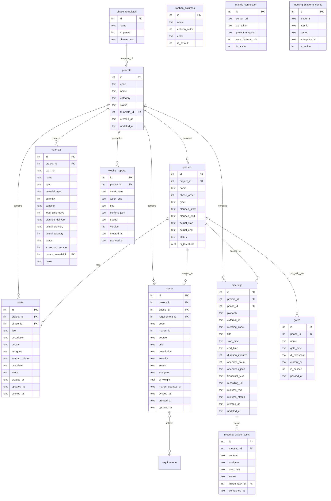

# HPM 系统架构设计

> 基准：`docs/PRD.md` v2.0 + `docs/modules/01-06-*.md`  
> 日期：2026-07-07   
> 后续：基础架构搭建 → M1→M6 串行开发

---

## 一、实现方案与框架选型

| 层 | 选型 | 理由 |
|---|------|------|
| **前端框架** | React 18 + Vite 5 | 个人工具，Vite 冷启动快，React+MUI 生态成熟 |
| **UI 库** | MUI 5 (Material UI) | 专业风格组件齐全（DataGrid/Timeline/Gantt 替代方案）|
| **样式辅助** | Tailwind CSS 3 | 补充 MUI 覆盖不到的自定义布局 |
| **路由** | react-router-dom v6 | SPA 标配 |
| **状态管理** | React Context + useReducer | 个人工具无需 Redux，轻量够用 |
| **甘特图** | `@neodrag/gantt` 或自研 SVG | 轻量无依赖 |
| **看板拖拽** | `@dnd-kit/core` | Headless 拖拽库，配合 MUI 卡片 |
| **后端框架** | Express 4 | 生态最大、中间件丰富 |
| **ORM** | `better-sqlite3`（同步 SQLite 驱动）| 个人使用，零配置、无网络依赖 |
| **数据库** | SQLite 3 | 个人工具首选，单文件存储，无需独立服务 |
| **API 风格** | RESTful JSON | 前后端分离标准 |
| **部署** | 待定（候选：本地 Electron 打包 / Vercel+Supabase） |

---

## 二、数据库设计

### 2.1 ER 图（Mermaid）



### 2.2 完整建表 DDL

```sql
-- =====================================================
-- M1 项目进度模块
-- =====================================================

CREATE TABLE phase_templates (
    id INTEGER PRIMARY KEY AUTOINCREMENT,
    name TEXT NOT NULL,
    is_preset INTEGER DEFAULT 0,           -- 1=系统预设不可删
    phases_json TEXT NOT NULL               -- JSON: [{name,order,type(PHASE|GATE),duration_weeks,di_threshold,...}]
);

CREATE TABLE projects (
    id INTEGER PRIMARY KEY AUTOINCREMENT,
    code TEXT NOT NULL,                     -- 项目代号
    name TEXT NOT NULL,                     -- 项目名称
    category TEXT DEFAULT '新品',           -- 新品/OEM/升级/定制/派生/部件引入/独立板卡/机柜机箱/产品维护
    status TEXT DEFAULT '进行中',           -- 进行中/已结项/已归档
    template_id INTEGER REFERENCES phase_templates(id),
    created_at TEXT DEFAULT (datetime('now','localtime')),
    updated_at TEXT DEFAULT (datetime('now','localtime'))
);

CREATE TABLE phases (
    id INTEGER PRIMARY KEY AUTOINCREMENT,
    project_id INTEGER NOT NULL REFERENCES projects(id) ON DELETE CASCADE,
    name TEXT NOT NULL,                     -- 阶段名
    phase_order INTEGER NOT NULL,           -- 阶段序号
    type TEXT DEFAULT 'PHASE',              -- PHASE / GATE
    planned_start TEXT,
    planned_end TEXT,
    actual_start TEXT,
    actual_end TEXT,
    status TEXT DEFAULT '未开始',           -- 未开始/进行中/已完成/已逾期
    di_threshold REAL                       -- DI值门槛（仅GATE类型）
);

CREATE TABLE gates (
    id INTEGER PRIMARY KEY AUTOINCREMENT,
    phase_id INTEGER NOT NULL REFERENCES phases(id) ON DELETE CASCADE,
    name TEXT NOT NULL,                     -- 门禁点名
    gate_type TEXT NOT NULL,                -- TR / DCP / MR / G-O
    di_threshold REAL,
    current_di REAL DEFAULT 0,
    is_passed INTEGER DEFAULT 0,
    passed_at TEXT
);

-- =====================================================
-- M2 待办事项模块
-- =====================================================

CREATE TABLE kanban_columns (
    id INTEGER PRIMARY KEY AUTOINCREMENT,
    name TEXT NOT NULL,                     -- 列名
    column_order INTEGER NOT NULL,          -- 排序
    color TEXT DEFAULT '#1565C0',           -- 顶部色条
    is_default INTEGER DEFAULT 0            -- 预设列不可删
);

CREATE TABLE tasks (
    id INTEGER PRIMARY KEY AUTOINCREMENT,
    project_id INTEGER REFERENCES projects(id) ON DELETE SET NULL,
    phase_id INTEGER REFERENCES phases(id) ON DELETE SET NULL,
    title TEXT NOT NULL,
    description TEXT,
    priority TEXT DEFAULT 'P2',             -- P0 / P1 / P2
    assignee TEXT,                          -- 负责人（字符串）
    kanban_column TEXT DEFAULT '待开始',     -- 所属看板列
    due_date TEXT,
    status TEXT DEFAULT '待开始',           -- 与kanban_column联动
    created_at TEXT DEFAULT (datetime('now','localtime')),
    updated_at TEXT DEFAULT (datetime('now','localtime')),
    deleted_at TEXT                         -- 软删除
);

-- =====================================================
-- M3 故障管理模块
-- =====================================================

CREATE TABLE issues (
    id INTEGER PRIMARY KEY AUTOINCREMENT,
    project_id INTEGER NOT NULL REFERENCES projects(id) ON DELETE CASCADE,
    phase_id INTEGER REFERENCES phases(id) ON DELETE SET NULL,
    requirement_id INTEGER,                 -- 后续关联需求表
    code TEXT NOT NULL UNIQUE,              -- HPM-xxx 或 Mantis-xxxxx
    mantis_id INTEGER,                      -- Mantis Issue ID（NULL=本地缺陷）
    source TEXT DEFAULT 'local',            -- mantis / local
    title TEXT NOT NULL,
    description TEXT,
    severity TEXT DEFAULT 'Minor',          -- Critical / Major / Minor / Trivial
    status TEXT DEFAULT '新建',             -- 新建/处理中/已解决/已关闭
    assignee TEXT,
    di_weight REAL DEFAULT 1.0,             -- Critical=10, Major=3, Minor=1, Trivial=0.1
    mantis_updated_at TEXT,
    synced_at TEXT,
    created_at TEXT DEFAULT (datetime('now','localtime')),
    updated_at TEXT DEFAULT (datetime('now','localtime'))
);

CREATE TABLE mantis_connection (
    id INTEGER PRIMARY KEY AUTOINCREMENT,
    server_url TEXT NOT NULL,
    api_token TEXT NOT NULL,                -- 加密存储
    project_mapping TEXT,                   -- JSON: [{mantis_id, hpm_project_id}]
    sync_interval_min INTEGER DEFAULT 30,
    is_active INTEGER DEFAULT 1
);

-- =====================================================
-- M4 物料管理模块
-- =====================================================

CREATE TABLE materials (
    id INTEGER PRIMARY KEY AUTOINCREMENT,
    project_id INTEGER NOT NULL REFERENCES projects(id) ON DELETE CASCADE,
    part_no TEXT NOT NULL,                  -- 料号
    name TEXT NOT NULL,                     -- 物料名称
    spec TEXT,                              -- 规格
    material_type TEXT DEFAULT '开发',       -- 通用/开发/包材
    quantity INTEGER DEFAULT 1,
    supplier TEXT,
    lead_time_days INTEGER,                 -- 备料周期（天）
    planned_delivery TEXT,                  -- 计划交期
    actual_delivery TEXT,                   -- 实际到货日期
    actual_quantity INTEGER,
    status TEXT DEFAULT '待下单',           -- 待下单/已下单/在途/已到货/已逾期
    is_second_source INTEGER DEFAULT 0,     -- 是否Second Source
    parent_material_id INTEGER REFERENCES materials(id) ON DELETE SET NULL,
    notes TEXT,
    created_at TEXT DEFAULT (datetime('now','localtime')),
    updated_at TEXT DEFAULT (datetime('now','localtime'))
);

-- =====================================================
-- M5 会议纪要模块
-- =====================================================

CREATE TABLE meeting_platform_config (
    id INTEGER PRIMARY KEY AUTOINCREMENT,
    platform TEXT NOT NULL UNIQUE,           -- tencent / quanshi
    app_id TEXT,
    secret TEXT,                            -- 加密存储
    enterprise_id TEXT,
    is_active INTEGER DEFAULT 0
);

CREATE TABLE meetings (
    id INTEGER PRIMARY KEY AUTOINCREMENT,
    project_id INTEGER REFERENCES projects(id) ON DELETE SET NULL,
    phase_id INTEGER REFERENCES phases(id) ON DELETE SET NULL,
    platform TEXT DEFAULT 'manual',         -- tencent / quanshi / manual
    external_id TEXT,                       -- 外部系统会议ID
    meeting_code TEXT,                      -- 会议号
    title TEXT NOT NULL,
    start_time TEXT,
    end_time TEXT,
    duration_minutes INTEGER,
    attendee_count INTEGER,
    attendees_json TEXT,                    -- JSON: [{name,email,join_time,leave_time,role}]
    transcript_text TEXT,                   -- 转写全文
    recording_url TEXT,                     -- 录制链接
    minutes_text TEXT,                      -- 纪要正文（Markdown）
    minutes_status TEXT DEFAULT '待编写',   -- 待编写/已编写
    created_at TEXT DEFAULT (datetime('now','localtime')),
    updated_at TEXT DEFAULT (datetime('now','localtime'))
);

CREATE TABLE meeting_action_items (
    id INTEGER PRIMARY KEY AUTOINCREMENT,
    meeting_id INTEGER NOT NULL REFERENCES meetings(id) ON DELETE CASCADE,
    content TEXT NOT NULL,                  -- 决议内容
    assignee TEXT,
    due_date TEXT,
    status TEXT DEFAULT '待处理',           -- 待处理/已完成
    linked_task_id INTEGER REFERENCES tasks(id) ON DELETE SET NULL,
    completed_at TEXT
);

-- =====================================================
-- M6 周报模块
-- =====================================================

CREATE TABLE weekly_reports (
    id INTEGER PRIMARY KEY AUTOINCREMENT,
    project_id INTEGER REFERENCES projects(id) ON DELETE CASCADE,
    week_start TEXT NOT NULL,               -- 周一 ISO8601
    week_end TEXT NOT NULL,                 -- 周日 ISO8601
    title TEXT,
    content_json TEXT NOT NULL,             -- 六板块结构化JSON
    status TEXT DEFAULT '草稿',             -- 草稿/已定稿
    version INTEGER DEFAULT 1,
    created_at TEXT DEFAULT (datetime('now','localtime')),
    updated_at TEXT DEFAULT (datetime('now','localtime'))
);

-- =====================================================
-- 索引
-- =====================================================
CREATE INDEX idx_phases_project ON phases(project_id, phase_order);
CREATE INDEX idx_tasks_project ON tasks(project_id);
CREATE INDEX idx_tasks_due ON tasks(due_date) WHERE deleted_at IS NULL;
CREATE INDEX idx_issues_project ON issues(project_id, status);
CREATE INDEX idx_issues_mantis ON issues(mantis_id);
CREATE INDEX idx_materials_project ON materials(project_id, status);
CREATE INDEX idx_materials_delivery ON materials(planned_delivery);
CREATE INDEX idx_meetings_project ON meetings(project_id);
CREATE INDEX idx_meetings_time ON meetings(start_time);
CREATE INDEX idx_weekly_reports_project ON weekly_reports(project_id, week_start);
```

---

## 三、API 路由全景

**Base URL**: `/api`

| Method | Path | 模块 | 说明 |
|--------|------|:--:|------|
| GET | /projects | M1 | 项目列表（?status=&category=&search=） |
| POST | /projects | M1 | 创建项目 |
| GET | /projects/:id | M1 | 项目详情 |
| PUT | /projects/:id | M1 | 更新项目 |
| DELETE | /projects/:id | M1 | 归档（软删除） |
| GET | /templates | M1 | 流程模板列表 |
| GET | /projects/:id/phases | M1 | 项目阶段列表 |
| PUT | /projects/:id/phases | M1 | 批量更新阶段 |
| PUT | /projects/:id/phases/:pid | M1 | 更新单个阶段 |
| POST | /projects/:id/gates/:gid/check | M1 | 门禁条件检查 |
| POST | /projects/:id/gates/:gid/pass | M1 | 手动通过门禁 |
| GET | /tasks | M2 | 任务列表（?project=&phase=&priority=&assignee=&status=） |
| POST | /tasks | M2 | 创建任务 |
| GET | /tasks/:id | M2 | 任务详情 |
| PUT | /tasks/:id | M2 | 更新任务 |
| DELETE | /tasks/:id | M2 | 软删除 |
| PUT | /tasks/batch | M2 | 批量更新 |
| GET | /tasks/overdue | M2 | 逾期任务 |
| GET | /kanban-columns | M2 | 看板列配置 |
| PUT | /kanban-columns | M2 | 更新列配置 |
| GET | /issues | M3 | 缺陷列表（?project=&phase=&severity=&status=&source=&search=） |
| POST | /issues | M3 | 创建本地缺陷 |
| GET | /issues/:id | M3 | 缺陷详情 |
| PUT | /issues/:id | M3 | 更新缺陷 |
| POST | /issues/:id/push-to-mantis | M3 | 推送至 Mantis |
| GET | /issues/di-summary | M3 | DI 汇总 |
| POST | /mantis/sync | M3 | 手动触发同步 |
| GET | /mantis/sync-status | M3 | 同步状态 |
| GET | /mantis/connection | M3 | 连接配置 |
| PUT | /mantis/connection | M3 | 更新连接 |
| GET | /materials | M4 | 物料列表（?project=&type=&status=&search=） |
| POST | /materials | M4 | 创建物料 |
| POST | /materials/batch | M4 | 批量导入 |
| GET | /materials/:id | M4 | 物料详情 |
| PUT | /materials/:id | M4 | 更新物料（含到货确认） |
| DELETE | /materials/:id | M4 | 软删除 |
| GET | /materials/overdue | M4 | 逾期物料 |
| GET | /materials/stats | M4 | 物料统计 |
| GET | /meetings | M5 | 会议列表（?project=&platform=&status=&from=&to=） |
| POST | /meetings | M5 | 手动创建会议 |
| GET | /meetings/:id | M5 | 会议详情（含决议项） |
| PUT | /meetings/:id | M5 | 更新纪要 |
| POST | /meetings/sync | M5 | 触发平台同步 |
| GET | /meetings/sync-status | M5 | 同步状态 |
| POST | /meetings/:id/action-items | M5 | 添加决议项 |
| PUT | /meetings/:id/action-items/:aid | M5 | 更新决议项 |
| POST | /meetings/:id/action-items/:aid/convert | M5 | 决议→M2待办 |
| GET | /meeting-config | M5 | 平台配置 |
| PUT | /meeting-config | M5 | 更新配置 |
| POST | /weekly-reports/generate | M6 | 生成周报 |
| GET | /weekly-reports | M6 | 周报列表 |
| GET | /weekly-reports/:id | M6 | 周报详情 |
| PUT | /weekly-reports/:id | M6 | 更新周报 |
| GET | /weekly-reports/:id/versions | M6 | 版本历史 |
| GET | /weekly-reports/:id/versions/:v | M6 | 指定版本 |

---

## 四、前端路由与组件树

### 4.1 路由结构（react-router-dom v6）

```
/                           → 仪表盘 DashboardPage
/projects/:id               → 项目详情 ProjectDetailPage
/projects/:id/phases        → 阶段管理 PhaseManagePage
/projects/:id/tasks         → 待办看板 TaskKanbanPage
/projects/:id/issues        → 故障列表 IssueListPage
/projects/:id/materials     → 物料管理 MaterialListPage
/projects/:id/meetings      → 会议台账 MeetingListPage
/projects/:id/weekly        → 周报 WeeklyReportPage
/projects/new               → 新建项目 CreateProjectPage
```

### 4.2 组件树

```
App
├── Layout
│   ├── Sidebar (迷你侧边栏：仪表盘/项目列表/+新建项目)
│   └── <Outlet />
│
├── DashboardPage
│   ├── StatsBar (统计卡片：项目总数/进行中/高风险/逾期物料)
│   ├── ProjectCardGrid
│   │   └── ProjectCard * N
│   │       ├── ProgressRing (进度圆环)
│   │       └── RiskBadge (风险色标)
│   └── FilterBar (状态/类别筛选+搜索)
│
├── ProjectDetailPage
│   ├── ProjectHeader (代号/名称/类别/状态/编辑按钮)
│   ├── PhaseTimeline (阶段时间线-纵向地铁图)
│   │   └── PhaseNode * N (阶段节点：名称/日期/状态色/门禁图标)
│   ├── GateCheckPanel (门禁检查面板)
│   └── TabNavigator
│       ├── PhaseTasks (当前阶段任务列表)
│       ├── IssueSummary (故障摘要卡片)
│       ├── MaterialSummary (物料摘要卡片)
│       └── MeetingSummary (会议摘要卡片)
│
├── TaskKanbanPage
│   ├── KanbanFilterBar (项目/阶段/优先级/负责人筛选)
│   └── KanbanBoard
│       ├── KanbanColumn * N (可拖拽列)
│       │   ├── ColumnHeader (列名+任务数+添加按钮)
│       │   └── TaskCard * N (可拖拽卡片)
│       │       ├── PriorityChip (P0红/P1橙/P2蓝)
│       │       ├── DueDateLabel (截止日期+逾期标记)
│       │       └── ProjectTag (项目标签)
│   └── TaskDrawer (侧边栏：创建/编辑任务表单)
│
├── IssueListPage
│   ├── IssueFilterBar
│   ├── IssueTable (MUI DataGrid)
│   │   ├── SeverityChip
│   │   ├── SourceBadge (Mantis/本地)
│   │   └── StatusChip
│   ├── DIStatsPanel (DI值仪表板-折叠面板)
│   │   ├── DIGauge (当前DI vs 阈值)
│   │   ├── DITrendChart (趋势折线图)
│   │   └── DIBySeverityPie (按严重度分布)
│   └── IssueDrawer
│
├── MaterialListPage
│   ├── MaterialFilterBar
│   ├── MaterialTable
│   │   ├── DeliveryStatusChip (交期状态色标)
│   │   └── OverdueBadge (逾期红标)
│   ├── MaterialDrawer
│   └── BatchImportDialog (批量导入对话框)
│
├── MeetingListPage
│   ├── MeetingFilterBar
│   ├── MeetingTable
│   │   ├── PlatformBadge (腾讯/全时/手动)
│   │   └── MinutesStatusChip
│   └── MeetingDrawer
│       ├── MinutesEditor (Markdown 编辑区)
│       ├── AttendeeList (参会人列表)
│       ├── TranscriptSection (转写文本折叠区)
│       ├── ActionItemList (决议项列表)
│       └── ActionItemForm (添加决议项)
│
├── WeeklyReportPage
│   ├── WeekSelector (周范围选择器+项目选择器)
│   ├── GenerateButton (生成周报按钮)
│   ├── ReportEditor (六个板块的Markdown编辑区)
│   │   ├── SectionEditor * 6
│   └── ReportHistory (历史版本列表)
│
└── CreateProjectPage
    └── StepperForm (Step1基本信息→Step2选模板→Step3确认)
```

---

## 五、项目目录结构

```
hpm/
├── client/                          # 前端 Vite + React
│   ├── public/
│   ├── src/
│   │   ├── main.jsx                # 入口
│   │   ├── App.jsx                 # 路由 + Layout
│   │   ├── api/                    # API 请求封装
│   │   │   └── client.js           # axios/fetch 实例 + 拦截器
│   │   ├── pages/                  # 页面级组件
│   │   │   ├── DashboardPage.jsx
│   │   │   ├── ProjectDetailPage.jsx
│   │   │   ├── TaskKanbanPage.jsx
│   │   │   ├── IssueListPage.jsx
│   │   │   ├── MaterialListPage.jsx
│   │   │   ├── MeetingListPage.jsx
│   │   │   ├── WeeklyReportPage.jsx
│   │   │   └── CreateProjectPage.jsx
│   │   ├── components/             # 可复用组件
│   │   │   ├── layout/
│   │   │   │   ├── Sidebar.jsx
│   │   │   │   └── Layout.jsx
│   │   │   ├── project/
│   │   │   │   ├── ProjectCard.jsx
│   │   │   │   ├── PhaseTimeline.jsx
│   │   │   │   └── GateCheckPanel.jsx
│   │   │   ├── task/
│   │   │   │   ├── KanbanBoard.jsx
│   │   │   │   ├── KanbanColumn.jsx
│   │   │   │   ├── TaskCard.jsx
│   │   │   │   └── TaskDrawer.jsx
│   │   │   ├── issue/
│   │   │   │   ├── IssueTable.jsx
│   │   │   │   ├── IssueDrawer.jsx
│   │   │   │   └── DIStatsPanel.jsx
│   │   │   ├── material/
│   │   │   │   ├── MaterialTable.jsx
│   │   │   │   └── BatchImportDialog.jsx
│   │   │   ├── meeting/
│   │   │   │   ├── MeetingTable.jsx
│   │   │   │   ├── MeetingDrawer.jsx
│   │   │   │   └── MinutesEditor.jsx
│   │   │   ├── weekly/
│   │   │   │   └── ReportEditor.jsx
│   │   │   └── shared/
│   │   │       ├── FilterBar.jsx
│   │   │       ├── StatusChip.jsx
│   │   │       └── ConfirmDialog.jsx
│   │   ├── hooks/                  # 自定义 hooks
│   │   │   ├── useProjects.js
│   │   │   ├── useTasks.js
│   │   │   ├── useIssues.js
│   │   │   └── useMaterials.js
│   │   ├── context/                # React Context
│   │   │   └── AppContext.jsx       # 全局状态（当前项目、筛选条件）
│   │   └── utils/
│   │       ├── date.js             # 日期格式化/周计算
│   │       └── di.js               # DI 值计算
│   ├── index.html
│   ├── vite.config.js
│   ├── tailwind.config.js
│   └── package.json
│
├── server/                          # 后端 Express
│   ├── src/
│   │   ├── index.js                # 入口：Express app + 中间件 + 路由挂载
│   │   ├── db.js                   # SQLite 初始化 + better-sqlite3
│   │   ├── routes/                 # 路由模块
│   │   │   ├── projects.js
│   │   │   ├── tasks.js
│   │   │   ├── issues.js
│   │   │   ├── materials.js
│   │   │   ├── meetings.js
│   │   │   └── weekly-reports.js
│   │   ├── middleware/
│   │   │   ├── errorHandler.js
│   │   │   └── validate.js
│   │   └── adapters/               # 外部系统适配器（预留）
│   │       ├── mantis.js
│   │       ├── tencent-meeting.js
│   │       └── quanshi-meeting.js
│   └── package.json
│
├── docs/                            # 项目文档
│   ├── PRD.md
│   ├── architecture.md
│   └── modules/
│       └── 01-06-*.md
│
├── .gitignore
└── README.md
```

---

## 六、任务列表（有序，含依赖）

| # | 任务 | 模块 | 依赖 | 说明 |
|:--:|------|:--:|:--:|------|
| **T0** | 基础架构搭建 | 全局 | — | Vite+React 脚手架 + Express 骨架 + SQLite 初始化 + 目录结构 |
| T0.1 | `client/` Vite+React+MUI+Tailwind 初始化 | 全局 | — | `npm create vite`, 安装依赖, 配置 Tailwind+MUI 主题 |
| T0.2 | `server/` Express 初始化 + SQLite 连接 | 全局 | — | Express + better-sqlite3 + CORS + 错误处理中间件 |
| T0.3 | 全部 14 张表 DDL 执行 | 全局 | T0.2 | 在 SQLite 中执行建表 + 索引 |
| T0.4 | 预置曙光流程模板数据 | M1 | T0.3 | 插入 phase_templates 的 is_preset=1 记录 |
| T0.5 | 前端 Layout + 路由骨架 | 全局 | T0.1 | Sidebar + Outlet + 8 条路由 + 空占位页面 |
| **T1** | M1 项目进度模块 | M1 | T0 | — |
| T1.1 | `server/routes/projects.js` CRUD | M1 | T0.3 | 项目 CRUD + 模板列表 + 阶段 CRUD API |
| T1.2 | `pages/DashboardPage.jsx` | M1 | T0.5 | 项目卡片网格 + 统计栏 + 筛选 |
| T1.3 | `components/project/ProjectCard.jsx` | M1 | T1.2 | 卡片：代号/进度环/风险色标 |
| T1.4 | `pages/CreateProjectPage.jsx` | M1 | T1.2 | 三步表单（基本信息→模板→确认） |
| T1.5 | `pages/ProjectDetailPage.jsx` | M1 | T1.1 | 项目详情+阶段时间线 |
| T1.6 | `components/project/PhaseTimeline.jsx` | M1 | T1.5 | 纵向地铁线 + 阶段节点 |
| T1.7 | `components/project/GateCheckPanel.jsx` | M1 | T1.5 | 门禁检查+DI 比对 |
| T1.8 | 甘特图视图 | M1 | T1.5 | Gantt 组件（委托 P1，先占位） |
| **T2** | M2 待办事项模块 | M2 | T1 | — |
| T2.1 | `server/routes/tasks.js` CRUD | M2 | T0.3 | 任务 CRUD + 看板列 + 逾期查询 API |
| T2.2 | `pages/TaskKanbanPage.jsx` | M2 | T0.5 | 看板页布局 + 筛选栏 |
| T2.3 | `components/task/KanbanBoard.jsx` | M2 | T2.2 | 多列拖拽容器（@dnd-kit） |
| T2.4 | `components/task/TaskCard.jsx` | M2 | T2.3 | 可拖拽卡片 + 优先级色标 + 截止日期 |
| T2.5 | `components/task/TaskDrawer.jsx` | M2 | T2.2 | 创建/编辑表单侧边栏 |
| **T3** | M3 故障管理模块 | M3 | T1 | — |
| T3.1 | `server/routes/issues.js` CRUD | M3 | T0.3 | 缺陷 CRUD + DI 汇总 API |
| T3.2 | `server/adapters/mantis.js` | M3 | T3.1 | Mantis 适配器（全量拉取+增量同步） |
| T3.3 | `pages/IssueListPage.jsx` | M3 | T0.5 | 缺陷列表页 + 筛选 |
| T3.4 | `components/issue/IssueTable.jsx` | M3 | T3.3 | MUI DataGrid 表格 |
| T3.5 | `components/issue/DIStatsPanel.jsx` | M3 | T3.3 | DI 仪表板（仪表+趋势+分布） |
| T3.6 | `components/issue/IssueDrawer.jsx` | M3 | T3.3 | 缺陷详情/编辑 |
| **T4** | M4 物料管理模块 | M4 | T1 | — |
| T4.1 | `server/routes/materials.js` CRUD | M4 | T0.3 | 物料 CRUD + 批量导入 + 统计 API |
| T4.2 | `pages/MaterialListPage.jsx` | M4 | T0.5 | 物料列表页 + 筛选 |
| T4.3 | `components/material/MaterialTable.jsx` | M4 | T4.2 | 物料表格 + 交期色标 |
| T4.4 | `components/material/BatchImportDialog.jsx` | M4 | T4.2 | CSV 粘贴批量导入 |
| **T5** | M5 会议纪要模块 | M5 | T1 | — |
| T5.1 | `server/routes/meetings.js` CRUD | M5 | T0.3 | 会议 CRUD + 决议项 API |
| T5.2 | `server/adapters/tencent-meeting.js` | M5 | T5.1 | 腾讯会议适配器 |
| T5.3 | `server/adapters/quanshi-meeting.js` | M5 | T5.1 | 全时会议适配器 |
| T5.4 | `pages/MeetingListPage.jsx` | M5 | T0.5 | 会议台账页 |
| T5.5 | `components/meeting/MeetingDrawer.jsx` | M5 | T5.4 | 详情侧边栏（纪要编辑+决议+转写） |
| T5.6 | `components/meeting/MinutesEditor.jsx` | M5 | T5.5 | Markdown 编辑器 |
| **T6** | M6 周报模块 | M6 | T2,T3,T4,T5 | — |
| T6.1 | `server/routes/weekly-reports.js` | M6 | T0.3 | 周报 CRUD + 生成 + 版本 API |
| T6.2 | `pages/WeeklyReportPage.jsx` | M6 | T0.5 | 周报页面 |
| T6.3 | `components/weekly/ReportEditor.jsx` | M6 | T6.2 | 六板块 Markdown 编辑 |
| **T7** | 全局联调 + 边界处理 | 全局 | T1-T6 | 错误处理/空状态/加载态/路由守卫 |

---

## 七、依赖包清单

### 前端 `client/package.json`

```json
{
  "dependencies": {
    "react": "^18.3.1",
    "react-dom": "^18.3.1",
    "react-router-dom": "^6.23.0",
    "@mui/material": "^5.15.0",
    "@mui/icons-material": "^5.15.0",
    "@mui/x-data-grid": "^7.0.0",
    "@mui/x-charts": "^7.0.0",
    "@emotion/react": "^11.11.0",
    "@emotion/styled": "^11.11.0",
    "@dnd-kit/core": "^6.1.0",
    "@dnd-kit/sortable": "^8.0.0",
    "axios": "^1.7.0",
    "dayjs": "^1.11.0",
    "react-markdown": "^9.0.0"
  },
  "devDependencies": {
    "@vitejs/plugin-react": "^4.3.0",
    "vite": "^5.4.0",
    "tailwindcss": "^3.4.0",
    "autoprefixer": "^10.4.0",
    "postcss": "^8.4.0"
  }
}
```

### 后端 `server/package.json`

```json
{
  "dependencies": {
    "express": "^4.19.0",
    "better-sqlite3": "^11.0.0",
    "cors": "^2.8.5",
    "morgan": "^1.10.0",
    "axios": "^1.7.0",
    "joi": "^17.13.0"
  },
  "devDependencies": {
    "nodemon": "^3.1.0"
  }
}
```

---

## 八、共享知识（跨文件约定）

### 8.1 API 响应格式

```json
// 成功
{ "ok": true, "data": { ... } }

// 列表
{ "ok": true, "data": [...], "total": 42 }

// 错误
{ "ok": false, "error": "描述信息", "code": "VALIDATION_ERROR" }
```

### 8.2 日期格式

全部 API 传输使用 ISO8601 字符串（`"2026-07-07"` 或 `"2026-07-07T10:30:00"`）。数据库存储使用 TEXT 类型。前端展示使用 `dayjs` 格式化。

### 8.3 状态枚举

| 领域 | 枚举值 |
|------|--------|
| 项目类别 | 新品, OEM, 升级, 定制, 派生, 部件引入, 独立板卡, 机柜机箱, 产品维护 |
| 项目状态 | 进行中, 已结项, 已归档 |
| 阶段状态 | 未开始, 进行中, 已完成, 已逾期 |
| 任务优先级 | P0, P1, P2 |
| 缺陷严重度 | Critical, Major, Minor, Trivial |
| 缺陷状态 | 新建, 处理中, 已解决, 已关闭 |
| 物料类型 | 通用, 开发, 包材 |
| 物料状态 | 待下单, 已下单, 在途, 已到货, 已逾期 |
| 会议平台 | tencent, quanshi, manual |

### 8.4 软删除约定

- `tasks` 表：`deleted_at` 字段（NULL=未删除）
- `projects` 表：`status = '已归档'`（不物理删除，30天后可彻底清理）
- 物料/缺陷/会议/周报：不实现软删除，直接物理删除（确认提示）

### 8.5 DI 值计算约定

```js
// DI = SUM(未关闭缺陷的 di_weight)
const DI_WEIGHTS = { Critical: 10, Major: 3, Minor: 1, Trivial: 0.1 };

// 按项目+阶段统计
SELECT phase_id, SUM(di_weight) as current_di 
FROM issues WHERE project_id=? AND status NOT IN ('已关闭')
GROUP BY phase_id;
```

### 8.6 颜色系统（MUI Theme）

```js
// 主色
primary: { main: '#1565C0' }        // 深蓝
// 状态色
success: { main: '#2E7D32' }        // 绿色(正常)
warning: { main: '#ED6C02' }        // 橙色(临期/警告)
error:   { main: '#D32F2F' }        // 红色(逾期/严重)
// 优先级
P0: '#D32F2F'  P1: '#ED6C02'  P2: '#1565C0'
```

---

> **架构版本**: v1.0 | **下次更新**: 任一模块开发完成/技术栈变更时。
