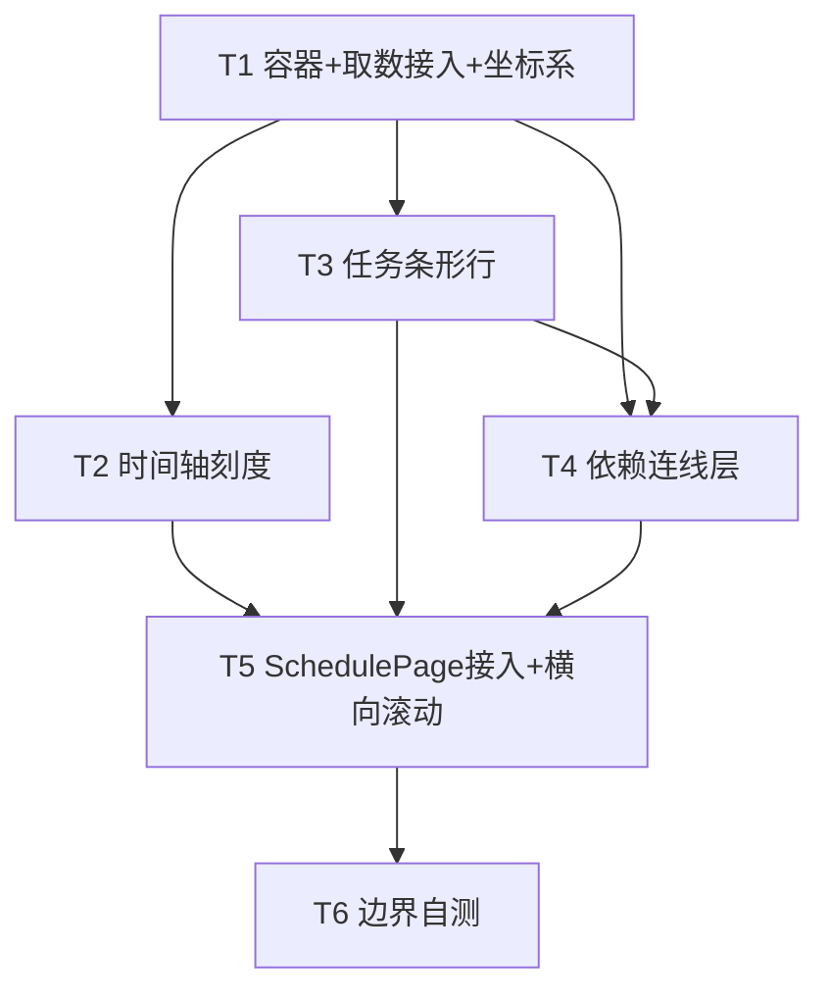

# 项目计划页甘特图（增量设计 + 任务分解）

> 作者：高见远（software-architect）　|　团队：software-gantt　|　类型：前端增量，无需改后端 / 数据模型
> 目标：在「项目计划」页排期表（`<ScheduleTable>`）**下方**，基于现有 `schedule_tasks` 排期数据，渲染一张**只读**甘特图，体现任务间的 **FS（完成→开始）依赖关系**。

---

## 一、实现方案 + 框架选型

**结论：零新增依赖，使用 `dayjs` + `@mui/material` + 纯 SVG/CSS 自绘横向时间轴。**

| 维度 | 选型 | 理由 |
|------|------|------|
| 日期计算 | `dayjs`（项目已装 `^1.11`） | 与现有 `utils/schedule-date.js` 一致；算日期差、取月/周分段、边界留白都用 dayjs |
| 布局 / 样式 | `@mui/material`（Box / Stack / Tooltip / Typography） | 项目已装；用于容器、任务名列、悬浮提示、空态（复用 `common/EmptyState.jsx`），风格与现有页面统一 |
| 条形 + 连线 | 纯 SVG + CSS | 条形用 `div`/SVG `rect`，依赖箭头用一层绝对定位 SVG `path` + `marker`；SVG 对折线/箭头/今天线控制力最强，且体积小 |
| 甘特库 | **不引入**（frappe-gantt / gantt-task-react / dhtmlx） | ① 本期只读，自绘足够；② 第三方库 API 约束 + 样式覆盖成本高、与 MUI 风格割裂、体积增大；③ 依赖关系已是定制字段（`predecessor_ids` 字符串 + FS 解释），自绘更贴合 |

**复用（不修改）**：`api.schedule.list(projectId)`、`utils/schedule-date.js`（`toDayjs` / `fmtDate` / `calcCompletionStatus` / `detectCycle` / `JSON.parse(predecessor_ids)` 范式）、`ScheduleTable.jsx`、`server/src/routes/schedule.js` 的禁用约束（本期只读，不触发）。

**架构模式**：展示型容器组件 `GanttChart` + 3 个职责单一子组件（时间轴 / 条形行 / 依赖连线层）。`GanttChart` 为**纯展示组件**，数据由 `SchedulePage` 已取好的 `tasks` 通过 props 传入（不在组件内重新发请求）。

---

## 二、文件清单及相对路径

| 操作 | 文件路径 | 职责 | 拆分说明 |
|------|----------|------|----------|
| 新增 | `client/src/components/schedule/GanttChart.jsx` | 主容器：接收 `tasks`，计算时间轴范围 / 行映射 / 绘图模型，组合子组件，外层横向滚动 | 必拆 |
| 新增 | `client/src/components/schedule/GanttTimeline.jsx` | 双行表头（月 + 周）刻度 + 竖向网格线 | 必拆 |
| 新增 | `client/src/components/schedule/GanttRow.jsx` | 单行：左侧任务名（depth 缩进）+ 右侧时间轴内条形（着色 / hover Tooltip） | 必拆 |
| 新增 | `client/src/components/schedule/GanttLinks.jsx` | 绝对定位 SVG 层：解析 `predecessor_ids`，画 FS 依赖箭头折线 | 必拆 |
| 修改 | `client/src/pages/SchedulePage.jsx` | 在 **第 459 行 `<ScheduleTable>` 之后**插入 `<GanttChart tasks={tasks} />`，并包一层横向滚动容器 | 仅插入，不重构 |
| 不改 | `client/src/api/client.js`、`client/src/utils/schedule-date.js`、`client/src/components/schedule/ScheduleTable.jsx`、后端全部 | 直接复用 | — |

**子组件拆分理由**：时间轴（刻度/网格）、条形行（高频逐行渲染）、依赖连线（SVG 叠加层）三者关注点不同，拆分后各自易测、易调；主组件只做"数据→绘图模型"的转换与编排。

---

## 三、数据结构 / 接口契约

### 3.1 `GanttChart` props

```ts
// GanttChart 仅接收这一个 props，数据来自 SchedulePage 已取好的数组
GanttChartProps {
  tasks: TaskDTO[]      // = api.schedule.list(projectId).data（扁平、按 task_order 深度优先排序）
}

// TaskDTO —— 字段直接来自后端 schedule 接口，无需映射
TaskDTO {
  id: number
  name: string
  planned_start: string        // YYYY-MM-DD
  planned_end: string          // YYYY-MM-DD
  duration_days: number
  depth: number                // 树形层级（后端路由追加）
  predecessor_ids: string      // JSON 数组「字符串」，如 "[1,3]" —— 必须 JSON.parse
  task_type: '阶段任务' | '普通任务' | '节点任务'
  completion_status: '已完成' | '进行中' | '未开始'
  bg_color: string | null
  is_locked: number
}
```

### 3.2 内部绘图模型（主组件 `useMemo` 计算一次）

```ts
GanttRowModel {            // 每行一条
  id: number
  name: string
  depth: number
  taskType: string
  status: string
  bgColor: string | null
  rowIndex: number        // 行号 = tasks 扁平顺序下标（0 基），复用后端排序
  startDate: Dayjs        // toDayjs(planned_start)
  endDate: Dayjs          // toDayjs(planned_end)
  x: number               // 条形左端相对时间轴起点像素 = startDate.diff(timelineStart,'day') * DAY_WIDTH
  width: number           // = duration_days * DAY_WIDTH（首尾工期，见 4.4）
  color: string           // 取色：bg_color 优先，否则按 status 映射（见第七节）
}

GanttLinkModel {          // 每条有效依赖一条
  fromId: number
  toId: number
  fromRowIndex: number
  toRowIndex: number
  fromX: number           // 前置条形右端 = rowModels[from].x + rowModels[from].width
  fromY: number           // = fromRowIndex * ROW_HEIGHT + ROW_HEIGHT/2
  toX: number             // 后继条形左端 = rowModels[to].x
  toY: number             // = toRowIndex * ROW_HEIGHT + ROW_HEIGHT/2
}
```

### 3.3 行号映射

后端已按 `task_order` 深度优先返回扁平数组，因此 **`rowIndex = 数组下标`**，天然保持树形顺序；同时建 `id -> rowIndex` 的 `Map`，供依赖连线 O(1) 查行号。

---

## 四、核心算法（工程师照做）

### 4.1 绘图常量（集中定义在 `GanttChart.jsx` 顶部）

| 常量 | 值 | 说明 |
|------|----|------|
| `DAY_WIDTH` | `24` | 每天像素宽 |
| `ROW_HEIGHT` | `36` | 每行高 |
| `BAR_HEIGHT` | `22` | 条形高（垂直居中于行） |
| `HEADER_HEIGHT` | `48` | 双行表头（月 24 + 周 24） |
| `NAME_COL_WIDTH` | `220` | 左侧任务名列宽（与 ScheduleTable name 列对齐） |
| `PAD_DAYS` | `3` | 时间轴两端留白天数 |
| `ARROW_GAP` | `12` | 连线从条形端点外扩的水平距离，避免压住条形 |
| `TODAY_COLOR` | `#ef4444` | 今天线颜色 |

### 4.2 时间轴范围

1. 收集 `starts = tasks.map(t => toDayjs(t.planned_start)).filter(valid)`，`ends = tasks.map(t => toDayjs(t.planned_end)).filter(valid)`。
2. `minStart = min(starts)`，`maxEnd = max(ends)`。
3. `timelineStart = minStart.subtract(PAD_DAYS, 'day')`；`timelineEnd = maxEnd.add(PAD_DAYS, 'day')`。
   - （可选增强：对齐月初/月末 `timelineStart.startOf('month')`、`timelineEnd.endOf('month')`，首版用固定 PAD 即可。）
4. `totalDays = timelineEnd.diff(timelineStart, 'day') + 1`；`chartWidth = totalDays * DAY_WIDTH`；`chartHeight = tasks.length * ROW_HEIGHT`。
5. **空态**：`tasks.length === 0` → 直接渲染 `EmptyState`（文案"暂无排期，生成或导入排期后查看甘特图"），不渲染时间轴。

### 4.3 刻度与网格（`GanttTimeline`）

- **月行（上行）**：从 `timelineStart` 到 `timelineEnd` 按月分段，每段宽度 = 该月实际天数 × `DAY_WIDTH`，label = `${y}年${m}月`（zh-cn）；每月起始处画一条竖向**粗**网格线。
- **周行（下行）**：按"周一"为界分段（dayjs `.startOf('isoWeek')`），每段 label = 该周周一的 `DD` 或 `W{n}`；每周起始画竖向**细**网格线；每日也可补更细的浅线（可选）。
- **水平网格**：每行画一条浅色横线（`borderTop`），行底色奇偶微差以提升可读性。
- 表头两行 `position: sticky; top: 0`，随纵向滚动固定。

### 4.4 条形定位（`GanttRow`）

- `x(task) = toDayjs(task.planned_start).diff(timelineStart, 'day') * DAY_WIDTH`
- `width(task) = task.duration_days * DAY_WIDTH`
  - 一致性校验：现有规则 `planned_end = planned_start + (duration_days - 1) 天`（首尾工期）。例 start=第0天、dur=5 → end=第4天，跨 0..4 共 5 列 = `5 * DAY_WIDTH` ✓，与 `schedule-date.js` 完全一致。
- 条形垂直居中：`barTop = HEADER_HEIGHT + rowIndex * ROW_HEIGHT + (ROW_HEIGHT - BAR_HEIGHT) / 2`。
- **左侧任务名列**：宽度 `NAME_COL_WIDTH`，文本按 `depth * 16px` 缩进（与 ScheduleTable 视觉对齐），`position: sticky; left: 0` 随横向滚动固定；`task_type === '阶段任务'` 加粗。
- 条形圆角矩形，填充 `color`；`hover` 显示 `Tooltip`：名称 / 起止 / 工期 / 状态。

### 4.5 依赖箭头（FS 类型，`GanttLinks`）

**解析**：对每个任务 `T`，`preds = JSON.parse(T.predecessor_ids || "[]")`（沿用 `schedule-date.js` 的安全解析范式）。本期**全部按 FS（完成→开始）、lag=0** 解释：`from` = 前置条形右端，`to` = 后继条形左端。

**坐标**（已在 3.2 定义）：`fromX = from.x + from.width`、`fromY = fromRow*ROW_HEIGHT + ROW_HEIGHT/2`、`toX = to.x`、`toY = toRow*ROW_HEIGHT + ROW_HEIGHT/2`。

**折线拐点逻辑（防穿越条形）**：

- **情形 A｜后继在右后方足够远（`toX ≥ fromX + 2*ARROW_GAP`）**：
  - `midX = fromX + ARROW_GAP`
  - 路径：`M fromX,fromY → L midX,fromY → L midX,toY → L toX,toY`
  - 终点箭头朝右（指向 `toX,toY`，即后继条形左端）✓
- **情形 B｜后继在左方 / 重叠（`toX < fromX + 2*ARROW_GAP`，数据异常或反向 FS）**：绕行，从后置任务左端**左侧**进入，避免横穿条形：
  - `detourY = (fromY + toY) / 2`（取两行中线作为绕行通道）
  - 路径：`M fromX,fromY → L (fromX+ARROW_GAP),fromY → L (fromX+ARROW_GAP),detourY → L (toX-ARROW_GAP),detourY → L (toX-ARROW_GAP),toY → L toX,toY`
  - 终点箭头仍朝右（从 `toX` 左侧进入后继左端）✓
- **箭头**：SVG `<marker>` 小三角（`orient="auto"`，填充 `#64748b`），挂载在 path 终点。
- **防御**：逐条 link 校验 `fromId/toId` 均在 `id→rowIndex` Map 中（不存在则跳过）；`pid === T.id`（自依赖）跳过；任一坐标为 `NaN` 跳过。`detectCycle` 已在保存前置时保证无环，渲染层仍做存在性校验兜底。

### 4.6 今天线

- `today = dayjs().startOf('day')`；若 `today` 落在 `[timelineStart, timelineEnd]` 区间内才画。
- `todayX = today.diff(timelineStart, 'day') * DAY_WIDTH`。
- 在时间轴区域画一条 `TODAY_COLOR` 竖向线（`y: 0 → chartHeight`），顶端标"今天"小标签。

---

## 五、任务列表（有序、含依赖、按实现顺序）

> 说明：团队主理人明确枚举 T1–T6，故按 6 个任务交付（超出通用模板的 5 个上限属本任务特意要求）。

| Task | 名称 | 源文件 | 依赖 | 优先级 |
|------|------|--------|------|--------|
| **T1** | 容器与取数接入 + 坐标系骨架 | `GanttChart.jsx`（新增） | 无 | P0 |
| **T2** | 时间轴刻度（月+周双行 + 网格） | `GanttTimeline.jsx`（新增） | T1 | P1 |
| **T3** | 任务条形行（depth 缩进、着色、今天线、Tooltip） | `GanttRow.jsx`（新增） | T1 | P1 |
| **T4** | 依赖连线层（SVG FS 箭头 + 折线 + 防御） | `GanttLinks.jsx`（新增） | T1, T3 | P1 |
| **T5** | SchedulePage 接入 + 横向滚动对齐 | `SchedulePage.jsx`（修改，第 459 行后插入） | T1–T4 | P0 |
| **T6** | 边界自测（空态 / 单任务 / 无依赖 / 循环依赖防御 / 跨月长跨度） | 以上全部 + 手动用例 | T5 | P2 |

**T1 要点**：定义 4.1 全部常量；`useMemo` 算 `timelineStart/End`、`rowModels`（含 `x/width/color`）、`id→rowIndex` Map；空态分支；渲染时把 `timelineStart/DAY_WIDTH/rowModels` 传给 T2/T3，把 `links` 传给 T4。
**T2 要点**：实现 4.3 的月/周分段与网格，接收 `timelineStart/End/DAY_WIDTH`。
**T3 要点**：实现 4.4 定位 + 4.6 今天线；左侧名列 sticky；复用 `calcCompletionStatus` 作状态兜底。
**T4 要点**：实现 4.5 解析与折线（A/B 两种情形）+ 防御。
**T5 要点**：`SchedulePage.jsx` 第 459 行 `<ScheduleTable>` 闭合标签后新增一行 `<GanttChart tasks={tasks} />`；外层包 `<Box sx={{ overflowX: 'auto' }}>` 保证与表格等宽横向滚动。
**T6 要点**：覆盖第八节的边界用例，重点验证循环依赖不崩、无 `predecessor_ids` 不报错、今天线越界不画。

---

## 六、依赖包列表

**无新增依赖。** 全部使用已有：`react`、`@mui/material`、`@mui/x-date-pickers`、`dayjs`、`recharts`（recharts 本期不使用）。

---

## 七、共享知识（跨任务约定）

- **日期**：统一用 `dayjs`；解析用 `toDayjs(str)`（`utils/schedule-date.js` 已导出，取当天零点）。
- **`predecessor_ids` 解析**：`JSON.parse(task.predecessor_ids || "[]")`，得到 `number[]`；解析失败回退 `[]`。
- **每天像素**：`DAY_WIDTH = 24`（全组件统一，改一处即可缩放）。
- **条形宽度**：`width = duration_days * DAY_WIDTH`（首尾工期，与 `schedule-date.js` 一致）。
- **颜色映射**：
  - 优先 `bg_color`（非空即用之）；
  - 否则按 `completion_status`：`已完成 → #22c55e`、`进行中 → #f59e0b`、`未开始 → #93c5fd`（MUI 风格，最终值以设计稿为准）；
  - 阶段任务可加深描边以区分层级。
- **状态兜底**：渲染层可用 `calcCompletionStatus(task, today)` 重算，但优先用后端 `completion_status` 字段。
- **循环依赖**：保存前置时 `detectCycle` 已拦截；渲染层对每条 link 仍做存在性 + 非自依赖校验，防止 `NaN`。

---

## 八、待明确事项 / 本期不做 + 后续增强

**本期不做（明确边界）**：
1. **拖拽改期**：需对接 `api.schedule.update` 并遵守 `server/src/routes/schedule.js`（第 527–544 行）节点任务/阶段任务禁用改起止日期约束；留作后续增强。
2. **SS / FF / SF 依赖类型与 lag**：本期仅 FS、lag=0；其他类型需扩展 `predecessor_ids` 语义。
3. **负责人维度**：数据模型无 `assignee` 字段，本期不展示。
4. 关键路径高亮、基线对比、里程碑（节点任务）菱形样式、导出 PNG/PDF、缩略图 minimap、虚拟滚动。

**后续增强建议**：
- 拖拽改期 + 后端约束联动（只读 → 可编辑）。
- 多依赖类型 + lag 解析与渲染。
- 关键路径算法（最长链高亮）。
- 节点任务用里程碑菱形标记。
- 超长任务列表虚拟滚动；底部 minimap 快速定位。

---

## 九、任务依赖图


