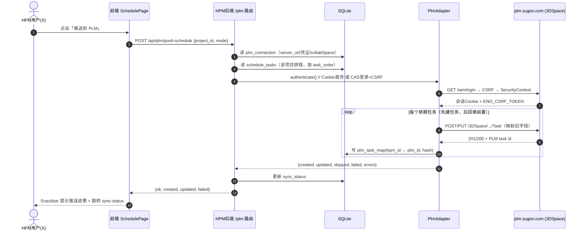

# HPM → 曙光 PLM 项目排程同步：技术可行性评估与技术方案设计

> **评估人**：高见远（HPM 架构师）  
> **日期**：2026-07-11  
> **对象需求**：让 HPM【项目计划】的排程（阶段 / 里程碑 / 甘特图任务）推送到 `plm.sugon.com` 对应的项目排程，实现"改 HPM → PLM 跟着变"。  
> **目标 URL**：`https://plm.sugon.com/3dspace/common/emxNavigator.jsp?collabSpace=GLOBAL`  
> **本报告性质**：架构评估 + 方案设计（不进入编码阶段，不写实现代码）

标注说明：本报告中所有判断均标注 **【已证实】**（来自已读代码/文档或公开可核验资料）或 **【推测】**（基于平台通用特征推断，并注明依据）。

---

## 1. 可行性结论

### Verdict：⚠️ 条件可行（Conditionally Feasible）

| 维度 | 判断 |
|------|------|
| 总体结论 | ⚠️ **条件可行** —— 技术路径明确、且有"零风险降级方案"保底 |
| 最优路线（API 直推）是否可行 | 取决于 3 个前提（见第 4 章），目前**未证实**但**高度可能** |
| 最差情况是否仍可用 | ✅ 是 —— 即使 PLM 完全不开放写接口，仍可走"半自动导出/导入"（路线 D），风险为零 |

**一句话核心约束**：  
> 技术上完全可打通，但能否走"最优的 API 直推路线（路线 A）"，取决于 PLM 是否对 HPM 开放**可写的服务端接口 + 非交互账号**；若开放，方案清晰且稳定；若不开，降级为"导出 Excel/JSON → 人在 PLM 导入"依然 100% 可行。

**关键前置条件（必须成立其一）**：
1. HPM 服务端能网络可达 `plm.sugon.com`（内网/VPN/白名单）；
2. 存在一个可用于服务端调用的 PLM 身份（服务账号 + API 凭证，或复用 SSO Cookie —— **后者已被 Mantis 适配器验证可行**）；
3. PLM 侧"项目排程"对象支持外部创建/更新（REST 或 MQL/SOAP），且字段 schema 可探明。

> **已证实**的利好：HPM 现有 `mantis.js` 适配器已经用"**复用 SSO Cookie**"的方式打通了另一个 SSO 绑定的系统（Mantis），说明"SSO 强绑定域账号"并不必然阻断服务端调用——这把本需求最大的风险点（鉴权）从"高"降到了"中"。

---

## 2. 技术路线对比

> 说明：平台同时保留 **经典 ENOVIA v6 内核**（`emxNavigator.jsp` 是 v6 JSP 导航页）与 **3DEXPERIENCE 前端**（`/3dspace` 是 3DSpace Web 应用），因此下列四条路线在技术上都可能成立，只是代价不同。

| 路线 | 描述 | 实现复杂度 | 稳定性 | 实时性 | 对 PLM 依赖 | 推荐度 |
|:--:|------|:--:|:--:|:--:|:--:|:--:|
| **A. 3DEXPERIENCE 3DSpace REST API 直连** | 用 `axios` 调 `/3DSpace/resources/v1/...`（或 `/3dspace/api/...`），以 `SecurityContext` + `ENO_CSRF_TOKEN` 头创建/更新 Task/Gate/Milestone | 中-高（鉴权流程较绕，但官方、文档化） | **高**（官方 API，版本受控） | **高**（按需即时推送） | 需 PLM 启用 REST 且开放可写 + 服务账号 | ★★★★★（**推荐主线**） |
| **B. ENOVIA v6 MQL / SOAP 桥接** | 经 MQL（Matrix Query Language）或 SOAP Web Service / JPO 在 v6 内核写 WBS 任务；Node 侧用 `soap` 库或经一个轻量 Java 网关 | 高（MQL 低层、需特权；SOAP 需 WSDL/网关） | 中（强大但依赖管理员开 MQL/SOAP 权限） | 高 | 需 MQL/SOAP 端点 + 管理员特权账号 | ★★★★（**A 不可用时的首选兜底**） |
| **C. 浏览器 RPA 自动化** | Playwright/Puppeteer 驱动 `emxNavigator.jsp`，模拟人工在网页上填排程 | 中（脚本开发不难，但选择器脆弱） | **低**（PLM 前端改版即崩，且受登录态影响） | 中（能即时但慢、易超时） | 几乎无（只依赖网页 UI） | ★★（**最后手段**） |
| **D. 半自动导出 / 导入** | HPM 一键导出排期 JSON/Excel → 人在 PLM 手动导入 | **低**（复用已有 export 端点） | **高**（纯文件，零外部依赖） | **低**（非实时，人工触发） | 无 | ★★★（**永远可用的保底 + P0 探针载体**） |

**推荐组合**：
- **主线 = A**（最优，若平台开放可写 REST）；
- **保底 = D**（任何情况下都可交付，且可作为 P0 探针与兜底）；
- **次级兜底 = B**（若 v6 内核开放 MQL/SOAP 但 REST 未启用）；
- **C 仅在 A/B/D 均不可行时考虑**，且应明确标注"脆弱、需专人维护"。

---

## 3. 推荐方案详细设计（路线 A 主线）

### 3.1 新增适配器 `server/src/adapters/plm.js`（参照 `mantis.js` 类结构）

> 设计原则（**已证实**自 `mantis.js`）：从 `plm_connection` 表读连接配置 → `_headers()` 封装鉴权头 → `_get/_post` 封装 `axios` 调用 → `mapError()` 错误映射。  
> 关键差异（**本需求核心难点**）：Mantis 是**只读拉取**（`_get` 分析数据），PLM 是**写入推送**（`_post` 创建/更新对象），因此需要 `authenticate()`（支持 Cookie 直传 *与* CAS 登录两种）+ `createTask/updateTask` + `pushSchedule`，并引入**任务映射表** `plm_task_map` 以支持增量。

**类骨架伪代码（非实现代码）**：

```text
class PlmAdapter {
  // ① 构造：从 SQLite 读 plm_connection
  constructor()
    conn = db.selectOne("SELECT * FROM plm_connection LIMIT 1")
    this.baseUrl    = conn.server_url            // https://plm.sugon.com
    this.authType   = conn.auth_type             // "cookie" | "cas" | "apikey"
    this.credential = conn.api_token            // SSO Cookie 串 / API Key / (CAS用user+pass)
    this.collabSpace = conn.collab_space         // "GLOBAL"
    this.securityCtx = conn.security_context     // 如 "ProjectLeader.Company.GLOBAL"

  // ② 鉴权：返回可复用请求头（两种模式）
  _headers()
    IF authType == "cookie":  return { Cookie: credential, "x-requested-with": "XMLHttpRequest" }
    IF authType == "cas":     return { Cookie: this._casSession, SecurityContext: securityCtx, ENO_CSRF_TOKEN: this._csrf }
    IF authType == "apikey":  return { Authorization: "Bearer " + credential, SecurityContext: securityCtx }

  // ③ CAS 登录 + 取 CSRF（authType=cas 时调用，对标 web 已证实流程）
  async authenticate()
    ticket = GET  {baseUrl}/iam/login?action=get_auth_params   → lt
    POST  {baseUrl}/iam/login  (username,password,lt)          → 设置 CASTGC/会话 Cookie
    csrf  = GET  {baseUrl}/3DSpace/resources/v1/application/CSRF → ENO_CSRF_TOKEN
    缓存 this._casSession / this._csrf（带过期时间）

  // ④ 只读探针：拉取 PLM 某项目的现有排程（P0 摸清结构用）
  async getProjectSchedule(plmProjectId) → List<PlmTask>

  // ⑤ 写：创建单个任务（普通任务/阶段任务/节点任务 映射到 PLM 类型）
  async createTask(plmProjectId, mappedTask) → plmTaskId

  // ⑥ 写：更新单个任务
  async updateTask(plmTaskId, mappedTask) → ok

  // ⑦ 核心：把一个 HPM 项目的排程推到 PLM
  //    mode: "full" 全量(谨慎) | "incremental" 增量(默认)
  //    dry_run: true 只校验/预览不落库（P0/P1 调试用）
  async pushSchedule(hpmProjectId, { mode, dryRun })
    plmProjectId = resolveMapping(hpmProjectId)        // 查 plm_connection.project_mapping
    tasks = db.select("SELECT * FROM schedule_tasks WHERE project_id=? ORDER BY task_order")
    for t in tasks:
      mapped = mapScheduleToPlm(t)                     // 见 3.3 映射表
      existing = db.selectOne("SELECT plm_task_id FROM plm_task_map WHERE hpm_task_id=?", t.id)
      if dryRun: 记录预览; continue
      if !existing:  pid = createTask(plmProjectId, mapped); 写 plm_task_map
      else if hashChanged(t, existing): updateTask(existing.plm_task_id, mapped); 更新 hash
      // 删除的 HPM 任务：标记 PLM 任务为取消态，不硬删
    return { created, updated, skipped, failed, errors[] }

  // ⑧ 连通性自检
  async testConnection() → bool
}
```

### 3.2 新增路由 `server/src/routes/plm.js`

> 完全对齐 `routes/mantis.js` 的"连接配置 CRUD + 同步路由"模式（**已证实**）。

| Method | Path | 说明 |
|--------|------|------|
| GET | `/plm/connection` | 读取 PLM 连接配置（脱敏） |
| PUT | `/plm/connection` | 创建/更新连接（server_url / auth_type / api_token / collab_space / security_context / project_mapping） |
| POST | `/plm/push-schedule` | **核心**：`{ project_id, mode: "full"|"incremental", dry_run?: bool }` → 调 `adapter.pushSchedule()` |
| GET | `/plm/probe` | **P0 探针**：只读拉取 PLM 排程，用于摸清对象 schema（零写入风险） |
| GET | `/plm/sync-status` | 最近一次推送结果（created/updated/failed/时间戳） |
| POST | `/plm/test` | 连通性测试（对标 `mantis.testConnection`） |

> 错误处理沿用 `mapMantisError` 风格：把 `auth_failed / timeout / network / plm_validation` 映射为 401/504/502/400 + 中文消息。

### 3.3 数据映射表：HPM【项目计划】↔ PLM 排程对象

> 左侧为 **【已证实】**（来自 `schedule_tasks` 表定义）；右侧 PLM 字段为 **【推测】**（基于 3DEXPERIENCE/ENOVIA "Project Management / Program Central" 通用对象模型，最终以 P0 探针返回为准）。

| HPM 侧（源） | 类型 | PLM 侧（目标，推测） | 备注 |
|------|------|------|------|
| `projects.code` / `name` | — | PLM Project/Program 对象 | 经 `plm_connection.project_mapping` 解析出 PLM 项目 ID |
| `schedule_tasks.name` | TEXT | Task.**name / title** | 任务名称 |
| `task_type = "普通任务"` | — | Task（叶子任务） | 普通工作项 |
| `task_type = "阶段任务"` | — | Summary Task / WBS 元素 | 聚合型，日期取子任务 MIN/MAX |
| `task_type = "节点任务"` | — | **Gate / Milestone** | 里程碑/评审点（对应 HPM 的 TR/DCP/MR/G-O） |
| `planned_start` | ISO8601 | Task.**Planned Start / Start Date** | 计划开始 |
| `planned_end` | ISO8601 | Task.**Planned Finish / End Date** | 计划结束 |
| `duration_days` | INT | Task.**Duration** | 工期（天） |
| `predecessor_ids` (JSON) | — | Task.**Predecessors** | 前置依赖；需经 `plm_task_map` 把 HPM id 翻译成 PLM task id |
| `assignee` | TEXT(自由串) | Task.**Assignee / Owner**（Person 对象） | ⚠️ **高风险字段**：HPM 是自由文本，PLM 需 Person 对象，需"姓名→人员"解析，解析失败回退到项目 Leader |
| `completion_status` | — | Task.**Status** | 未开始→Not Started；进行中→In Progress；已完成→Complete |

> **映射落点**：新增表 `plm_task_map(hpm_task_id, plm_task_id, sync_hash, last_sync_at)`，是实现**增量同步 + 前置依赖翻译 + 失败回滚**的关键（HPM 现有表无此结构，属新增）。

### 3.4 同步策略

| 策略项 | 方案 |
|------|------|
| **推送模式** | 默认 **增量**（incremental）：用 `plm_task_map` 比对 `sync_hash`，仅创建新任务 / 更新有变化的任务；**全量**（full）仅首次或强制重建时使用，且需二次确认（避免 PLM 重复造对象、触发工作流）。 |
| **以哪边为准（冲突）** | **HPM 为唯一事实源**（需求本身就是"改 HPM → PLM 跟着变"）。PLM 端若被人手改，下次推送以 HPM 覆盖；推送前用 `dry_run` + 审计日志记录"PLM 侧与 HPM 的差异"，便于追溯。 |
| **前置依赖** | 必须在 PLM 内先创建完所有任务、拿到 PLM task id 后，再按 `plm_task_map` 回填 Predecessors（避免引用不存在的对象）。 |
| **失败回滚** | PLM 无跨请求事务，采用**补偿（compensation）**：本批次内若第 N 个任务创建失败，对已创建的 N-1 个 PLM 对象执行 best-effort 删除/标记取消，并记录 `sync_status=failed` + 部分报告（created/updated/failed 计数 + 错误明细），前端可重推。 |
| **删除处理** | HPM 侧删除的排期任务，**不硬删 PLM 对象**，仅将其 PLM 任务标记为"取消/废弃"态，保留可追溯性。 |
| **安全开关** | `dry_run=true` 贯穿 P0/P1，先校验字段映射与权限，零写入。 |

### 3.5 调用时序图（Mermaid sequenceDiagram）



---

## 4. 需用户确认的前提清单

> 以下任一条不清楚，都会让"路线 A 的推荐度"打折；但**不会让整个需求失效**（有路线 D 保底）。请 X 逐条确认。

| # | 前提（关键未知项） | 不清楚时的"打折"后果 |
|:--:|------|------|
| **P-1** | **网络可达性**：HPM（X 的个人机器）能否出站访问 `plm.sugon.com`？是否需要 VPN / 白名单 / 反向代理？ | 【推测】曙光内网系统大概率需 VPN 或同网段。若不可达 → 路线 A/B/C 全部不成立，只能走 D（导出文件后由人在公司网络导入）。 |
| **P-2** | **账号与鉴权**：PLM 是否提供**服务账号 + API 凭证**，还是强制 **SSO 绑定域账号**？ | 【已证实利好】Mantis 适配器已用"SSO Cookie 复用"打通同类系统。若为 SSO：可复用 X 的登录 Cookie（像 Mantis 那样手动粘贴），或申请服务账号。若为强 SSO 且 Cookie 短时效 → 需频繁更新凭证，体验打折但不阻断。 |
| **P-3** | **PLM 排程对象 schema**："项目排程"对应的**对象类型与字段**是什么（任务名/开始/结束/前置/负责人/状态）？REST 还是 MQL 可写？ | 【推测】应是 Project Management / Program Central 的 Task/Gate/Milestone。但字段名、是否必填、Person 如何引用均未知。→ 必须在 P0 用**只读探针**探明，否则映射表（3.3）只能是假设。 |
| **P-4** | **写入是否触发工作流/审批**：外部系统直接写排程，PLM 是否要求走审批流？ | 【推测】部分 PLM 配置会在 Task 创建时触发通知/门禁。→ 若触发：先推到**草稿/暂存态**或独立"HPM 同步"项目，再人工转正，避免污染正式排程。 |
| **P-5**（补充） | **项目对应关系**：HPM 的哪个项目应映射到 PLM 的哪个项目（project_mapping）？PLM 项目 ID 是多少？ | 影响 `plm_connection.project_mapping` 配置。若映射错，会把排程推到错误项目。→ 需在连接配置中明确。 |

---

## 5. 风险与缓解

| 风险 | 等级 | 缓解措施 |
|------|:--:|------|
| **鉴权受阻**（SSO 绑定域账号，无服务账号） | 中 | 【已证实可行】复用 SSO Cookie（参照 `mantis.js` 的 `api_token` 即存 Cookie 的做法）；或向 PLM 管理员申请服务账号 + API 凭证（3DPassport 支持 Client ID+Secret，**已证实**）。 |
| **网络隔离**（HPM 个人机无法访问 PLM） | 中-高 | VPN / 网络白名单 / 反向代理；若仍不可达 → 降级路线 D（导出文件，人在内网导入）。 |
| **PLM schema 不透明** | 中 | P0 阶段先做**只读拉取探针**（`GET /plm/probe`）摸清对象模型与字段，再写映射，避免盲推。 |
| **写操作触发 PLM 工作流/审批** | 中 | 预创建为**草稿态** / 推到独立"HPM 同步"暂存项目；或仅推送"计划"字段，状态变更留人工。 |
| **RPA 路线脆弱性**（若被迫走 C） | 高 | 明确标注脆弱、需专人维护；优先保 A/B，C 仅兜底；一旦 PLM 前端改版即失效。 |
| **负责人字段无法解析**（HPM 自由文本 vs PLM Person 对象） | 中 | 建"姓名→人员"解析 + 失败回退到项目 Leader；P0 探针时先验证 PLM 人员查询接口。 |
| **意外覆盖 PLM 手工修改** | 中 | HPM 为事实源 + `dry_run` 预览 + 审计日志记录差异；删除仅标记取消不硬删。 |
| **推送部分失败导致脏数据** | 中 | 补偿式回滚（best-effort 删除本批已建对象）+ `sync_status` 部分报告，支持重推。 |

---

## 6. 分阶段实施建议（对齐现有 adapter 模式）

> 严格复用 `mantis.js` / `routes/mantis.js` 的"连接配置表 + 适配器类 + 同步路由"范式，降低认知与维护成本。**P0 零风险**，每阶段都可独立交付。

### P0 —— 连接配置 + 只读探针（零写入风险，摸清结构）
- **目标**：确认 P-1/P-2/P-3，用只读方式探明 PLM 排程对象 schema。
- **涉及文件**：
  - `server/src/adapters/plm.js`（仅 `authenticate()` + `getProjectSchedule()` + `testConnection()`，不做写）
  - `server/src/routes/plm.js`（`GET/PUT /plm/connection`、`GET /plm/probe`、`POST /plm/test`）
  - `server/src/db.js`（新增 `plm_connection` 表，结构对齐 `mantis_connection`）
  - `client/src/api/plm.js` + `client/src/pages/PlmSettingsPage.jsx`（连接配置表单 + 探针按钮）

### P1 —— 单向推送核心链路（HPM → PLM）
- **目标**：打通"点一下 → PLM 出现排程"的最小可用闭环，默认 `dry_run` 可关。
- **涉及文件**：
  - `server/src/adapters/plm.js`（补 `createTask()` / `updateTask()` / `pushSchedule()`）
  - `server/src/routes/plm.js`（补 `POST /plm/push-schedule`）
  - `server/src/db.js`（新增 `plm_task_map` 映射表）

### P2 —— 增量同步 + 冲突处理 + 前端"推送"按钮与状态
- **目标**：正式上增量、前置依赖回填、失败补偿、前端在排期页一键推送并看状态。
- **涉及文件**：
  - `client/src/pages/SchedulePage.jsx`（新增「推送到 PLM」按钮 + 结果提示）
  - `client/src/hooks/useSchedule.js`（同步状态维护）
  - `server/src/routes/plm.js`（`GET /plm/sync-status` 完善）
  - `server/src/adapters/plm.js`（增量比对 `sync_hash`、前置回填、补偿回滚）

> **永远保留路线 D 作为保底**：P0 的导出能力（已有 `GET /api/projects/:id/schedule/export`）在任何阶段都能让 X 把排期导出 Excel，在 PLM 手动导入——这是"即使 A/B/C 全失败也 100% 可用"的退路。

---

## 7. 给主理人 / 用户的下一步建议（最重要）

**请 X 先确认以下 3 个前提**（按性价比排序，决定路线 A 是否走得通）：

1. **P-1 网络**：你的 HPM 机器能否访问 `https://plm.sugon.com`？（在公司 VPN/内网下打开那个 URL 试一下，或 `curl` 一次）
2. **P-2 账号**：PLM 能否给你一个**服务账号/API 凭证**，或者你愿意像 Mantis 那样**把登录 Cookie 贴进 HPM**？（Mantis 已验证此路可通）
3. **P-3 schema**：PLM 里"项目排程"对应的**对象类型与字段**能否让管理员给一份，或允许我们**只读探针**探一次？

> 这 3 条若都能"是"，即可按**路线 A + P0→P1→P2** 推进，预计是稳定且实时的最优解；  
> 若 P-1 或 P-2 卡住，则直接落**路线 D（导出/导入）**保底，零风险交付。

---

### 附：证据与依据索引
- **【已证实】HPM 适配器模式**：`D:/HPM/server/src/adapters/mantis.js`、`D:/HPM/server/src/routes/mantis.js`（已 Read，SSO Cookie 鉴权 + axios 封装 + 错误映射 + 连接配置表）。
- **【已证实】HPM 排程数据结构**：`D:/HPM/docs/architecture.md` §"△ 增量：项目计划排期表"（`schedule_tasks` / `schedule_versions` 表 + 13 个 API）。
- **【已证实】3DEXPERIENCE 鉴权与 REST**：3DPassport CAS 协议、`/iam/login` + `/3DSpace/resources/v1/application/CSRF` 取 `ENO_CSRF_TOKEN`、`SecurityContext` 头、REST 建对象流程（公开文档，WebSearch 已核验）。
- **【已证实】3DPassport 服务账号能力**：Security > API 管理 Client ID + Secret（公开文档）。
- **【推测】PLM 排程对象类型/字段**：基于 3DEXPERIENCE "Project Management / Program Central" 与 ENOVIA v6 WBS 通用模型推断，最终以 P0 探针返回为准。
