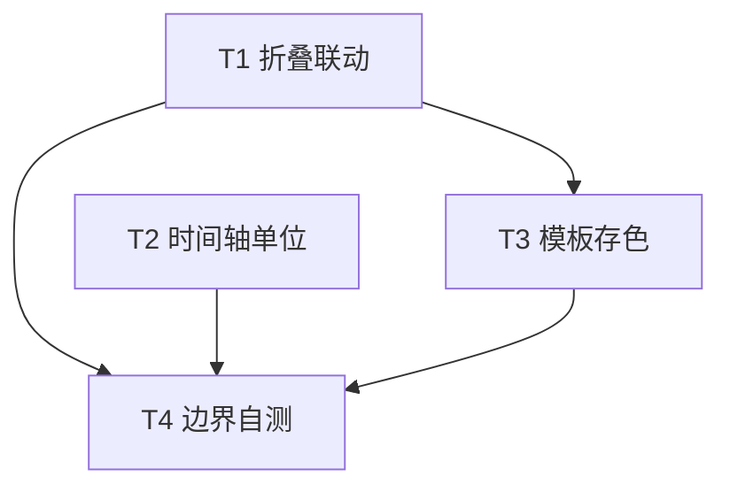
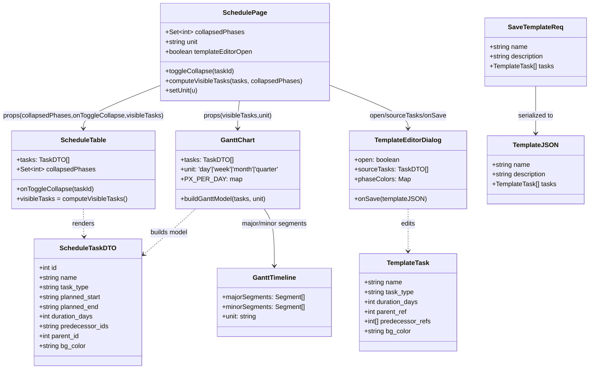
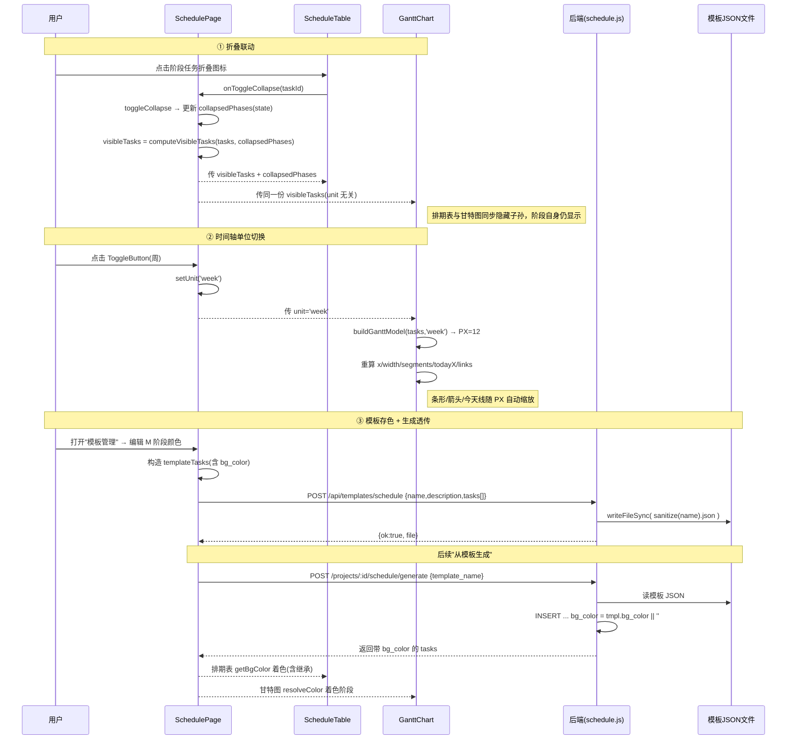

# 项目计划页三项增量功能 · 系统设计与任务分解

> 架构师：高见远（software-architect）　|　团队：software-schedule-enhance　|　类型：设计稿 + 任务分解（不写实现代码）

---

## 0. 范围与输入摘要

本期交付三条增量功能（全部实现）：

| 编号 | 功能 | 一句话目标 |
|------|------|------------|
| ① | 阶段任务可折叠（联动） | 排期表与甘特图中，`task_type='阶段任务'` 可展开/收起其子孙，两者折叠状态**联动同步** |
| ② | 时间轴单位可调整 | 甘特图时间刻度可在 **日 / 周 / 月 / 季度** 之间切换（缩放） |
| ③ | 模板阶段背景色 + 存入模板 | 排期模板每个 M 级阶段带背景色，模板保存时持久化；应用模板生成排期时透传到 `schedule_tasks.bg_color` |

**现状关键结论（已采信，详见调研输入）**
- 模板为文件型 JSON（`server/src/templates/custom-hardware.json`），无 `bg_color` 字段；M 级阶段 = `task_type:'阶段任务'`，层级用 `parent_ref`（指 tasks 数组下标）。
- 后端 `generate`（schedule.js:342-477）INSERT 末尾 `bg_color` 被硬编码 `''`；`PUT /api/schedule-tasks/:id`（516-632）已支持 `bg_color`；`restore`（1073-1121）已保留 `bg_color`。**当前无任何"保存模板"接口。**
- `persistTaskFields`（schedule.js:282-292）只写 `planned_start/end/duration_days/completion_status`，**不碰 bg_color** → 在 INSERT 带上 `bg_color` 即可在整个 generate 流水线中存活。
- 前端折叠逻辑现存在于 `ScheduleTable` 内部（`collapsedPhases` state + 递归隐藏子孙的 `visibleTasks` useMemo），**未上抛、未传给甘特图**；`GanttChart` 仅收 `tasks`，刻度写死月+周两层，条形 `x=days*DAY_WIDTH`。
- `ContextMenu.jsx` 已实现 11 色 `presetColors` 调色板 + 自定义取色器，经 `handleBgColorSave` → `PUT`。

---

## 1. 实现方案与框架选型

### 1.1 依赖结论
**零新增依赖。** 全部复用现有栈：React 18、MUI（`@mui/material`、`@mui/icons-material`、`@mui/x-date-pickers`）、dayjs（含 `isoWeek` 插件，新增 `quarterOfYear` 插件为 dayjs 内置、无新包）。

### 1.2 复用点清单

| 复用对象 | 位置 | 本期用法 |
|----------|------|----------|
| `computeVisibleTasks`（新增工具，提取自 ScheduleTable 现有 `visibleTasks` 逻辑） | `client/src/utils/schedule-date.js` | ① 折叠计算，SchedulePage 与 ScheduleTable 共用 |
| `presetColors` + 自定义取色器逻辑 | `client/src/components/schedule/ContextMenu.jsx` | ③ 模板编辑对话框复用同一套调色板与 `transparent` 清除约定 |
| `toDayjs` / `detectCycle` | `client/src/utils/schedule-date.js` | ② 坐标换算复用 `toDayjs`；③ 保存模板防御循环依赖可复用 `detectCycle` 思路 |
| `GanttLinks` 箭头/今天线算法 | `client/src/components/schedule/GanttLinks.jsx` | ② 不改其实现，仅消费的 `links.todayX` 由新 `x` 基准自动重算 |
| `api` 请求封装 `request` | `client/src/api/client.js` | ③ 新增 `saveTemplate` / `getTemplate` 复用现有 `request` |
| `ScheduleTable` 现有 `toggleCollapse` | — | ① 逻辑上提为 SchedulePage 的 `toggleCollapse`，ScheduleTable 改为受控 |

### 1.3 架构模式
- **纯前端状态上提（Lifting State Up）**：折叠状态、时间轴单位从"局部/无"提升为 `SchedulePage` 的受控 state，向下游 `ScheduleTable` 与 `GanttChart` 单向传递，实现联动。
- **后端补 2 个轻量接口 + 改 1 处 INSERT**：模板写回（与现有 GET 列表、generate 完全兼容）、模板单文件读取（编辑用）；generate 仅改 INSERT 末尾占位符。
- **模板 JSON 加可选字段 `bg_color`**：向后兼容（旧模板无此字段时默认 `''`）。

---

## 2. 文件清单（相对仓库根 `/d/HPM`）

### 2.1 新增文件

| 文件 | 说明 |
|------|------|
| `client/src/components/schedule/TemplateEditorDialog.jsx` | 模板新建/编辑对话框：列出现有阶段任务（M 级及嵌套阶段），为每个阶段任务提供调色板（复用 ContextMenu 的 `presetColors` + 自定义取色器），保存时调用新增接口 |

### 2.2 修改文件（含改动点）

| 文件 | 改动点 |
|------|--------|
| `server/src/routes/schedule.js` | **(a)** 新增 `POST /api/templates/schedule`（写回 JSON，含文件名安全校验、bg_color 安全校验、ref 下标越界/循环防御）；**(b)** 新增 `GET /api/templates/schedule/:file`（返回单模板完整内容含 tasks，供编辑预填）；**(c)** `generate` 的 INSERT（374-377 行）末尾 `''` 改为 `tmpl.bg_color \|\| ''` 并补 run 参数 |
| `server/src/templates/custom-hardware.json` | 为 M1–M5 及各嵌套阶段任务补 `bg_color` 字段（见 §3.3 配色表） |
| `client/src/pages/SchedulePage.jsx` | **(a)** 上提 `collapsedPhases` state + `toggleCollapse` + `visibleTasks`（调 `computeVisibleTasks`）；**(b)** 新增 `unit` state + 日/周/月/季度 `ToggleButtonGroup` 控件，传 `unit` 给 `GanttChart`；**(c)** 新增 `templateEditorOpen` state + "模板管理"按钮，渲染 `TemplateEditorDialog`，接 `api.schedule.saveTemplate` / `getTemplate`；**(d)** `ScheduleTable` 与 `GanttChart` 改传 `visibleTasks` / `collapsedPhases` / `onToggleCollapse` / `unit` |
| `client/src/components/schedule/ScheduleTable.jsx` | 移除内部 `collapsedPhases` state 与 `toggleCollapse`；改为接收 `collapsedPhases` / `onToggleCollapse` props；`visibleTasks` 改用 `computeVisibleTasks(tasks, collapsedPhases)`；折叠图标 `onClick` 调 `onToggleCollapse` |
| `client/src/components/schedule/GanttChart.jsx` | 新增 `unit` prop（默认 `'day'`）；定义 `PX_PER_DAY[unit]` 取代写死 `DAY_WIDTH`；`x/width/segment/todayX/links` 全部基于 `PX` 重算；分段改为按 `unit` 生成 `majorSegments`/`minorSegments` 并传给 `GanttTimeline`；`dayjs.extend(quarterOfYear)` |
| `client/src/components/schedule/GanttTimeline.jsx` | props 由 `monthSegments`/`weekSegments` 改为通用 `majorSegments`/`minorSegments`（仍双行：上行 major、下行 minor），`unit` 仅用于标签格式（如季度显示 `YYYY Qn`） |
| `client/src/api/client.js` | `schedule` 对象新增 `saveTemplate: (body) => request('/templates/schedule', { method:'POST', body: JSON.stringify(body) })` 与 `getTemplate: (file) => request('/templates/schedule/'+file)` |
| `client/src/utils/schedule-date.js` | 新增纯函数 `computeVisibleTasks(tasks, collapsedPhases)`（提取自 ScheduleTable 现有递归逻辑），供 SchedulePage 与 ScheduleTable 共用 |

---

## 3. 数据结构 / 接口契约

### 3.1 `GanttChart` 新 props 契约

| Prop | 类型 | 默认 | 说明 |
|------|------|------|------|
| `tasks` | `TaskDTO[]` | `[]` | **已过滤后的可见任务**（由 SchedulePage 传 `visibleTasks`），按 `task_order` 深度优先排序；甘特图内部 `id→rowIndex` Map 基于输入重建 |
| `unit` | `'day' \| 'week' \| 'month' \| 'quarter'` | `'day'` | 时间轴单位，决定像素缩放与刻度粒度 |

> `GanttRow` / `GanttLinks` props 不变（仍消费 `model.x/width` 绝对坐标与 `links`）。

### 3.2 模板 JSON 新结构（带 `bg_color` 示例）

```json
{
  "name": "自定义硬件研发流程",
  "description": "从用户保存的版本导出",
  "tasks": [
    { "name": "M1 预研阶段", "task_type": "阶段任务", "duration_days": 1, "bg_color": "rgba(124,58,237,0.12)" },
    { "name": "L3 立项筹备", "task_type": "普通任务", "duration_days": 1, "parent_ref": 0, "bg_color": "" },
    { "name": "M2 计划阶段", "task_type": "阶段任务", "duration_days": 7, "bg_color": "rgba(59,130,246,0.12)" },
    { "name": "L4 概要设计", "task_type": "普通任务", "duration_days": 7, "parent_ref": 2, "predecessor_refs": [1], "bg_color": "" }
  ]
}
```

- `bg_color`：**可选**，缺省视为 `''`。仅阶段任务赋值，普通任务留 `""`（运行时向父继承，沿用现有 `getBgColor` 逻辑）。
- `parent_ref` / `predecessor_refs`：保持现有"指向 tasks 数组下标"约定，generate 端已正确映射为 `parent_id` / `predecessor_ids`。

### 3.3 `custom-hardware.json` 阶段配色表（高区分度，沿用 ContextMenu 调色板）

| 任务（下标） | 类型 | 赋值 bg_color |
|--------------|------|--------------|
| M1 预研阶段 (0) | 阶段任务 | `rgba(124,58,237,0.12)` 紫 |
| M2 计划阶段 (2) | 阶段任务 | `rgba(59,130,246,0.12)` 蓝 |
| M3 研发测试阶段 (5) | 阶段任务 | `rgba(16,185,129,0.12)` 翠 |
| ├ L6 详细设计 (6) | 阶段任务(嵌套) | `rgba(14,165,233,0.12)` 天蓝 |
| ├ 板卡详设 (7) | 阶段任务(嵌套) | `rgba(59,130,246,0.12)` 蓝 |
| ├ 结构详设 (14) | 阶段任务(嵌套) | `rgba(168,85,247,0.12)` 紫罗兰 |
| ├ 散热详设 (17) | 阶段任务(嵌套) | `rgba(249,115,22,0.12)` 橙 |
| ├ L9 DVT (21) | 阶段任务(嵌套) | `rgba(236,72,153,0.12)` 粉 |
| └ 板卡改版 (26) | 阶段任务(嵌套) | `rgba(120,113,108,0.12)` 石灰 |
| M4 试制阶段 (31) | 阶段任务 | `rgba(245,158,11,0.12)` 琥珀 |
| M5 新品导入阶段 (35) | 阶段任务 | `rgba(100,116,139,0.12)` 岩灰 |

> 普通任务（叶子）`bg_color` 均为 `""`，在排期表中自动继承最近带色祖先；甘特图中仅"自身有 bg_color 的任务"（即各阶段任务）着底色，叶子按 `completion_status` 着色（沿用 `resolveColor`），符合需求③只强调"阶段带色"。

### 3.4 `POST /api/templates/schedule` — 保存/新建模板

**请求体**
```json
{
  "name": "自定义硬件研发流程",
  "description": "可选描述",
  "tasks": [
    { "name": "M1 预研阶段", "task_type": "阶段任务", "duration_days": 1, "bg_color": "rgba(124,58,237,0.12)" },
    { "name": "L3 立项筹备", "task_type": "普通任务", "duration_days": 1, "parent_ref": 0, "predecessor_refs": [0], "bg_color": "" }
  ]
}
```

**校验规则（服务端）**
1. `name`：非空；文件名 = `sanitize(name) + '.json'`；`sanitize` 仅保留中文/字母/数字/`_`/`-`，拒绝 `/ \ . .` 与 `..`，并 `path.resolve` 断言结果仍在 `TEMPLATES_DIR` 内（防目录穿越）。同名则覆盖（upsert）。
2. `tasks`：数组；每项校验 `name`(字符串)、`task_type` ∈ {普通任务,阶段任务,节点任务}、`duration_days`(≥0 整数)、`parent_ref`(null 或合法数组下标)、`predecessor_refs`(数组且元素为合法下标)、`bg_color`(经 `sanitizeColor`)。越界 ref / 未知字段一律丢弃。
3. `sanitizeColor(c)`：仅允许 `transparent`、`rgba(r,g,b,a)`（a∈0–1）、`#rgb`/`#rrggbb`；不符则置 `''`。
4. 循环依赖防御：以 `parent_ref` / `predecessor_refs` 重建有向图，检测环（可复用 `detectCycle` 思路），有环返回 `400`。

**响应**
```json
{ "ok": true, "data": { "file": "自定义硬件研发流程.json", "name": "自定义硬件研发流程", "task_count": 37 } }
```
失败：`{ "ok": false, "error": "..." }`（400/500）。

### 3.5 `GET /api/templates/schedule/:file` — 读取单模板（编辑预填用）

**响应**：`{ "ok": true, "data": { "name", "description", "tasks": [...] } }`（完整 tasks 含 `bg_color`）。文件不存在返回 `404`。

### 3.6 `generate` 透传改动（最小 diff）

原 INSERT（schedule.js:374-377）：
```sql
INSERT INTO schedule_tasks (project_id, name, task_order, task_type, planned_start, planned_end,
  duration_days, predecessor_ids, parent_id, is_locked, notes, bg_color)
VALUES (?, ?, ?, ?, ?, ?, ?, ?, NULL, ?, '', '')
```
改为（末尾 `bg_color` 由字面 `''` 改为占位 `?`）：
```sql
VALUES (?, ?, ?, ?, ?, ?, ?, ?, NULL, ?, ?, ?)
```
`insertStmt.run(...)` 末尾补第 11 参 `''`(notes)、第 12 参 `tmpl.bg_color || ''`(bg_color)。`parent_ref→parent_id`、`predecessor_refs→predecessor_ids` 映射逻辑**不动**。持久化后 `persistTaskFields` 不覆盖 `bg_color`，透传成立。

---

## 4. 核心算法（工程师照做，不写实现代码）

### 4.1 折叠可见性计算 `computeVisibleTasks(tasks, collapsedPhases)`

> 提取自 ScheduleTable 现有 `visibleTasks` useMemo，纯函数化。

```
输入：tasks（深度优先扁平数组，含 id / parent_id / task_type）
      collapsedPhases（Set<taskId>，被收起的阶段任务 id）
输出：可见任务数组（阶段任务自身始终保留，仅隐藏其子孙）

hidden = new Set()
for task in tasks:
  if task.task_type == '阶段任务' and collapsedPhases.has(task.id):
    collectDescendants(parentId):
      for t in tasks:
        if t.parent_id == parentId:
          hidden.add(t.id)
          collectDescendants(t.id)   // 递归隐藏所有层级子孙
    collectDescendants(task.id)
return tasks.filter(t => !hidden.has(t.id))
```
- 联动关键：`collapsedPhases` 由 SchedulePage 持有；ScheduleTable 与 GanttChart 都消费同一份 `visibleTasks`（= `computeVisibleTasks(tasks, collapsedPhases)`），任一处 toggle 触发 SchedulePage state 变更 → 两组件同步重渲染。
- 后端 `parent_id` 层级与全量 `tasks` 不变，折叠仅影响展示。

### 4.2 时间轴单位换算（② 缩放核心）

**单一真相源：按单位的"每天像素宽"**（`GanttChart` 顶部常量集中定义）：
```
PX_PER_DAY = { day: 24, week: 12, month: 4, quarter: 1.5 }   // 数值可调，单位 px/天
```
> 设计决策：采用**缩放模型**（单位越粗 → 每天像素越少 → 整图越"缩"），使"日/周/月/季度"真正改变显示比例（满足用户"调整刻度"诉求）。若按字面示例 `day=24/week=168/month=720/quarter=2160`（=天数×24），则条宽与位置与日模式完全一致、仅表头标签变化，无缩放效果——故不采用字面数值，改用上表 `px/天` 递减模型。

**坐标换算（统一公式，替代原 `×DAY_WIDTH`）**
```
PX = PX_PER_DAY[unit]
daysFromStart(d) = d.diff(timelineStart, 'day')          // 相对时间轴起点的天数差
x(d)        = daysFromStart(d) * PX
width(task)  = task.duration_days * PX
```
- 行模型 `row.x = x(startDate)`，`row.width = width(task)`。
- `chartWidth = totalDays * PX`（`totalDays = timelineEnd.diff(timelineStart,'day')+1`，`PAD_DAYS=3` 不变）。
- **箭头/今天线自动重算**：`GanttLinks` 消费的 `links.fromX = from.x+from.width`、`toX = to.x`、`fromY/toY = rowIndex*ROW_HEIGHT + ROW_HEIGHT/2` 均基于已 ×PX 的 `row.x/width`，故缩放后箭头与今天线坐标自动正确，**GanttLinks 实现零改动**。

**分段生成（按 unit 切换刻度粒度）**
- minor（下行细刻度）/ major（上行粗刻度）配对：

| unit | minor 刻度 | major 刻度 |
|------|------------|------------|
| day | 每天一格（label `MM/DD`） | 月（`YYYY年MM月`） |
| week | 每周一格（isoWeek 起点，label `MM/DD`） | 月 |
| month | 每月一格（label `YYYY年MM月`） | 季度（`YYYY Qn`） |
| quarter | 每季度一格（label `YYYY Qn`，需 `dayjs.extend(quarterOfYear)`） | 年（`YYYY年`） |

- 每个刻度单元：`cellStart = 单位起点`（对 `timelineStart` 向上取整到单位边界），`cellEnd = cellStart.endOf(单位)`；`seg.x = x(cellStart)`，`seg.width = (cellEnd-cellStart 天数 + 1) * PX`；越界部分按 `timelineStart/End` 裁剪。
- `gridLines`：取 minor/major 边界去重（major 用粗线、minor 用细线），沿用原去重逻辑。
- `todayX = x(today)`（仅当 today ∈ [timelineStart, timelineEnd]）。

`GanttTimeline` 改为接收通用 `majorSegments` / `minorSegments`（结构仍为 `{label,x,width}[]`），上行渲染 major、下行渲染 minor，`unit` 仅用于标签格式化（如季度显示 `Qn`）。

### 4.3 模板保存写入 + generate 透传（③）

**保存写入流程**
```
前端 TemplateEditorDialog:
  - 数据源：从当前项目 tasks（深度优先扁平）或 GET 单模板加载
  - 仅阶段任务可设色（presetColors + 自定义取色器），普通任务 bg_color=""
  - 构造 templateTasks：
      idToIndex = Map(task.id -> 当前数组下标)   // 复用深度优先顺序
      for t in orderedTasks:
        parent_ref      = t.parent_id != null ? idToIndex.get(t.parent_id) : undefined
        predecessor_refs = JSON.parse(t.predecessor_ids||'[]').map(idToIndex).filter(valid)
        bg_color        = (t 是阶段任务) ? phaseColors.get(t.id) ?? t.bg_color ?? '' : ''
  - POST /api/templates/schedule { name, description, tasks: templateTasks }

后端 POST /api/templates/schedule:
  - sanitize(name) -> filename，断言路径不越界
  - 逐项校验 + sanitizeColor + 循环依赖检测
  - writeFileSync(TEMPLATES_DIR/filename, JSON.stringify({name,description,tasks}))
```

**生成透传流程**（见 §3.6）：模板读入 → INSERT 用 `tmpl.bg_color || ''` 写入 `schedule_tasks.bg_color` → `persistTaskFields` 不覆盖 → `getProjectTasksTree` 返回带 `bg_color` 的任务 → 排期表 `getBgColor` 着色、甘特图 `resolveColor` 着色。

---

## 5. 任务列表（有序、含依赖、按实现顺序）

> 说明：本期**无"项目基础设施"任务**——零新增依赖、无构建/配置文件变更（vite/tsconfig/tailwind 均不动），故不单列 infra 任务（与通用模板的 T01 规则唯一偏差，已在此注明）。每个任务均跨越 ≥3 个文件、按功能模块分组。

### T1 · 阶段任务折叠联动（上提状态 + ScheduleTable 受控 + 甘特图接入）
- **源文件**：`client/src/utils/schedule-date.js`（新增 `computeVisibleTasks`）、`client/src/components/schedule/ScheduleTable.jsx`（移除内部 state，改受控 props）、`client/src/pages/SchedulePage.jsx`（上提 `collapsedPhases`/`toggleCollapse`/`visibleTasks`，传 `visibleTasks` 给 ScheduleTable 与 GanttChart）
- **依赖**：无（可最先做）
- **优先级**：P0

### T2 · 时间轴单位切换（GanttChart unit + GanttTimeline 通用分段 + SchedulePage 控件）
- **源文件**：`client/src/components/schedule/GanttChart.jsx`（`unit` prop + `PX_PER_DAY` + 按单位分段）、`client/src/components/schedule/GanttTimeline.jsx`（`majorSegments`/`minorSegments` 通用化）、`client/src/pages/SchedulePage.jsx`（`unit` state + `ToggleButtonGroup` 控件 + 传 `unit`）
- **依赖**：无（与 T1 互相独立，可并行）
- **优先级**：P0

### T3 · 模板阶段背景色 + 存入模板（后端接口 + generate 透传 + 模板 JSON 补色 + 编辑 UI）
- **源文件**：`server/src/routes/schedule.js`（POST 保存 + GET 单模板 + generate INSERT 透传）、`server/src/templates/custom-hardware.json`（补 bg_color）、`client/src/components/schedule/TemplateEditorDialog.jsx`（新增，复用 presetColors）、`client/src/api/client.js`（`saveTemplate`/`getTemplate`）、`client/src/pages/SchedulePage.jsx`（"模板管理"按钮 + 对话框接入）
- **依赖**：T1（编辑对话框复用 `computeVisibleTasks` 思路非强制，但 UI 接入点同页，建议 T1 后做，降低合并冲突）
- **优先级**：P0

### T4 · 边界与自测（验证三项联动正确）
- **源文件**：`client/src/pages/SchedulePage.jsx`、`client/src/components/schedule/GanttChart.jsx`、`server/src/routes/schedule.js`、`server/src/templates/custom-hardware.json`
- **自测清单**：
  1. 折叠某阶段 → 排期表与甘特图同步隐藏其子孙，阶段自身仍显示；展开恢复。
  2. 单位切 day/week/month/quarter 四种，刻度标签与条形/箭头/今天线坐标均正确缩放，无 NaN/错位。
  3. 从补全色的模板"从模板生成"→ 各阶段任务 `bg_color` 非空且等于模板值；右键改单任务色仍生效（PUT 已支持）。
  4. 保存模板时：文件名含 `../` 被拒（目录穿越防御）；`parent_ref`/`predecessor_refs` 越界被丢弃；构造循环依赖返回 400。
  5. 空态：无模板 / 无排期时对话框与甘特图空态提示正常。
- **依赖**：T1、T2、T3 全完成
- **优先级**：P1

### 任务依赖图



---

## 6. 依赖包

**无新增。** 全程复用现有 `react` / `@mui/material` / `@mui/icons-material` / `@mui/x-date-pickers` / `dayjs`（仅新增 `quarterOfYear` 内置插件 `extend`，不引入新 npm 包）。

---

## 7. 共享知识（跨任务约束，工程师务必遵守）

1. **单位宽常量集中**：`PX_PER_DAY = { day:24, week:12, month:4, quarter:1.5 }` 必须定义在 `GanttChart.jsx` 顶部、替代原 `DAY_WIDTH`；所有 `x/width/segment/todayX` 一律经 `daysFromStart(d)*PX` 计算，禁止再写死 `DAY_WIDTH`。`ROW_HEIGHT/BAR_HEIGHT/HEADER_HEIGHT/NAME_COL_WIDTH/PAD_DAYS/ARROW_GAP/TODAY_COLOR` 保持不变。
2. **`predecessor_ids` 解析约定不变**：仍是字符串化 JSON 数组（如 `"[1,3]"`），`parsePredecessors` 容错解析（空/null/非法 → `[]`）；模板侧 `predecessor_refs` 仍是"指向 tasks 数组下标"，generate 端映射逻辑不动。
3. **`bg_color` 优先级（沿用现有）**：自身 `bg_color` > 父级继承（排期表 `getBgColor` 递归向上找最近带色祖先）；甘特图 `resolveColor` 仅用自身 `bg_color`，无则按 `completion_status` 映射。模板里只对阶段任务赋色，普通任务留 `""`。
4. **颜色格式约定**：统一使用 `rgba(r,g,b,a)`（a 为 0–1 小数）或 `#rgb`/`#rrggbb` 或 `transparent`；`transparent` 语义等同清除（前端映射为 `""`）。
5. **深度优先顺序即模板下标**：`getProjectTasksTree` 返回的扁平数组顺序 == 模板 tasks 数组顺序，故 `id→数组下标` 映射可安全用于模板写回的 `parent_ref`/`predecessor_refs` 重建。

---

## 8. 待明确事项 / 后续增强

### 8.1 本期明确不做
- **模板多版本管理**（模板自身的历史/版本对比）。
- **模板导入 / 导出文件**（上传 JSON、下载 JSON）。
- **拖拽改期**（在甘特图直接拖动条形修改 `planned_start/end`）。
- **模板删除接口**（`DELETE /api/templates/schedule/:file`）——本期仅保存/读取，删除可后续补。
- **模板阶段颜色在甘特图中的"子任务继承"**：本期甘特图仅阶段任务自身着底色，叶子不继承（沿用现有 `resolveColor` 行为）。

### 8.2 假设与待确认
1. **缩放数值**：§4.2 的 `PX_PER_DAY` 为推荐初值，需产品/视觉确认最终缩放比例（尤其 quarter 模式下的可读性）。
2. **保存即覆盖**：`POST /api/templates/schedule` 采用 upsert（同名覆盖）。若需"禁止覆盖系统模板（如 sugon-standard）"或"同名冲突返回 409"，请确认——当前设计允许覆盖用户模板、且列表接口本就过滤 `sugon-standard.json`。
3. **编辑入口数据源**：模板编辑器"新建"默认基于**当前项目 tasks** 克隆结构再赋色；"编辑已有"经新增 `GET /api/templates/schedule/:file` 预填。若产品希望编辑入口只面向"从当前排期另存为模板"，可去掉 GET 单模板接口（T3 后端相应简化）。
4. **M 级定义**：本期"M 级阶段"按 `task_type='阶段任务'` 且名称含 `M\d` 识别（与现有数据一致）；嵌套子阶段（L6/板卡详设 等）一并赋色以增强区分度，已在 §3.3 配色表列出。

---

## 附录 A · 类结构（Mermaid classDiagram）



## 附录 B · 关键调用流（Mermaid sequenceDiagram）


