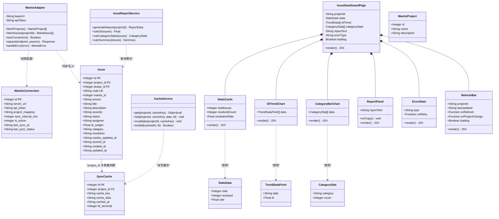
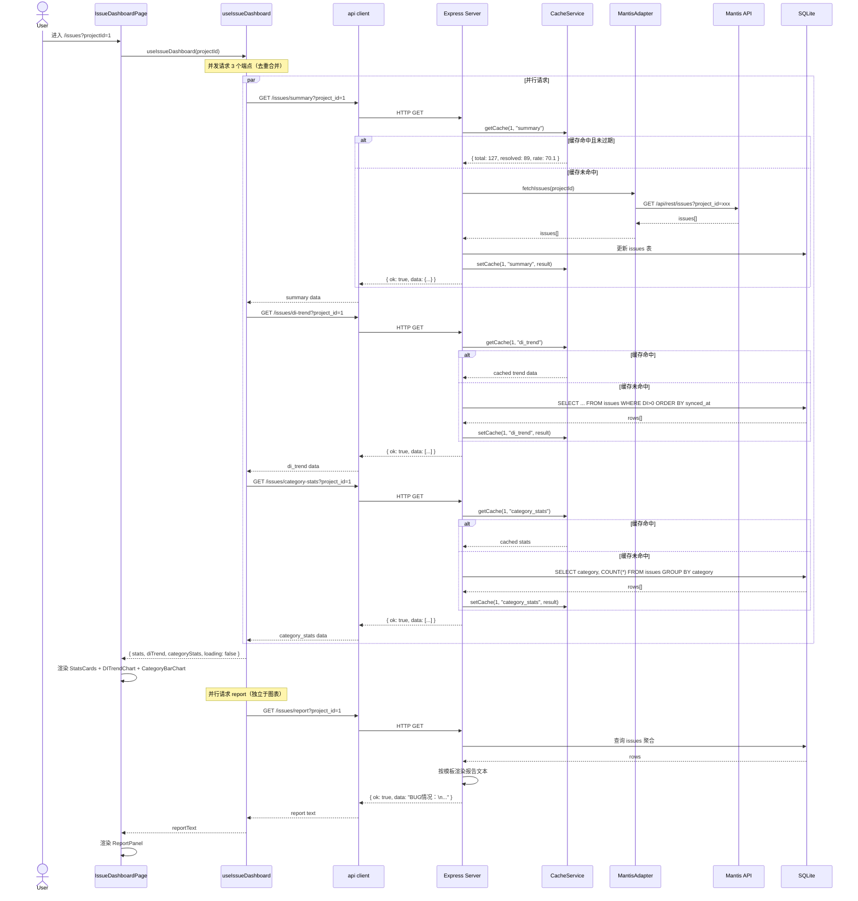
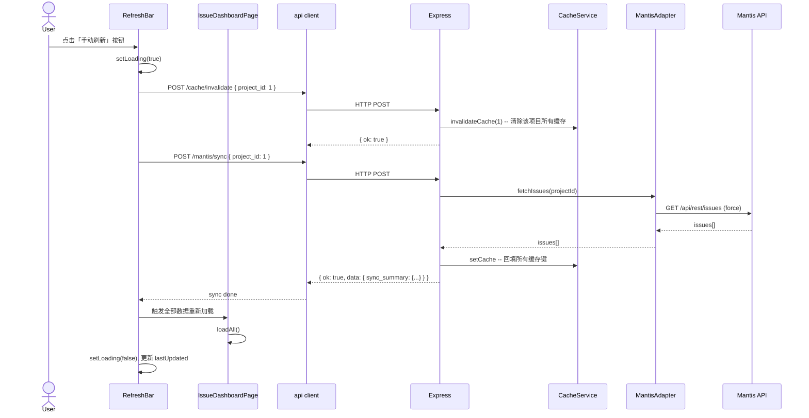
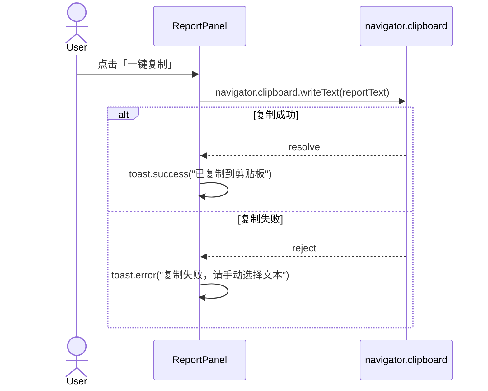
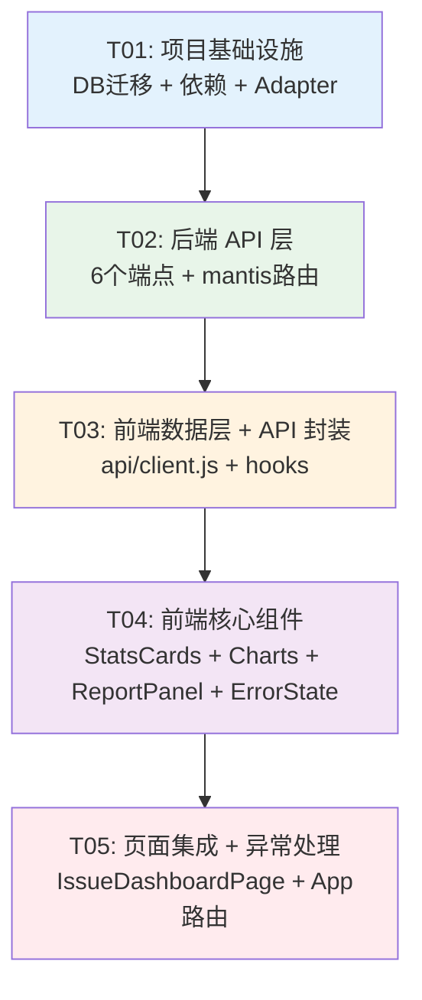

# M3 故障管理模块 — 系统架构设计 + 任务分解

> **基准 PRD**: `docs/modules/03-故障管理模块-PRD.md` v1.1  
> **基准架构**: `docs/architecture.md` v1.0  
> **日期**: 2026-07-08  
> **设计者**: Bob (Architect)

---

## Part A: 系统设计

---

### 1. 实现方案与框架选型

#### 1.1 核心技术挑战

| # | 挑战 | 解决方案 |
|---|------|---------|
| C1 | Mantis REST API 鉴权与数据拉取 | 后端 Adapter 模式封装 `axios` 调用，Bearer Token 鉴权，统一错误映射 |
| C2 | 缓存策略（TTL 5min + 手动刷新强制穿透） | 新增 `sync_cache` 表，后端中间件先查缓存 → 未命中则拉取 Mantis → 回填缓存；手动刷新走 `Cache-Control: no-cache` header |
| C3 | DI 趋势折线图（过滤 DI=0，缩放+t tooltip） | `recharts` `<LineChart>` + `<Brush>` 缩放 + `<Tooltip>` |
| C4 | 缺陷分类柱状图（4 维度，0 条不渲染） | `recharts` `<BarChart>`，数据层预过滤 count=0 的分类 |
| C5 | 前端请求去重（同项目同接口并发合并） | 前端自定义 hook 内用 `useRef` 存 Promise，实现 dedup |
| C6 | 4 种异常友好提示 | 前端统一的 `ErrorState` 组件按错误码渲染不同提示文案+图标 |

#### 1.2 框架选型（增量）

| 层 | 选型 | 说明 |
|---|------|------|
| **前端图表** | `recharts` ^2.12 | React 原生声明式图表，MUI 风格契合 |
| **后端 HTTP** | `axios` ^1.7（server 侧） | 对 Mantis REST API 发请求，已有生态 |
| **缓存层** | SQLite `sync_cache` 表 | 无额外依赖，利用现有 SQLite |
| **剪贴板** | `navigator.clipboard.writeText()` | 原生 API，无需额外包 |

#### 1.3 架构模式

- **前端**：自底向上 → Page 层组合 Compound Components（MetricCards + TrendChart + CategoryChart + ReportPanel）
- **后端**：Router → Cache Middleware → MantisAdapter → SQLite（Adapter 模式已在架构文档中定义）
- **数据流**：`Mantis API → MantisAdapter → sync_cache / issues 表 → Express Route → JSON Response → React State → recharts`

---

### 2. 文件列表

#### 2.1 新增文件

```
# 后端
server/src/adapters/mantis.js              # [新增] Mantis REST API 适配器（鉴权+拉取+错误处理）
server/src/routes/mantis.js                # [新增] Mantis 相关路由（projects/sync/cache/invalidate）

# 前端
client/src/pages/IssueDashboardPage.jsx    # [新增] 故障仪表盘主页面（替代旧 IssueListPage 的图表视图）
client/src/components/issue/StatsCards.jsx # [新增] 全局统计卡片（故障总数/已解决/解决率）
client/src/components/issue/DITrendChart.jsx # [新增] DI 趋势折线图（recharts LineChart）
client/src/components/issue/CategoryBarChart.jsx # [新增] 缺陷分类柱状图（recharts BarChart）
client/src/components/issue/ReportPanel.jsx # [新增] 自动报告生成 + 一键复制面板
client/src/components/issue/ErrorState.jsx  # [新增] 统一异常状态组件（4种异常场景）
client/src/components/issue/RefreshBar.jsx  # [新增] 顶部操作栏（项目选择+刷新+时间戳）
client/src/hooks/useIssueDashboard.js       # [新增] 故障仪表盘数据 hook（含缓存+去重+轮询）
client/src/hooks/useDedupRequest.js         # [新增] 通用请求去重 hook
client/src/api/mantis.js                    # [新增] Mantis 相关 API 封装
```

#### 2.2 修改文件

```
# 后端
server/src/db.js                           # [修改] 新增 sync_cache 表 + issues/mantis_connection 字段迁移
server/src/routes/issues.js                # [修改] 新增 di-trend/category-stats/summary/report 端点
server/src/index.js                        # [修改] 挂载 mantis 路由

# 前端
client/src/App.jsx                         # [修改] /issues 路由指向新 IssueDashboardPage
client/src/api/client.js                   # [修改] 新增 issues 相关 API 方法 + mantis API
client/package.json                        # [修改] 新增 recharts 依赖
server/package.json                        # [修改] 新增 axios 依赖
```

---

### 3. 数据结构和接口

#### 3.1 类图（Mermaid classDiagram）



#### 3.2 关键接口设计

**MantisAdapter**:

```
MantisAdapter(baseUrl: string, apiToken: string)
  ├── fetchProjects() → { id, name, description }[]
  ├── fetchIssues(projectId: number) → MantisIssueRaw[]
  ├── testConnection() → boolean
  └── _request(method, path, params) → axios response
```

**CacheService** (在 issues 路由内以函数实现):

```
getCache(projectId, cacheKey) → parsed JSON | null
setCache(projectId, cacheKey, data, ttl=300)
invalidateCache(projectId, cacheKey?)
isCacheValid(cachedAt, ttl) → boolean
```

**前端 API 扩展** (追加到 `client/src/api/client.js`):

```js
issues: {
  diTrend: (projectId) => request(`/issues/di-trend?project_id=${projectId}`),
  categoryStats: (projectId) => request(`/issues/category-stats?project_id=${projectId}`),
  summary: (projectId) => request(`/issues/summary?project_id=${projectId}`),
  report: (projectId) => request(`/issues/report?project_id=${projectId}`),
}
mantis: {
  projects: () => request("/mantis/projects"),
  sync: (projectId) => request(`/mantis/sync`, { method: "POST", body: JSON.stringify({ project_id: projectId }) }),
  connection: () => request("/mantis/connection"),
  updateConnection: (data) => request("/mantis/connection", { method: "PUT", body: JSON.stringify(data) }),
}
cache: {
  invalidate: (projectId) => request("/cache/invalidate", { method: "POST", body: JSON.stringify({ project_id: projectId }) }),
}
```

---

### 4. 程序调用流程

#### 4.1 页面加载完整流程（时序图）



#### 4.2 手动刷新流程



#### 4.3 一键复制报告流程



---

### 5. 待明确事项

| # | 问题 | 假设/处理方式 |
|---|------|-------------|
| Q1 | Mantis "缺陷分类"字段名 | **假设**：Mantis 自定义字段 key 为 `category`，映射值 BIOS/BMC/HW/Perf/Other。设计为可配置映射表，默认映射写在 MantisAdapter 中 |
| Q2 | "已解决"统计口径 | **假设**：`status IN ('已解决', '已关闭')` = resolved（PRD 的 resolution 字段辅助标记） |
| Q3 | Mantis 项目列表 API 端点 | **假设**：`GET /api/rest/projects`（基于 Mantis REST API 标准），暂不分页 |
| Q4 | DI 趋势图时间范围 | **默认展示全部历史数据**，通过 `<Brush>` 支持用户缩放 |
| Q5 | 多项目切换时是否前端内存缓存 | **不缓存**，每次切换重新请求（但后端 sync_cache 层生效，秒级返回） |
| Q6 | "遗留BUG"口径 | **假设**：`status NOT IN ('已关闭')`（即新建+处理中+已解决但未关闭），与 report 统计数据一致 |

---

## Part B: 任务分解

---

### 6. 依赖包清单（增量）

```
# 前端新增 (client/package.json)
- recharts@^2.12.0: 声明式图表库（LineChart + BarChart + Tooltip + Brush）

# 后端新增 (server/package.json)
- axios@^1.7.0: 对 Mantis REST API 发 HTTP 请求
```

---

### 7. 任务列表

| Task ID | 任务名称 | 源文件 | 依赖 | 优先级 |
|---------|---------|--------|------|--------|
| **T01** | 项目基础设施 | 见下方 | — | P0 |
| **T02** | 后端 API 层 | 见下方 | T01 | P0 |
| **T03** | 前端数据层 + API 封装 | 见下方 | T02 | P0 |
| **T04** | 前端核心组件（图表+统计+报告） | 见下方 | T03 | P0 |
| **T05** | 前端页面集成 + 异常处理 + 联调 | 见下方 | T04 | P0 |

#### T01 — 项目基础设施

**源文件**:
```
# 新增
server/src/adapters/mantis.js              # Mantis REST API 适配器

# 修改
server/src/db.js                           # 新增 sync_cache 表 + issues/mantis_connection 迁移
server/package.json                        # 新增 axios 依赖
client/package.json                        # 新增 recharts 依赖
```

**内容**:
1. `server/package.json` — 添加 `axios` 依赖并 `npm install`
2. `client/package.json` — 添加 `recharts` 依赖并 `npm install`
3. `server/src/db.js` — 追加 DDL:
   - `sync_cache` 表（id/project_id/cache_key/cache_data/cached_at/ttl_seconds）
   - `issues` 表迁移：新增 `category` TEXT, `resolution` TEXT
   - `mantis_connection` 表迁移：新增 `last_sync_at` TEXT, `last_sync_status` TEXT
   - 新索引：`idx_sync_cache_project_key`
4. `server/src/adapters/mantis.js` — MantisAdapter 类:
   - 构造函数读取 `mantis_connection` 表配置
   - `fetchProjects()` — GET 拉取项目列表
   - `fetchIssues(projectId)` — GET 拉取 issues（含 category 字段映射）
   - `testConnection()` — 验证 API Token 有效性
   - 统一错误处理：鉴权失败 → 401 / 超时 → 408 / 其他 → 500
   - `_request(method, path, params)` — axios 封装（Bearer Token、超时 30s）

**验收**:
- `sync_cache` 表和字段迁移在 SQLite 中执行无误
- MantisAdapter 可实例化，testConnection 返回 boolean

#### T02 — 后端 API 层

**源文件**:
```
# 新增
server/src/routes/mantis.js                # Mantis 路由（projects/sync/cache）

# 修改
server/src/routes/issues.js                # 新增 4 个聚合端点
server/src/index.js                        # 挂载 mantisRouter
```

**内容**:
1. `server/src/routes/issues.js` — 新增端点:
   - `GET /issues/di-trend?project_id=` — 查询 issues 表 WHERE DI>0，按 synced_at 分组，返回 `[{date, di}]`
   - `GET /issues/category-stats?project_id=` — `SELECT category, COUNT(*) FROM issues WHERE project_id=? AND category IS NOT NULL GROUP BY category` → `[{category, count}]`
   - `GET /issues/summary?project_id=` — 聚合 total/resolved/rate
   - `GET /issues/report?project_id=` — 按模板渲染文本（统计用 summary 数据 + category 分组）
   - 所有端点内置缓存逻辑：先查 `sync_cache` → 命中返回 / 未命中查询后回填
2. `server/src/routes/mantis.js` — 新增路由:
   - `GET /mantis/projects` — 调用 MantisAdapter.fetchProjects()
   - `POST /mantis/sync` — 调用 MantisAdapter.fetchIssues() + 写入 issues 表 + 回填所有缓存
   - `GET /mantis/connection` — 读取 mantis_connection 配置
   - `PUT /mantis/connection` — 更新配置
   - `POST /cache/invalidate` — 清除指定 project_id 的缓存
3. `server/src/index.js` — 新增 `import mantisRouter from "./routes/mantis.js"` + `app.use("/api", mantisRouter)`

**验收**:
- 所有 6 个新端点返回 `{ ok: true, data: ... }` 格式
- 缓存命中时后端日志可见 "cache hit"
- `POST /cache/invalidate` 后缓存被清除

#### T03 — 前端数据层 + API 封装

**源文件**:
```
# 新增
client/src/api/mantis.js                    # Mantis API 封装
client/src/hooks/useDedupRequest.js         # 请求去重 hook

# 修改
client/src/api/client.js                    # 追加 issues/mantis/cache API 方法
```

**内容**:
1. `client/src/api/client.js` — 追加 API 方法:
   - `issues.diTrend(projectId)`, `issues.categoryStats(projectId)`, `issues.summary(projectId)`, `issues.report(projectId)`
   - `mantis.projects()`, `mantis.sync(projectId)`, `mantis.connection()`, `mantis.updateConnection(data)`
   - `cache.invalidate(projectId)`
2. `client/src/api/mantis.js` — 导出命名函数（与 client.js 解耦，方便测试）
3. `client/src/hooks/useDedupRequest.js` — 通用请求去重:
   ```js
   // 同一 key 的并发请求合并为单次调用
   function useDedupRequest() {
     const pending = useRef(new Map());
     const dedup = useCallback((key, fn) => {
       if (pending.current.has(key)) return pending.current.get(key);
       const promise = fn().finally(() => pending.current.delete(key));
       pending.current.set(key, promise);
       return promise;
     }, []);
     return dedup;
   }
   ```

**验收**:
- `npm run dev` 前端无报错
- 浏览器 Network 面板可看到 API 调用

#### T04 — 前端核心组件（图表+统计+报告）

**源文件**:
```
# 新增 (全部)
client/src/components/issue/StatsCards.jsx
client/src/components/issue/DITrendChart.jsx
client/src/components/issue/CategoryBarChart.jsx
client/src/components/issue/ReportPanel.jsx
client/src/components/issue/ErrorState.jsx
client/src/components/issue/RefreshBar.jsx
client/src/hooks/useIssueDashboard.js
```

**内容**:

1. **StatsCards.jsx** — 3 张 MUI Card 横向排列:
   - 故障总数（`total`，大字号数字）
   - 已解决（`resolved`，success 色）
   - 解决率（`rate`，百分比，保留 1 位小数）
   - Props: `{ total, resolved, rate, loading }`
   - Loading 态：MUI `<Skeleton variant="rectangular" height={80} />`

2. **DITrendChart.jsx** — recharts `<LineChart>`:
   - X 轴 = `date`（dayjs 格式化为 MM-DD），Y 轴 = `di`
   - `<Tooltip>` 显示精确日期 + DI 值
   - `<Brush>` 支持缩放
   - 数据层过滤 DI=0 的数据点
   - DI 全为 0 时显示空状态
   - Props: `{ data: TrendDataPoint[], loading }`

3. **CategoryBarChart.jsx** — recharts `<BarChart>`:
   - X 轴 = 分类（BIOS/BMC/HW/Perf），Y 轴 = 数量
   - 4 色柱子（蓝/橙/绿/紫）
   - `<Tooltip>` 显示分类名 + 精确数量
   - 过滤 count=0 的柱子
   - Props: `{ data: CategoryStat[], loading }`

4. **ReportPanel.jsx** — 报告面板:
   - 预格式化文本框（`<Paper>` + `<Typography>` 等宽字体）
   - 「一键复制」按钮 → `navigator.clipboard.writeText()`
   - 复制成功 → MUI `<Snackbar>` toast "已复制到剪贴板"
   - Props: `{ reportText, loading }`

5. **ErrorState.jsx** — 统一异常组件:
   - `type` prop: `"auth_failed"` | `"timeout"` | `"no_projects"` | `"di_all_zero"`
   - 每种类型渲染对应图标+文案+操作按钮（重试/去配置）
   - Props: `{ type, onRetry, onGoToConfig }`

6. **RefreshBar.jsx** — 顶部操作栏:
   - 复用 `ProjectSelector` 组件
   - 「手动刷新」按钮（`<IconButton>` + 旋转动画 loading）
   - 「上次更新: YYYY-MM-DD HH:mm」时间戳展示
   - Props: `{ projectId, lastUpdated, loading, onRefresh, onProjectChange }`

7. **useIssueDashboard.js** — 数据管理 hook:
   - 输入 `projectId`
   - 输出 `{ stats, diTrend, categoryStats, reportText, loading, error, errorType, refresh, lastUpdated }`
   - 内部并发调用 4 个 API + 去重
   - `refresh()` 方法：先 `POST /cache/invalidate` → `POST /mantis/sync` → 重新 load
   - 错误分类：HTTP 401 → `auth_failed`, 408 → `timeout`, 200+空 → `no_data`

**验收**:
- 各组件可独立渲染（Mock 数据）
- DITrendChart 过滤 DI=0 数据点
- ReportPanel 复制按钮功能正常，toast 可见

#### T05 — 前端页面集成 + 异常处理 + 联调

**源文件**:
```
# 新增
client/src/pages/IssueDashboardPage.jsx    # 故障仪表盘主页面

# 修改
client/src/App.jsx                         # /issues 路由指向新页面
```

**内容**:

1. **IssueDashboardPage.jsx** — 组装所有子组件:
   ```
   IssueDashboardPage
   ├── RefreshBar (项目切换 + 手动刷新 + 时间戳)
   ├── StatsCards (3 张统计卡片)
   ├── DITrendChart + CategoryBarChart (左右/上下排列)
   ├── ReportPanel (报告 + 复制)
   └── ErrorState (条件渲染，覆盖 loading/error/empty 状态)
   ```
   - 状态机: `loading` → `error` → `empty` → `data`
   - 使用 `useSearchParams` 读取 `projectId`（与现有 ProjectSelector 一致）
   - 未选项目时显示「请选择项目」引导提示
   - 切换项目 → 重新加载全部数据
   - 滚动位置锁定（复用 useKanbanScroll pattern）

2. **App.jsx** — `import IssueDashboardPage from "./pages/IssueDashboardPage"`，路由 `/issues` 指向新页面（保留旧 IssueListPage 备用或删除）

**验收**:
- 完整流程：选项目 → 自动加载图表+统计+报告 → 切换项目 → 联动刷新
- 手动刷新按钮带 loading 动画
- 异常场景覆盖：鉴权失败 / 超时 / 无数据 / DI全为0
- 报告一键复制，toast 提示

---

### 8. 共享知识

```
# ── API 响应格式（沿用现有约定）──
成功: { ok: true, data: {...} }
列表: { ok: true, data: [...] }
错误: { ok: false, error: "描述" }

# ── 日期格式 ──
全部 API 传输 ISO8601: "2026-07-08" 或 "2026-07-08T10:30:00"
前端展示: dayjs 格式化

# ── DI 值计算（保持不变）──
DI_WEIGHTS = { Critical: 10, Major: 3, Minor: 1, Trivial: 0.1 }
DI = SUM(未关闭缺陷 di_weight)

# ── 严重度颜色 ──
Critical → #D32F2F (error), Major → #ED6C02 (warning), Minor → #1565C0 (info), Trivial → #757575 (default)

# ── 分类颜色（柱状图）──
BIOS → #1565C0, BMC → #ED6C02, HW → #2E7D32, Perf → #6A1B9A

# ── 缓存键命名 ──
sync_cache.cache_key 枚举: "di_trend" | "category_stats" | "summary"
TTL 默认: 300 秒

# ── Mantis API 配置 ──
Base URL: https://mantis.sugon.com/api/rest
鉴权: Bearer Token (api_token 字段)
超时: 30 秒

# ── 报告模板 ──
模板: "BUG情况：\n项目BUG状况：当前项目DI={di}、BUG={total}条、已解决={resolved}条，解决率={rate}%\n遗留BUG {unresolved}条：BIOS-{bios}、BMC-{bmc}、HW-{hw}、Pef-{perf}\n"
遗留BUG = status NOT IN ('已关闭')，即新建 + 处理中 + 已解决但未关闭

# ── 错误类型枚举 ──
"auth_failed"   → 鉴权失败，请检查 API Token
"timeout"       → 请求超时，请检查网络后重试
"no_projects"   → 当前账号下暂无 Mantis 项目数据
"di_all_zero"   → DI 值均为 0，无趋势数据可展示（图表正常显示但提示）
"no_data"       → 暂无数据

# ── 前端请求去重 key 格式 ──
`${projectId}:${endpoint}` → 例: "1:summary", "1:di_trend"
```

---

### 9. 任务依赖图



---

> **架构版本**: M3-v1.0 | **基于**: `docs/architecture.md` v1.0 + `docs/modules/03-故障管理模块-PRD.md` v1.1
