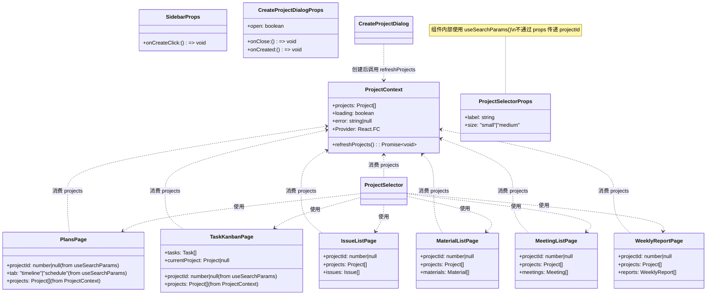
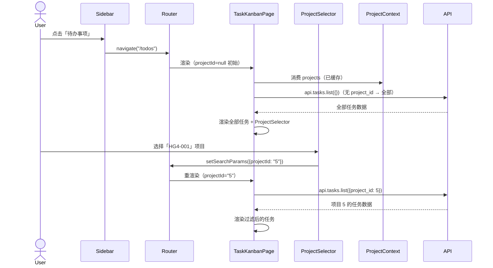
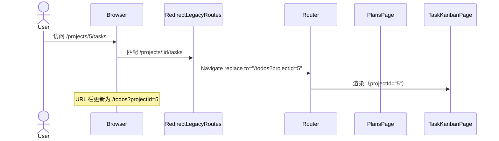
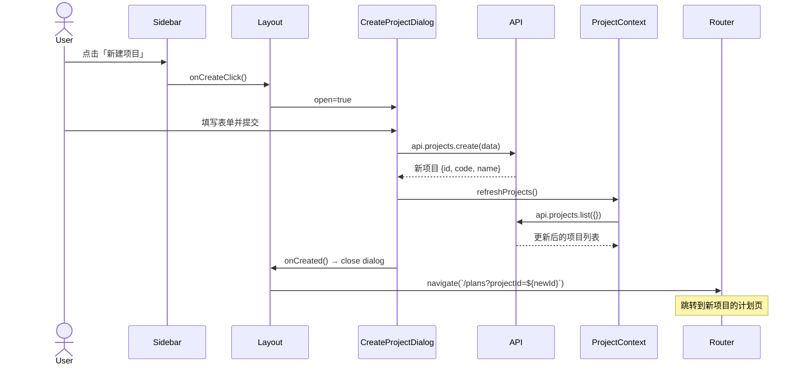
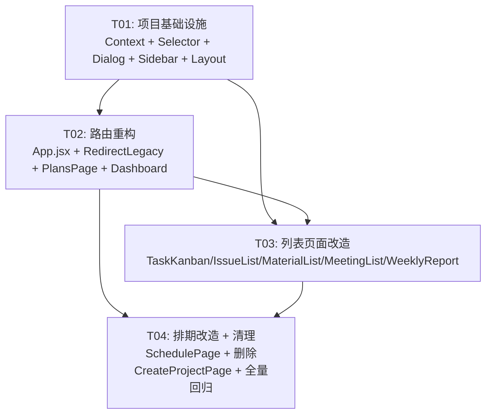

# 全局侧边栏导航 — 系统设计与任务分解

## Part A: 系统设计

---

### 1. 实现方案

#### 1.1 核心挑战

| 挑战 | 分析 |
|------|------|
| **路由扁平化** | 将嵌套 `/projects/:id/xxx` 改为全局 `/xxx?projectId=yyy`，同时保持旧链接可用 |
| **跨页面项目切换** | 用户在任一页面切换项目后，数据随 `?projectId` 变化而刷新，不丢失当前页面上下文 |
| **"全部项目"模式** | 利用后端已支持 `project_id` 可选参数，不传即返回跨项目全局数据 |
| **排期页面特殊性** | 排期 API 仍依赖路由级 `projectId`（`/projects/:id/schedule`），需要在 Plans 页面中集成 |
| **新建项目弹窗化** | 从独立路由页面改为全局 Dialog，创建后需刷新侧边栏/选择器中的项目列表 |

#### 1.2 框架与库选型

所有依赖已就绪，无需新增：

| 依赖 | 用途 |
|------|------|
| `react-router-dom@^6.23.0` | 路由管理（`useSearchParams`、`Navigate`、`useNavigate`） |
| `@mui/material@^5.15.0` | UI 组件（`Autocomplete`、`Dialog`、`Drawer`、`ListItemButton` 等） |
| `@mui/icons-material@^5.15.0` | 侧边栏与工具栏图标 |
| `react@^18.3.1` | `useContext` + `createContext` 用于项目列表缓存 |

#### 1.3 架构模式

```
┌─────────────────────────────────────────────────────────┐
│  BrowserRouter                                           │
│  ┌───────────────────────────────────────────────────┐  │
│  │  Layout (AppBar + Sidebar + <Outlet/>)             │  │
│  │  ┌──────────┐  ┌────────────────────────────────┐ │  │
│  │  │ Sidebar  │  │  Page Content                   │ │  │
│  │  │ 7 items  │  │  ┌──────────────────────────┐  │ │  │
│  │  │ +新建    │  │  │  ProjectSelector (顶部)   │  │ │  │
│  │  │          │  │  │  (useSearchParams 读写)   │  │ │  │
│  │  │          │  │  ├──────────────────────────┤  │ │  │
│  │  │          │  │  │  页面主体                 │  │ │  │
│  │  │          │  │  │  (api.xxx.list 根据       │  │ │  │
│  │  │          │  │  │   projectId 传参/不传)    │  │ │  │
│  │  │          │  │  └──────────────────────────┘  │ │  │
│  │  └──────────┘  └────────────────────────────────┘ │  │
│  └───────────────────────────────────────────────────┘  │
│                                                          │
│  ProjectContext.Provider (缓存项目列表)                    │
│  CreateProjectDialog (全局弹窗，不占路由)                  │
│  RedirectLegacyRoutes (/projects/:id/* → 新路由)          │
└─────────────────────────────────────────────────────────┘
```

**数据流方向**：URL Search Params (`?projectId=xxx`) 是 projectId 的 Single Source of Truth。ProjectContext 仅负责缓存项目列表（避免重复请求），不持有当前选中状态。

---

### 2. 文件列表

基于 `D:\HPM\client\src/`：

#### 2.1 新增文件

| 相对路径 | 说明 |
|----------|------|
| `context/ProjectContext.jsx` | 项目列表缓存 Context，提供 `projects`、`loading`、`refreshProjects` |
| `components/layout/Sidebar.jsx` | 侧边栏导航组件（从 Layout 中抽取，7 项 + 新建按钮） |
| `components/common/ProjectSelector.jsx` | 全局项目选择器（MUI Autocomplete），读写 URL `?projectId` |
| `components/common/CreateProjectDialog.jsx` | 新建项目 Dialog（替代 CreateProjectPage 的路由） |
| `components/layout/RedirectLegacyRoutes.jsx` | 旧路由 `/projects/:id/xxx` → 新路由重定向（301 语义） |

#### 2.2 修改文件

| 相对路径 | 变更内容 |
|----------|----------|
| `App.jsx` | 新路由表 + 旧路由重定向 + ProjectContext.Provider |
| `main.jsx` | 无改动（keep as-is） |
| `components/layout/Layout.jsx` | 使用 Sidebar 子组件，集成 CreateProjectDialog |
| `pages/DashboardPage.jsx` | 默认 `projectId=null`（全部项目），项目卡片点击改为 `navigate(/plans?projectId=xxx)` |
| `pages/ProjectDetailPage.jsx` | **重命名** → `pages/PlansPage.jsx`，增加排期 Tab，使用 `useSearchParams` |
| `pages/TaskKanbanPage.jsx` | `useParams` → `useSearchParams`，顶部加 ProjectSelector，支持全部项目模式 |
| `pages/IssueListPage.jsx` | 同上 |
| `pages/MaterialListPage.jsx` | 同上 |
| `pages/MeetingListPage.jsx` | 同上 |
| `pages/WeeklyReportPage.jsx` | 同上 |
| `pages/SchedulePage.jsx` | 删除独立 Select 下拉，改用共享 ProjectSelector；改为 PlansPage 的子 Tab 调用 |
| `pages/CreateProjectPage.jsx` | **删除**（功能移至 CreateProjectDialog） |

---

### 3. 数据结构与接口



---

### 4. 程序调用流

#### 4.1 用户导航到"待办事项"并选择项目



#### 4.2 旧链接重定向



#### 4.3 新建项目



---

### 5. 待明确事项

| # | 问题 | 当前假设 |
|---|------|----------|
| 1 | **排期页归属**：PRD 侧边栏 7 项中未包含排期，但 SchedulePage 是核心功能 | 排期集成到「项目计划」(`/plans`) 页面，通过 `?tab=schedule` 切换 Tab |
| 2 | **全部项目模式下排期**：Schedule API 依赖 `projectId` 路由参数 | 未选项目时显示提示「请选择一个项目以查看排期」 |
| 3 | **项目计划页（/plans）在全部项目模式下的展示** | 未选项目时显示项目列表供选择；选择后显示阶段时间线 + 排期 Tab |
| 4 | **旧 Dashboard 中的"新建项目"按钮** | 保留，点击同样触发 CreateProjectDialog |
| 5 | **旧 `/projects/new` 路由** | 重定向到 `/dashboard?create=true`，触发 Dialog 弹出 |

---

## Part B: 任务分解

---

### 6. 依赖包

无需新增依赖。现有 `package.json` 已完全覆盖：

```
- react@^18.3.1                  → Context/Hooks
- react-dom@^18.3.1              → 渲染
- react-router-dom@^6.23.0       → useSearchParams / Navigate / Outlet
- @mui/material@^5.15.0          → Autocomplete / Dialog / Drawer / Tabs
- @mui/icons-material@^5.15.0    → 侧边栏图标
- @emotion/react@^11.11.0        → MUI 样式引擎（已有）
- @emotion/styled@^11.11.0       → MUI 样式引擎（已有）
```

---

### 7. 任务列表（按依赖排序）

| Task ID | 任务名称 | 源文件 | 依赖 | 优先级 |
|---------|----------|--------|------|--------|
| **T01** | 项目基础设施（Context + 公共组件） | `context/ProjectContext.jsx` (新), `components/common/ProjectSelector.jsx` (新), `components/common/CreateProjectDialog.jsx` (新), `components/layout/Sidebar.jsx` (新), `components/layout/Layout.jsx` (改) | 无 | P0 |
| **T02** | 路由重构 + 旧路由兼容 | `App.jsx` (改), `components/layout/RedirectLegacyRoutes.jsx` (新), `pages/PlansPage.jsx` (从ProjectDetailPage重命名+改), `pages/DashboardPage.jsx` (改) | T01 | P0 |
| **T03** | 列表页面改造（5 个数据页面统一切换） | `pages/TaskKanbanPage.jsx` (改), `pages/IssueListPage.jsx` (改), `pages/MaterialListPage.jsx` (改), `pages/MeetingListPage.jsx` (改), `pages/WeeklyReportPage.jsx` (改) | T01, T02 | P1 |
| **T04** | 排期页面改造 + 清理 + 集成调试 | `pages/SchedulePage.jsx` (改), `pages/CreateProjectPage.jsx` (删), 全量回归验证 | T01, T02, T03 | P1 |

> **说明**：T03 和 T04 在 T01+T02 完成后可并行进行，但 T04 建议在 T03 之后做最终验证。

---

### 8. 共享知识

#### 8.1 URL 参数命名规范
```
?projectId=123    → 选中项目 ID（数字字符串）
?projectId=       → 等效于无参数，表示「全部项目」
无 ?projectId     → 默认「全部项目」
?tab=schedule     → PlansPage 内 Tab 切换（timeline | schedule）
?create=true      → Dashboard 触发新建项目 Dialog
```

#### 8.2 ProjectSelector 使用约定
- 每个需要项目过滤的页面在**页面顶部**渲染 `<ProjectSelector />`
- 组件内部使用 `useSearchParams()` 自主读写，**不由父组件传 projectId**
- 组件显示格式：`[HG4-001] 项目名称`，默认值显示 `全部项目`
- `size="small"`，宽度 `minWidth: 260`

#### 8.3 useProjectId 模式（各页面复用）
```js
// 所有页面统一使用此模式获取 projectId
import { useSearchParams } from "react-router-dom";
const [searchParams] = useSearchParams();
const projectId = searchParams.get("projectId") || null; // null = 全部项目

// API 调用
api.tasks.list(projectId ? { project_id: Number(projectId) } : {})
```

#### 8.4 API 调用规范
- 所有 `.list()` 端点：传 `{project_id}` 过滤，不传返回全部
- `api.schedule.*` 端点仍需要 `projectId`（路由参数方式传），在 PlansPage 的排期 Tab 中处理
- `api.projects.get(id)` 仅在需要展示项目详情（名称、阶段等）时调用

#### 8.5 旧路由重定向映射
```
/projects/new           → /dashboard?create=true
/projects/:id           → /plans?projectId=:id
/projects/:id/tasks     → /todos?projectId=:id
/projects/:id/issues    → /issues?projectId=:id
/projects/:id/materials → /materials?projectId=:id
/projects/:id/meetings  → /meetings?projectId=:id
/projects/:id/weekly    → /reports?projectId=:id
/projects/:id/schedule  → /plans?projectId=:id&tab=schedule
```

#### 8.6 ProjectContext 接口约定
```js
const { projects, loading, error, refreshProjects } = useProjectContext();
// projects: Project[] — 全量项目列表，全局缓存
// loading: boolean — 首次加载中
// refreshProjects(): Promise — 强制刷新（新建/归档后调用）
```

---

### 9. 任务依赖图



---

### 10. 各任务详细内容

#### T01: 项目基础设施

**目标**：建立全局项目选择架构。

**具体工作**：

1. **`context/ProjectContext.jsx`**（新建）
   - `createContext` + `Provider` 组件
   - 在 Provider 内调用 `api.projects.list({})` 获取全量项目列表
   - 暴露 `projects`, `loading`, `error`, `refreshProjects`
   - 包裹 `<App />` 或置于 Layout 内

2. **`components/common/ProjectSelector.jsx`**（新建）
   - MUI `<Autocomplete>` 组件
   - 内部使用 `useSearchParams()` 读写 `projectId`
   - 从 ProjectContext 消费 `projects` 和 `loading`
   - `getOptionLabel`: `[p.code] p.name`
   - 默认值：`projectId` 不存在时显示 `"全部项目"`（自定义 option）
   - `onChange`: `setSearchParams(projectId ? { projectId: String(projectId) } : {})`

3. **`components/common/CreateProjectDialog.jsx`**（新建）
   - MUI `<Dialog>` 包裹原 CreateProjectPage 的表单逻辑
   - Props: `open`, `onClose`, `onCreated`
   - 创建成功后调用 `refreshProjects()` + `onCreated(newProjectId)`

4. **`components/layout/Sidebar.jsx`**（新建，从 Layout 抽取）
   - 7 个导航项（带图标）：
     | 文字 | 图标 | 路径 |
     |------|------|------|
     | 项目概览 | `Dashboard` | `/dashboard` |
     | 项目计划 | `Assessment` | `/plans` |
     | 待办事项 | `CheckCircleOutline` | `/todos` |
     | 物料管理 | `Inventory2` | `/materials` |
     | 故障管理 | `BugReport` | `/issues` |
     | 会议纪要 | `Groups` | `/meetings` |
     | 周报记录 | `Description` | `/reports` |
   - 底部固定「新建项目」按钮（`+` 图标），点击触发 `onCreateClick`
   - 当前路由高亮（`location.pathname` 前缀匹配）
   - 保留 permanent + temporary Drawer 双模式（响应式）

5. **`components/layout/Layout.jsx`**（修改）
   - 用 `<Sidebar>` 替换内联的 Drawer 列表
   - 管理 `createDialogOpen` 状态
   - 渲染 `<CreateProjectDialog>` 在 Layout 层级

#### T02: 路由重构 + 旧路由兼容

**目标**：建立新路由表，保留旧链接可访问。

**具体工作**：

1. **`App.jsx`**（修改）
   - 用 `<ProjectProvider>` 包裹路由
   - 新路由表：
     ```jsx
     <Route element={<Layout />}>
       <Route path="/dashboard" element={<DashboardPage />} />
       <Route path="/plans"     element={<PlansPage />} />
       <Route path="/todos"     element={<TaskKanbanPage />} />
       <Route path="/issues"    element={<IssueListPage />} />
       <Route path="/materials" element={<MaterialListPage />} />
       <Route path="/meetings"  element={<MeetingListPage />} />
       <Route path="/reports"   element={<WeeklyReportPage />} />
       {/* 根路径 → dashboard */}
       <Route path="/"          element={<Navigate to="/dashboard" replace />} />
     </Route>
     ```

2. **`components/layout/RedirectLegacyRoutes.jsx`**（新建）
   - 在 `<Routes>` 中（Layout 外部）挂载旧路径重定向：
     ```jsx
     <Route path="/projects/new"       element={<Navigate to="/dashboard?create=true" replace />} />
     <Route path="/projects/:id"       element={<LegacyRedirect to="/plans" />} />
     <Route path="/projects/:id/tasks" element={<LegacyRedirect to="/todos" />} />
     {/* ...其他类似 */}
     <Route path="/projects/:id/schedule" element={<LegacyRedirect to="/plans" extraParams={{tab:"schedule"}} />} />
     ```
   - `LegacyRedirect` 内部：`<Navigate to={`${to}?projectId=${id}&...extraParams`} replace />`

3. **`pages/PlansPage.jsx`**（从 ProjectDetailPage 重命名 + 大改）
   - 移除 `useParams` → 使用 `useSearchParams` 获取 `projectId` 和 `tab`
   - `tab === "schedule"` 时渲染排期内容（调用现有的 SchedulePage 核心逻辑）
   - 默认 `tab === "timeline"` 渲染阶段时间线
   - 全部项目模式（`!projectId`）：展示「请选择项目」提示或项目列表
   - 顶部放置 `<ProjectSelector />`
   - 移除旧的子页面跳转按钮（tasks/issues 等已移至侧边栏）

4. **`pages/DashboardPage.jsx`**（修改）
   - 项目卡片点击：`navigate(/plans?projectId=${p.id})`（原为 `/projects/${p.id}`）
   - 保留「新建项目」按钮，点击触发 `CreateProjectDialog`（通过 Context 或 prop drilling）
   - 支持 `?create=true` 参数：进入时自动弹出新建 Dialog
   - 顶部可选加入 `<ProjectSelector />`（选中后过滤卡片）

#### T03: 列表页面改造（5 个页面）

**目标**：5 个数据页面统一从 `useParams` 切换到 `useSearchParams`。

**具体工作**（每个页面模式相同）：

1. 移除 `const { id } = useParams()`
2. 替换为 `const [searchParams] = useSearchParams(); const projectId = searchParams.get("projectId") || null`
3. API 调用改造：
   ```js
   // 旧：
   api.tasks.list({ project_id: id })
   // 新：
   api.tasks.list(projectId ? { project_id: Number(projectId) } : {})
   ```
4. `api.projects.get(id)` → 仅当 `projectId` 存在时调用，用于显示项目名称
5. 页面标题改造：
   - 有项目：`{project?.name} — 待办看板`
   - 无项目（全部）：`全部项目 — 待办看板`
6. 页面顶部放置 `<ProjectSelector />`（在标题下方、操作按钮上方）
7. 移除 `useEffect` 中对 `id` 的依赖 → 改为对 `projectId` 的依赖

**涉及文件**：
- `pages/TaskKanbanPage.jsx`
- `pages/IssueListPage.jsx`
- `pages/MaterialListPage.jsx`
- `pages/MeetingListPage.jsx`
- `pages/WeeklyReportPage.jsx`

#### T04: 排期页面改造 + 清理 + 集成调试

**目标**：统一排期页的项目选择方式，删除旧文件，全量回归。

**具体工作**：

1. **`pages/SchedulePage.jsx`**（大改）
   - 移除内部 `<Select>` 下拉项目切换器
   - 顶部放置共享 `<ProjectSelector />`
   - 移除 `useParams` → `useSearchParams`
   - 修改 `loadSchedule`：从 `searchParams.get("projectId")` 获取 ID
   - `handleProjectChange` 删除（由 ProjectSelector 接管）
   - 移除独立的项目列表加载（由 ProjectContext 提供）
   - 移除页面内的「新建项目」按钮（侧边栏已有）
   - 全部项目模式下显示：
     ```jsx
     <Card sx={{ textAlign: "center", py: 8 }}>
       <Typography color="text.secondary">请从上方选择项目以查看排期计划</Typography>
     </Card>
     ```

2. **`pages/CreateProjectPage.jsx`**（删除）
   - 功能已由 `CreateProjectDialog` 完全替代

3. **全量回归验证**
   - 确认 7 个侧边栏导航正常跳转
   - 确认 ProjectSelector 在各页面切换后 URL 正确更新
   - 确认旧 URL `/projects/5/tasks` 正常重定向
   - 确认新建项目 Dialog 创建后项目列表刷新
   - 确认排期 Tab 在 PlansPage 中正常工作
   - 确认各页面"全部项目"模式数据显示正确
