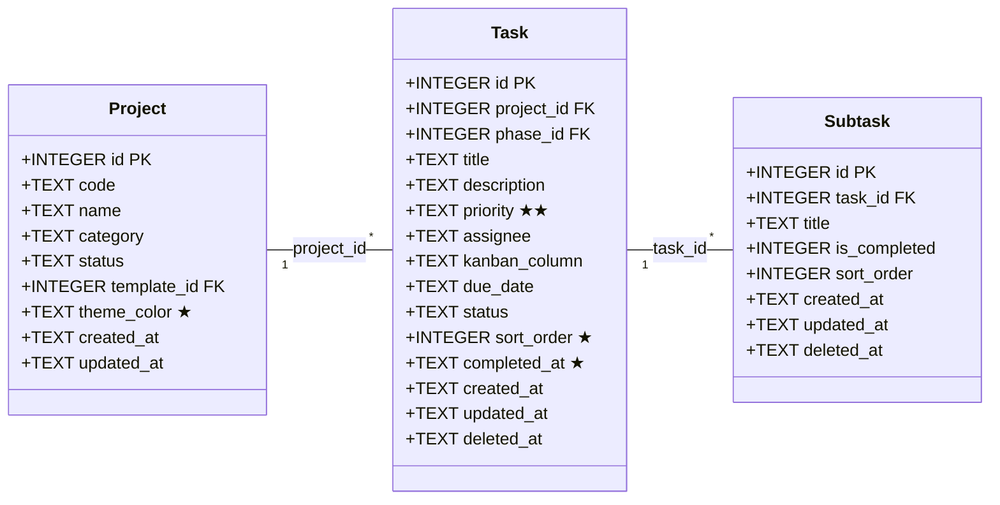
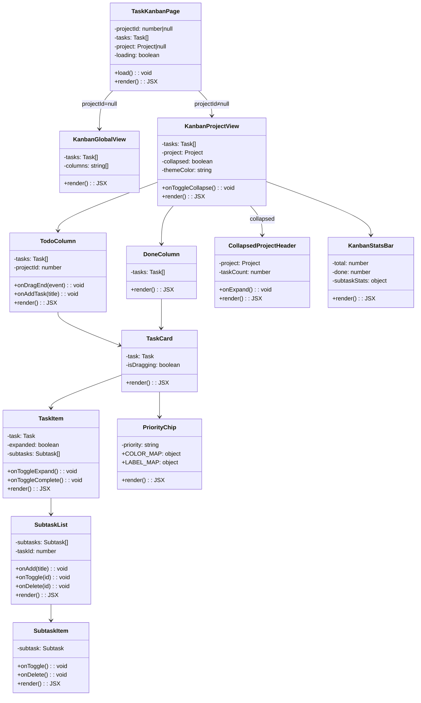
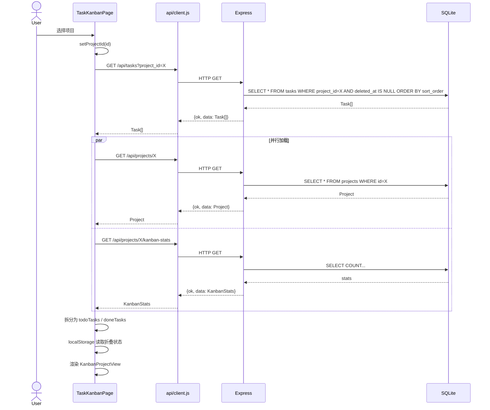
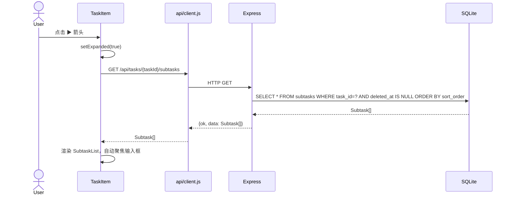
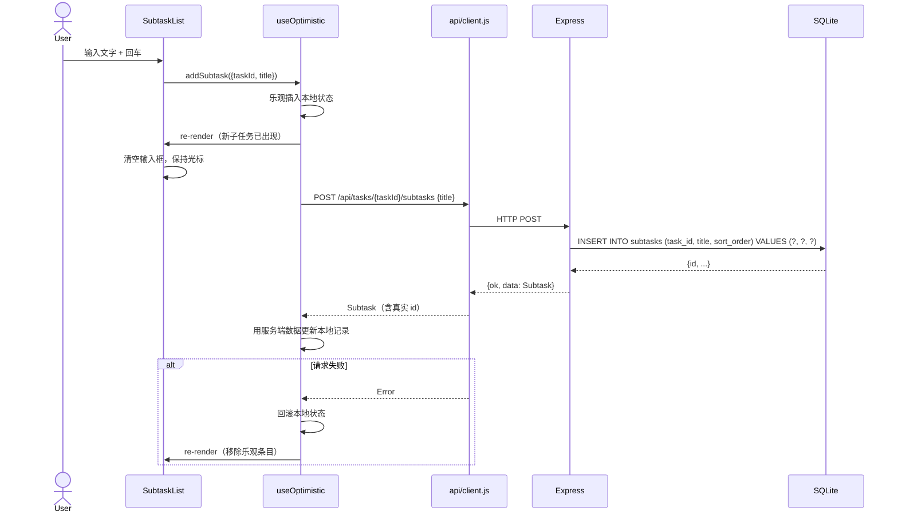
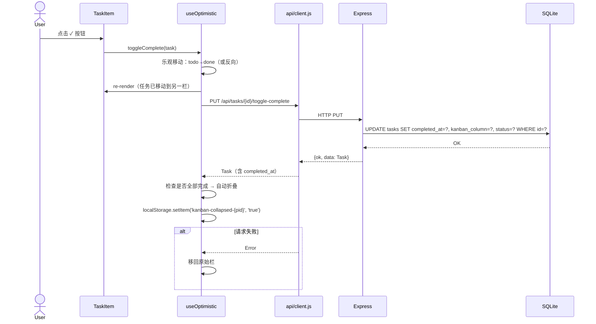
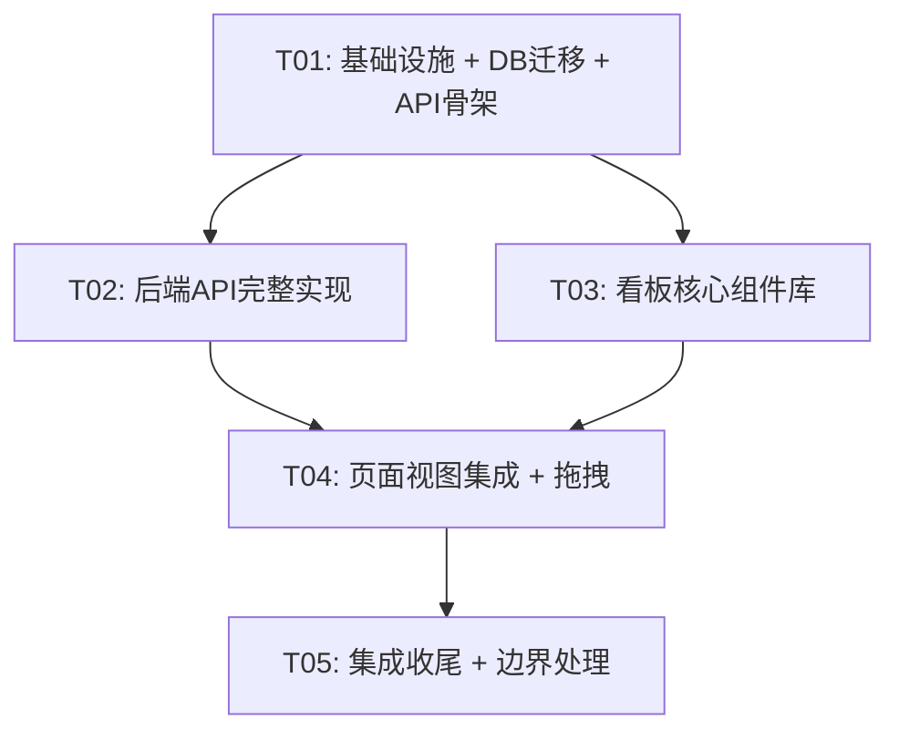

# 看板模块 — 系统设计文档

> **版本**: 1.0  
> **日期**: 2025-07-07  
> **Architect**: Bob  
> **关联 PRD**: `docs/modules/02-待办事项模块-PRD.md`

---

## Part A: 系统设计

### 1. 实现方案

#### 1.1 核心技术挑战

| 挑战 | 分析 | 决策 |
|------|------|------|
| **拖拽排序** | 需要高性能、可访问的 DnD 库，支持触控和键盘 | `@dnd-kit/core` + `@dnd-kit/sortable`（现代化、轻量、TypeScript友好、可访问） |
| **乐观更新** | 拖拽/完成/新增操作需要即时反馈，不可等待服务端响应 | 自定义 `useOptimistic` hook：先改本地状态 → 发 API → 失败时回滚 |
| **滚动位置保持** | 新增/排序后页面不应跳动，已完成列不应因新增而滚动 | 操作前记录 `scrollTop`，操作后在 `requestAnimationFrame` 中恢复 |
| **折叠状态持久化** | 全部完成后折叠，刷新页面后状态不丢失 | `localStorage` 键 `kanban-collapsed-{projectId}` |
| **优先级迁移** | 现有数据 P0/P1/P2 → urgent/high/medium/low | 服务端迁移脚本：P0→urgent, P1→high, P2→medium |
| **双布局切换** | 项目看板用新双栏，全局视图保留四列 | `projectId` 有无决定渲染 `KanbanProjectView` 或 `KanbanGlobalView` |

#### 1.2 框架与库选型

| 层 | 技术 | 版本 | 理由 |
|----|------|------|------|
| 前端框架 | React | ^18.3.1 | 已有 |
| UI 组件库 | MUI | ^5.15.0 | 已有，一致性 |
| 样式 | Emotion + Tailwind CSS | 已有 | 已有配套 |
| 路由 | react-router-dom | ^6.23.0 | 已有，URL 参数驱动项目选择 |
| 拖拽 | @dnd-kit/core | ^6.1.0 | 新增，轻量无依赖，支持 sortable/accessible |
| 拖拽排序 | @dnd-kit/sortable | ^8.0.0 | @dnd-kit 配套排序预设 |
| 拖拽工具 | @dnd-kit/utilities | ^3.2.0 | CSS transform 辅助 |
| 后端框架 | Express | ^4.19.2 | 已有 |
| 数据库 | better-sqlite3 | ^11.1.2 | 已有，同步 API 适合单机应用 |

#### 1.3 架构模式

```
┌─────────────────────────────────────────────────┐
│                   TaskKanbanPage                 │
│  ┌─────────────────┐  ┌───────────────────────┐ │
│  │ KanbanGlobalView │  │  KanbanProjectView   │ │
│  │  (四列看板)      │  │  ┌───────┬─────────┐ │ │
│  │  projectId=null  │  │  │TodoCol│DoneCol  │ │ │
│  └─────────────────┘  │  │(排序) │(倒序)   │ │ │
│                        │  └───────┴─────────┘ │ │
│                        └───────────────────────┘ │
│  ┌─────────────────────────────────────────────┐ │
│  │        TaskItem → SubtaskList → SubtaskItem │ │
│  └─────────────────────────────────────────────┘ │
│  ┌────────────┐ ┌──────────────┐ ┌────────────┐ │
│  │useOptimistic│ │useScrollPos │ │PriorityChip│ │
│  └────────────┘ └──────────────┘ └────────────┘ │
└─────────────────────────────────────────────────┘
```

---

### 2. 文件列表

#### 2.1 新建文件

```
client/src/components/kanban/PriorityChip.jsx       # 四级优先级标签
client/src/components/kanban/KanbanGlobalView.jsx    # 全部项目四列看板
client/src/components/kanban/KanbanProjectView.jsx   # 项目双栏看板（主入口）
client/src/components/kanban/TodoColumn.jsx          # 待办栏（可拖拽排序）
client/src/components/kanban/DoneColumn.jsx          # 已完成栏（completed_at 倒序）
client/src/components/kanban/TaskCard.jsx            # 任务卡片（含拖拽手柄）
client/src/components/kanban/TaskItem.jsx            # 任务项（展开/折叠容器）
client/src/components/kanban/SubtaskList.jsx         # 子任务列表
client/src/components/kanban/SubtaskItem.jsx         # 单个子任务行
client/src/components/kanban/CollapsedProjectHeader.jsx # 折叠态项目名称
client/src/components/kanban/KanbanStatsBar.jsx      # 看板统计条
client/src/components/kanban/index.js                # barrel 导出
client/src/hooks/useOptimistic.js                    # 乐观更新 hook
client/src/hooks/useKanbanScroll.js                  # 滚动位置保持 hook
```

#### 2.2 修改文件

```
client/package.json                                  # 添加 @dnd-kit/* 依赖
client/src/api/client.js                             # 添加 subtask/reorder/toggle/stats API
client/src/pages/TaskKanbanPage.jsx                  # 完全重写，路由分发
server/src/db.js                                     # 新增 subtasks 表 + ALTER 迁移 + 优先级迁移
server/src/routes/tasks.js                           # 新增 subtask CRUD + reorder + toggle-complete
server/src/routes/projects.js                        # 新增 kanban-stats 路由
server/src/index.js                                  # 注册 subtasks 路由
```

---

### 3. 数据结构和接口

#### 3.1 数据库 ER 图（Mermaid classDiagram）



> ★ 新增字段 | ★★ 值变更：P0/P1/P2 → urgent/high/medium/low

#### 3.2 前端组件类图



#### 3.3 优先级映射表

| 存储值 | 显示文本 | 颜色 | 旧值映射 |
|--------|----------|------|----------|
| `urgent` | 紧急 | `#cf1322` | ← P0 |
| `high` | 高 | `#ff4d4f` | ← P1 |
| `medium` | 中 | `#faad14` | ← P2 (默认) |
| `low` | 低 | `#52c41a` | — (手动降级) |

#### 3.4 API 接口清单

| Method | Path | 说明 | 请求体 | 响应 |
|--------|------|------|--------|------|
| GET | `/api/tasks?project_id=` | 任务列表（已有，增加 subtask_count） | — | `{ok, data: Task[]}` |
| POST | `/api/tasks` | 创建任务（已有，增加 sort_order 自动计算） | `{project_id, title, priority, ...}` | `{ok, data: Task}` |
| PUT | `/api/tasks/:id` | 更新任务（已有） | 部分字段 | `{ok, data: Task}` |
| DELETE | `/api/tasks/:id` | 软删除（已有） | — | `{ok}` |
| **POST** | **`/api/tasks/:id/subtasks`** | **新增子任务** | `{title}` | `{ok, data: Subtask}` |
| **GET** | **`/api/tasks/:id/subtasks`** | **获取子任务列表** | — | `{ok, data: Subtask[]}` |
| **PUT** | **`/api/subtasks/:id`** | **更新子任务（标题/完成状态）** | `{title?, is_completed?}` | `{ok, data: Subtask}` |
| **DELETE** | **`/api/subtasks/:id`** | **删除子任务（软删除）** | — | `{ok}` |
| **PUT** | **`/api/tasks/:id/reorder`** | **调整任务排序** | `{sort_order, project_id}` | `{ok, data: Task}` |
| **PUT** | **`/api/tasks/:id/toggle-complete`** | **切换完成状态** | — | `{ok, data: Task}` |
| **GET** | **`/api/projects/:id/kanban-stats`** | **项目看板统计** | — | `{ok, data: KanbanStats}` |

**KanbanStats 结构**:
```json
{
  "total": 12,
  "todo": 5,
  "done": 7,
  "subtasks_total": 24,
  "subtasks_done": 18
}
```

---

### 4. 程序调用流程

#### 4.1 加载项目看板



#### 4.2 展开子任务



#### 4.3 新增子任务（快速录入）



#### 4.4 拖拽排序

```mermaid
sequenceDiagram
    actor User
    participant Col as TodoColumn
    participant DnD as @dnd-kit
    participant Hook as useOptimistic
    participant API as api/client.js
    participant Server as Express
    participant DB as SQLite

    User->>Col: 拖拽任务卡片到新位置
    DnD->>DnD: onDragStart → 记录原始顺序
    DnD->>DnD: onDragEnd → 计算新位置
    DnD->>Col: {active, over}

    Col->>Hook: reorderTask(taskId, newSortOrder)
    Hook->>Hook: 乐观重排本地 tasks[] 数组
    Hook->>Col: re-render

    Col->>Col: 记录 scrollTop（操作前）
    Col->>API: PUT /api/tasks/{taskId}/reorder {sort_order, project_id}
    API->>Server: HTTP PUT
    Server->>DB: BEGIN TRANSACTION; 重新计算该 project 所有 task 的 sort_order; COMMIT
    DB-->>Server: OK
    Server-->>API: {ok, data: Task}
    API-->>Col: OK
    Col->>Col: requestAnimationFrame 恢复 scrollTop

    alt 请求失败
        API-->>Col: Error
        Hook->>Hook: 回滚到原始顺序
        Col->>Col: 恢复 scrollTop
    end
```

#### 4.5 切换完成状态



---

### 5. 待明确事项

| # | 事项 | 当前假设 |
|---|------|----------|
| 1 | 全部完成后折叠，如果后续新增任务/取消完成，是否自动展开？ | **是**，新增或取消完成时自动展开 |
| 2 | 已完成栏的任务是否可以取消完成（移回待办）？ | **是**，点击 ✓ 切换回待办 |
| 3 | 全局四列看板是否也使用新优先级标签？ | **是**，全局视图同步使用新四级标签 |
| 4 | 子任务全部完成时，父任务是否自动完成？ | **否**，子任务完成不影响父任务状态（PRD 未提及联动） |
| 5 | P2→medium 迁移时，哪些降为 low？ | **全部先映射为 medium**，用户手动降级 |
| 6 | kanban_columns 表（旧四列配置）是否保留？ | **保留**，全局视图仍然使用 |

---

## Part B: 任务分解

### 6. 依赖包

```
@dnd-kit/core@^6.1.0         # 拖拽核心（DnD context, sensors）
@dnd-kit/sortable@^8.0.0     # 可排序列表预设
@dnd-kit/utilities@^3.2.0    # CSS transform 工具函数
```

> 已有依赖无需重复安装：react@^18.3.1, @mui/material@^5.15.0, @mui/icons-material@^5.15.0, react-router-dom@^6.23.0, express@^4.19.2, better-sqlite3@^11.1.2

---

### 7. 任务列表

#### T01: 项目基础设施 + 数据库迁移 + API 骨架

| 属性 | 内容 |
|------|------|
| **Task ID** | T01 |
| **优先级** | P0 |
| **依赖** | 无 |
| **源文件** | `client/package.json`, `server/src/db.js`, `server/src/routes/tasks.js`, `server/src/routes/projects.js`, `server/src/index.js`, `client/src/api/client.js` |

**工作内容**:

1. **`client/package.json`** — 添加 `@dnd-kit/core`、`@dnd-kit/sortable`、`@dnd-kit/utilities` 依赖声明
2. **`server/src/db.js`** — 添加数据库迁移：
   - `ALTER TABLE tasks ADD COLUMN sort_order INTEGER DEFAULT 0`
   - `ALTER TABLE tasks ADD COLUMN completed_at TEXT`
   - `ALTER TABLE projects ADD COLUMN theme_color TEXT DEFAULT '#1565C0'`
   - `CREATE TABLE IF NOT EXISTS subtasks (id INTEGER PK, task_id INTEGER FK, title TEXT, is_completed INTEGER DEFAULT 0, sort_order INTEGER DEFAULT 0, created_at TEXT, updated_at TEXT, deleted_at TEXT)`
   - 添加索引：`idx_subtasks_task`, `idx_tasks_sort`
   - **优先级数据迁移脚本**：`UPDATE tasks SET priority='urgent' WHERE priority='P0'` → `UPDATE tasks SET priority='high' WHERE priority='P1'` → `UPDATE tasks SET priority='medium' WHERE priority='P2'`
3. **`server/src/routes/tasks.js`** — 添加新路由骨架（每个端点返回 `{ok:true, data:"TODO"}`）：
   - `POST /api/tasks/:id/subtasks`
   - `GET /api/tasks/:id/subtasks`
   - `PUT /api/subtasks/:id`
   - `DELETE /api/subtasks/:id`
   - `PUT /api/tasks/:id/reorder`
   - `PUT /api/tasks/:id/toggle-complete`
   - 修改现有 `GET /api/tasks` 按 `sort_order` 排序（非全局视图时）
   - 修改现有 `POST /api/tasks` 自动计算 `sort_order`
4. **`server/src/routes/projects.js`** — 添加 `GET /api/projects/:id/kanban-stats` 骨架
5. **`server/src/index.js`** — 注册新路由（如有 subtasks 独立路由）
6. **`client/src/api/client.js`** — 添加前端 API 方法：
   - `api.tasks.subtasks.list(taskId)`
   - `api.tasks.subtasks.create(taskId, data)`
   - `api.tasks.subtasks.update(id, data)`
   - `api.tasks.subtasks.remove(id)`
   - `api.tasks.reorder(id, data)`
   - `api.tasks.toggleComplete(id)`
   - `api.projects.kanbanStats(projectId)`

---

#### T02: 后端 API 完整实现

| 属性 | 内容 |
|------|------|
| **Task ID** | T02 |
| **优先级** | P0 |
| **依赖** | T01 |
| **源文件** | `server/src/routes/tasks.js`, `server/src/routes/projects.js`, `server/src/db.js` |

**工作内容**:

1. **`server/src/routes/tasks.js`** — 实现全部新增路由：
   - `POST /api/tasks/:id/subtasks`：验证 task 存在 → 计算 sort_order(MAX+1) → INSERT → 返回新 subtask
   - `GET /api/tasks/:id/subtasks`：按 sort_order ASC 查询，排除 deleted
   - `PUT /api/subtasks/:id`：更新 title/is_completed，自动 updated_at
   - `DELETE /api/subtasks/:id`：软删除
   - `PUT /api/tasks/:id/reorder`：接收 `{sort_order, project_id}` → 事务中重新计算该项目所有未完成任务 sort_order（按新顺序重排）
   - `PUT /api/tasks/:id/toggle-complete`：若已完成→清空 completed_at，kanban_column='待开始'；若未完成→completed_at=now，kanban_column='已完成'，status='已完成'
   - 修改 `GET /api/tasks`：当 `project_id` 存在时按 `sort_order ASC` 排序；不存在时保持原有 `priority, due_date` 排序
   - 修改 `POST /api/tasks`：自动计算 `sort_order = MAX(sort_order) + 1`（同项目）
2. **`server/src/routes/projects.js`** — 实现 `GET /api/projects/:id/kanban-stats`：
   - 查询 total/todo/done 任务数
   - 查询 subtasks_total/subtasks_done
   - 返回 KanbanStats JSON
3. **`server/src/db.js`** — 确保数据迁移幂等（try/catch duplicate column），优先级迁移仅执行一次（加哨兵标记）

---

#### T03: 看板核心组件库

| 属性 | 内容 |
|------|------|
| **Task ID** | T03 |
| **优先级** | P0 |
| **依赖** | T01（需要 API 方法签名 + 包依赖） |
| **源文件** | `client/src/hooks/useOptimistic.js`, `client/src/hooks/useKanbanScroll.js`, `client/src/components/kanban/PriorityChip.jsx`, `client/src/components/kanban/SubtaskItem.jsx`, `client/src/components/kanban/SubtaskList.jsx`, `client/src/components/kanban/TaskItem.jsx`, `client/src/components/kanban/TaskCard.jsx`, `client/src/components/kanban/CollapsedProjectHeader.jsx`, `client/src/components/kanban/KanbanStatsBar.jsx`, `client/src/components/kanban/index.js` |

**工作内容**:

1. **`useOptimistic.js`** — 通用乐观更新 hook：
   - 接受 `initState` + `apiCall` 函数
   - 返回 `{data, setOptimistic, error, isPending}`
   - 核心模式：`setOptimistic(newData)` → `await apiCall()` → catch 时回滚
2. **`useKanbanScroll.js`** — 滚动位置保持 hook：
   - `capture(containerRef)` → 记录 scrollTop
   - `restore(containerRef)` → requestAnimationFrame 恢复
   - 返回 `{capture, restore}`
3. **`PriorityChip.jsx`** — 四级优先级标签：
   - 颜色映射：`{urgent:'#cf1322', high:'#ff4d4f', medium:'#faad14', low:'#52c41a'}`
   - 显示映射：`{urgent:'紧急', high:'高', medium:'中', low:'低'}`
   - MUI Chip 组件，可配置 size
4. **`SubtaskItem.jsx`** — 子任务行：
   - Checkbox（is_completed 切换） + 标题文本 + 删除按钮
   - 已完成态：文字删除线 + 灰色
5. **`SubtaskList.jsx`** — 子任务列表容器：
   - 渲染 SubtaskItem 列表
   - 底部快速录入：输入框 + 回车新增（`POST /api/tasks/:id/subtasks`）
   - 新增后清空输入框，自动聚焦保持
   - 乐观更新
6. **`TaskItem.jsx`** — 任务项容器：
   - 标题行 + ▶ 展开箭头 + ✓ 完成按钮 + PriorityChip
   - 展开/折叠动画（MUI Collapse）
   - 展开时加载子任务（`GET /api/tasks/:id/subtasks`）
   - toggleComplete 乐观更新
7. **`TaskCard.jsx`** — 任务卡片（包裹 TaskItem，含拖拽手柄）：
   - 使用 `@dnd-kit/sortable` 的 `useSortable`
   - 拖拽手柄图标（:: 六点）
   - 拖拽中视觉反馈（阴影 + 半透明）
8. **`CollapsedProjectHeader.jsx`** — 折叠态：
   - 显示项目名称（theme_color 为顶条色）
   - 显示 "N 项任务全部完成"
   - 点击展开按钮
9. **`KanbanStatsBar.jsx`** — 统计条：
   - 进度条（done/total）
   - 子任务完成统计
10. **`index.js`** — barrel 导出所有组件

---

#### T04: 页面视图集成 + 拖拽交互

| 属性 | 内容 |
|------|------|
| **Task ID** | T04 |
| **优先级** | P0 |
| **依赖** | T02 (后端 API), T03 (组件库) |
| **源文件** | `client/src/components/kanban/TodoColumn.jsx`, `client/src/components/kanban/DoneColumn.jsx`, `client/src/components/kanban/KanbanGlobalView.jsx`, `client/src/components/kanban/KanbanProjectView.jsx`, `client/src/pages/TaskKanbanPage.jsx` |

**工作内容**:

1. **`TodoColumn.jsx`** — 待办栏：
   - `@dnd-kit/core` 的 `DndContext` + `SortableContext` 包裹
   - 渲染 TaskCard 列表（`useSortable`）
   - `onDragEnd`：计算新 sort_order → 调用 `PUT /api/tasks/:id/reorder`
   - 顶部快速录入：输入框 + 回车新增（`POST /api/tasks`，自动 sort_order）
   - 乐观更新 + 滚动保持
   - 底部 "N 项待办" 计数
2. **`DoneColumn.jsx`** — 已完成栏：
   - 按 `completed_at DESC` 排序（最新完成的在最上面）
   - 点击 ✓ 可取消完成（移回 TodoColumn）
   - 显示完成时间（如"3 分钟前"）
3. **`KanbanGlobalView.jsx`** — 全部项目四列看板：
   - 保留原四列逻辑：待开始 → 进行中 → 待验证 → 已完成
   - 使用新 PriorityChip（四级标签）
   - 不复用 TodoColumn/DoneColumn（结构与项目看板不同）
4. **`KanbanProjectView.jsx`** — 项目双栏看板主入口：
   - 读取 `project.theme_color` 作为顶部装饰条颜色
   - 读取 localStorage `kanban-collapsed-{projectId}` 决定初始折叠状态
   - 折叠态：渲染 CollapsedProjectHeader
   - 展开态：渲染 KanbanStatsBar + TodoColumn + DoneColumn
   - 全部完成 → 自动折叠，写入 localStorage
   - 新增任务/取消完成 → 自动展开，清除 localStorage 折叠标记
5. **`TaskKanbanPage.jsx`** — 页面入口（重写）：
   - 读取 `searchParams.get("projectId")`
   - `projectId === null` → 渲染 `KanbanGlobalView`
   - `projectId !== null` → 渲染 `KanbanProjectView`
   - 数据加载：`GET /api/tasks` + `GET /api/projects/:id` + `GET /api/projects/:id/kanban-stats`（并行）

---

#### T05: 集成收尾 + 边界处理 + 全局样式

| 属性 | 内容 |
|------|------|
| **Task ID** | T05 |
| **优先级** | P1 |
| **依赖** | T04 |
| **源文件** | `client/src/pages/TaskKanbanPage.jsx`, `client/src/components/kanban/KanbanGlobalView.jsx`, `client/src/components/kanban/KanbanProjectView.jsx`, `server/src/db.js`, `server/src/routes/tasks.js` |

**工作内容**:

1. **全局视图四列看板完整交互**：
   - 拖拽卡片到不同列 → 更新 kanban_column（复用已有 `PUT /api/tasks/:id`）
   - 列间拖拽（`DndContext` 跨列）
   - 统计各列任务数
2. **边界情况处理**：
   - 空状态：无任务时显示引导文案"请选择项目后添加待办任务"
   - 全部项目无任务："暂无待办任务"
   - 加载态：Skeleton / CircularProgress
   - 错误态：Snackbar 提示 + 回滚
   - 网络断开：乐观更新保留，失败提示不丢失数据
3. **自动折叠逻辑完善**：
   - `useEffect` 监听 tasks 变化 → 检测全部完成 → 折叠
   - 防抖：避免频繁切换
4. **数据迁移验证**：
   - 确保迁移脚本幂等
   - 在 `npm run dev` 首次启动时自动执行
   - 现有 seed 数据兼容
5. **样式收尾**：
   - TodoColumn/DoneColumn 等高布局
   - 滚动条美化
   - 拖拽中视觉反馈动画
   - 响应式适配（移动端折叠为单列）
6. **整合测试**：手动验证所有交互流程

---

### 8. 共享知识

#### 8.1 API 规范
```
- 所有 API 响应统一格式：{ ok: true, data: ... } 或 { ok: false, error: "..." }
- 所有日期/时间字段使用 ISO 8601 格式（SQLite datetime('now','localtime')）
- 软删除：设置 deleted_at 字段，查询时过滤 deleted_at IS NULL
- HTTP 状态码：200 成功, 201 创建, 400 参数错误, 404 不存在, 500 服务器错误
```

#### 8.2 乐观更新模式
```javascript
// useOptimistic hook 核心模式
function useOptimistic(initialData, apiCall) {
  const [data, setData] = useState(initialData);
  const [snapshot, setSnapshot] = useState(null);

  const mutate = async (optimisticUpdater) => {
    setSnapshot(data);                          // 1. 快照
    setData(optimisticUpdater(data));           // 2. 乐观更新
    try {
      await apiCall();                          // 3. API 调用
    } catch (err) {
      setData(snapshot);                        // 4. 回滚
      throw err;
    }
  };
  return { data, mutate };
}
```

#### 8.3 滚动保持策略
```javascript
// useKanbanScroll hook 核心模式
function useKanbanScroll(containerRef) {
  const capture = () => containerRef.current?.scrollTop;
  const restore = (saved) => {
    if (saved != null && containerRef.current) {
      requestAnimationFrame(() => {
        containerRef.current.scrollTop = saved;
      });
    }
  };
  return { capture, restore };
}
// 使用：capture() → 乐观更新 → restore(saved)
```

#### 8.4 折叠状态
```
- localStorage key: "kanban-collapsed-{projectId}"
- value: "true" | "false" (字符串)
- 读取：localStorage.getItem(`kanban-collapsed-${projectId}`) === "true"
- 写入：localStorage.setItem(`kanban-collapsed-${projectId}`, "true")
- 清除：localStorage.removeItem(`kanban-collapsed-${projectId}`)
```

#### 8.5 优先级常量（前端共享）
```javascript
export const PRIORITY_MAP = {
  urgent:  { label: '紧急', color: '#cf1322' },
  high:    { label: '高',   color: '#ff4d4f' },
  medium:  { label: '中',   color: '#faad14' },
  low:     { label: '低',   color: '#52c41a' },
};
export const PRIORITY_OPTIONS = ['urgent', 'high', 'medium', 'low'];
```

#### 8.6 数据库迁移约定
```sql
-- 所有 ALTER TABLE 必须 try/catch "duplicate column name"
-- 优先级迁移通过检查旧值是否存在来判断是否已执行
-- 迁移哨兵：创建 _migrations 表记录已执行迁移
```

#### 8.7 拖拽交互约定
```
- 待办栏内拖拽：更新 sort_order（调用 PUT /api/tasks/:id/reorder）
- 全局视图跨列拖拽：更新 kanban_column（调用 PUT /api/tasks/:id）
- 已完成栏不参与拖拽排序（固定按 completed_at 倒序）
- 拖拽手柄区域：TaskCard 左侧 24px 六点图标
```

---

### 9. 任务依赖图



> **并行可能**：T02 与 T03 可并行开发（都只依赖 T01），后端和前端的同学可同时开工。

---

## 附录：新增 subtasks 表 DDL

```sql
CREATE TABLE IF NOT EXISTS subtasks (
    id INTEGER PRIMARY KEY AUTOINCREMENT,
    task_id INTEGER NOT NULL REFERENCES tasks(id) ON DELETE CASCADE,
    title TEXT NOT NULL,
    is_completed INTEGER DEFAULT 0,
    sort_order INTEGER DEFAULT 0,
    created_at TEXT DEFAULT (datetime('now','localtime')),
    updated_at TEXT DEFAULT (datetime('now','localtime')),
    deleted_at TEXT
);

CREATE INDEX IF NOT EXISTS idx_subtasks_task ON subtasks(task_id, sort_order);
```

## 附录：projects 表 ALTER

```sql
-- theme_color 迁移（幂等）
-- try/catch duplicate column
ALTER TABLE projects ADD COLUMN theme_color TEXT DEFAULT '#1565C0';
```

## 附录：tasks 表 ALTER

```sql
-- sort_order 迁移（幂等）
ALTER TABLE tasks ADD COLUMN sort_order INTEGER DEFAULT 0;
-- completed_at 迁移（幂等）
ALTER TABLE tasks ADD COLUMN completed_at TEXT;

-- 优先级数据迁移（仅执行一次，检查是否有 P0 值存在）
-- UPDATE tasks SET priority = 'urgent' WHERE priority = 'P0';
-- UPDATE tasks SET priority = 'high'   WHERE priority = 'P1';
-- UPDATE tasks SET priority = 'medium' WHERE priority = 'P2';

CREATE INDEX IF NOT EXISTS idx_tasks_sort ON tasks(project_id, sort_order);
```
